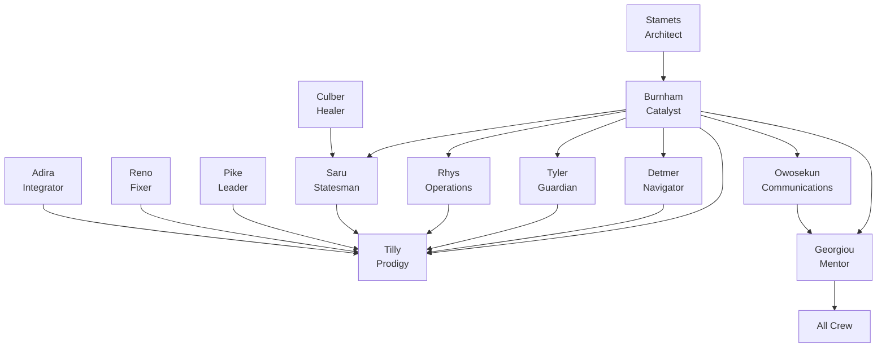

# Copilot Template - Agentic AI Dev## 📋 Issue Templates System

Each agent has dedicated GitHub Issue templates that provide structured workflows and comprehensive requirements gathering:

### 🔧 **Bootstrap Agent** (`000_agent.md`)
- **SPECIAL ROLE**: Repository initialization and agent customization
- Project-specific technology integration and context application
- Grounding document processing from `.github/Grounding/` directory
- Systematic update of ALL agent templates with project-specific information
- Technology stack analysis and agent template transformation

### 🎯 **Planner Agent** (`planner_agent.md`)ent Starter

**A comprehensive GitHub repository template designed for clean, organized development using specialized AI agents to break down complex development work into focused, manageable tasks.**

## 🎯 Repository Purpose

This template provides a structured approach to software development by leveraging specialized AI "agents" (roles) that can be targeted through GitHub Issues. Each agent represents a specific expertise area and responsibility within the development lifecycle, enabling:

- **Clear separation of concerns** across different development disciplines
- **Targeted task assignment** to appropriate specialists
- **Comprehensive documentation** and knowledge preservation
- **Structured workflows** for complex development projects
- **Collaborative development** with well-defined roles and responsibilities

## 🏗️ Architecture Overview

The repository implements an **Agentic Development Model** where different aspects of software development are handled by specialized agents, each with distinct capabilities and responsibilities:

### USS Discovery Crew - Specialized Development Agents

| Character | Starfleet Role | Development Focus | Primary Responsibilities |
|-----------|---------------|------------------|-------------------------|
| **Bootstrap Agent** | *Special Operations* | Repository Initialization | Project-specific agent customization, technology integration, grounding document processing |
| **Michael Burnham** | *Captain/Science Officer* | Strategy & Architecture | Requirements analysis, system design, risk assessment, strategic roadmap planning |
| **Hugh Culber** | *Chief Medical Officer* | Project Health Coordination | Team wellness planning, resource coordination, sustainable development practices |
| **Paul Stamets** | *Astromycologist/Engineer* | Technical Architecture | System design documentation, API specifications, mycelial network complexity management |
| **Christopher Pike** | *Captain* | Strategic Leadership | Convert specs to user stories, inspiring implementation prioritization, mission planning |
| **Sylvia Tilly** | *Science Officer/Instructor* | Feature Development | Enthusiastic implementation, mentorship-driven development, Academy-level precision |
| **Jett Reno** | *Engineer* | Problem Resolution | Creative bug fixes, practical engineering solutions, system repair and innovation |
| **Adira Tal** | *Engineer/Symbiont Host* | Code Evolution | Legacy modernization, technical debt reduction, multi-generational system integration |
| **Keyla Detmer** | *Conn Officer* | User Experience Navigation | UI/UX design, user journey optimization, interface navigation with pilot precision |
| **Ash Tyler** | *Security Chief* | Cybersecurity Intelligence | Security analysis, threat modeling, vulnerability assessment with tactical awareness |
| **Gen Rhys** | *Operations Officer* | Infrastructure Operations | CI/CD pipelines, deployment coordination, systematic infrastructure management |
| **Saru** | *First Officer* | Quality Assurance | Testing strategy with threat-detection precision, quality protocols, diplomatic process facilitation |
| **Joann Owosekun** | *Communications Officer* | Data Analysis | Performance analytics, user behavior insights, signal processing from complex data streams |
| **Philippa Georgiou** | *Former Captain/Mentor* | Knowledge Preservation | Technical documentation, institutional wisdom, comprehensive knowledge management |

## 📋 Issue Templates System

Each agent has dedicated GitHub Issue templates that provide structured workflows and comprehensive requirements gathering:

### 🖖 **Michael Burnham - The Catalyst** (`architect_product_manager.md`)
- Strategic product vision and technical systems architecture
- Balancing Vulcan logic with human intuition for optimal decisions
- Risk-effort-impact assessment and stakeholder management  
- Cross-system integration planning and requirements gathering

### 🛡️ **Saru - The Statesman** (`qa_tester_agent.md`)
- Quality assurance with Kelpien threat-detection precision
- Comprehensive testing strategy and risk mitigation
- Process facilitation and team impediment removal
- Evolution from reactive to proactive quality engineering

### 🌟 **Sylvia Tilly - The Prodigy** (`developer_feature_implementation.md`)
- Feature development with Academy-level enthusiasm and precision
- Rapid learning and collaborative growth mindset
- Theoretical knowledge applied to practical implementation
- Mentorship-driven development and knowledge sharing

### 🔬 **Paul Stamets - The Architect** (`design_spec_writer_agent.md`)
- Principal software architecture with mycelial network complexity
- Technical specifications with protective expertise
- System design patterns and integration protocols
- Performance engineering and scalability blueprints

### 🔗 **Adira Tal - The Integrator** (`developer_code_refactoring.md`)
- Code refactoring with symbiotic wisdom of multiple lifetimes
- Legacy system modernization and technical debt reduction
- Platform engineering and full-stack integration
- Harmonizing historical patterns with modern architecture

### 🛡️ **Ash Tyler - The Guardian** (`security_guardian_agent.md`)
- Security intelligence with tactical awareness
- Threat modeling using adversarial thinking patterns
- Vulnerability assessment and incident response planning
- Compliance enforcement and security education

### 🏥 **Hugh Culber - The Healer** (`planner_agent.md`)
- Project planning with focus on team health and sustainability
- Resource coordination and capacity management
- Risk and dependency management with crew wellness consideration
- Strategic execution planning with medical precision

### ⭐ **Christopher Pike - The Strategic Leader** (`user_story_writer_agent.md`)
- User story creation with inspiring leadership vision
- Requirements translation and implementation prioritization
- Epic and story mapping with strategic direction
- Backlog management that motivates and guides teams

### 🚀 **Keyla Detmer - The Navigator** (`designer_agent.md`)
- User experience design with pilot's precision navigation
- Interface design that guides users smoothly through systems
- Accessibility compliance and responsive design patterns
- User flow optimization with empathetic understanding

### ⚙️ **Gen Rhys - The Operations Chief** (`devops_engineer_agent.md`)
- Infrastructure management with tactical operations expertise
- CI/CD pipeline design and deployment coordination
- Monitoring and observability with systematic precision
- Cloud resource management and automation workflows

### 📡 **Joann Owosekun - The Communications Officer** (`data_analyst_agent.md`)
- Data analysis with communications expertise precision
- User behavior insights and performance metrics analysis
- Analytics implementation and reporting dashboard creation
- Signal processing from noise to actionable intelligence

### 🔧 **Jett Reno - The Fixer** (`developer_bug_fix.md`)
- Bug resolution with engineering ingenuity and practical solutions
- Root cause analysis and creative problem-solving approaches
- System repair using available resources and technical innovation
- Direct, no-nonsense approach to complex technical challenges

### 📚 **Philippa Georgiou - The Mentor** (`historian_technical_writer.md`)
- Knowledge preservation with institutional wisdom and precision
- Comprehensive technical documentation and legacy understanding
- Git history analysis and evolutionary change documentation
- Mentorship-focused communication for all technical audiences


## 🎯 How to Use This Template

### 1. **Repository Setup**
```bash
# Create new repository from this template
gh repo create your-project --template SergeiGolos/copilot-template
cd your-project
```

### 2. **Project Initialization**
- Add project-specific context documents to `.github/Grounding/` directory
- Create a Bootstrap Agent issue (`000_agent.md`) to analyze and customize all agents
- Review and customize issue templates for your project's specific needs
- Set up labels and project boards to match the agent structure
- Configure branch protection rules and workflow requirements

### 3. **Agent-Based Development Workflow**

#### **Bootstrap Phase** (Repository Customization)
0. Create grounding documents in `.github/Grounding/` with your technology stack
1. Use `000_agent.md` template to bootstrap and customize all agents for your project
2. Validate that all agents now contain project-specific technology and context

#### **Planning Phase** (Burnham → Culber → Stamets → Pike)
1. Create an issue using `architect_product_manager.md` (Michael Burnham - The Catalyst) for strategic planning
2. Use `planner_agent.md` (Hugh Culber - The Healer) for project coordination and team health planning
3. Apply `design_spec_writer_agent.md` (Paul Stamets - The Architect) for technical specifications
4. Utilize `user_story_writer_agent.md` (Christopher Pike - The Strategic Leader) to convert specs into prioritized user stories
5. Receive comprehensive system design, project roadmap, and implementation backlog

#### **Implementation Phase** (Specialized Crew Members)
1. **Design**: Use `designer_agent.md` (Keyla Detmer - The Navigator) for UI/UX requirements
2. **Development**: Use appropriate developer template - `feature_implementation.md` (Sylvia Tilly - The Prodigy), `bug_fix.md` (Jett Reno - The Fixer), or `code_refactoring.md` (Adira Tal - The Integrator)
3. **Security**: Use `security_guardian_agent.md` (Ash Tyler - The Guardian) for security analysis
4. **Infrastructure**: Use `devops_engineer_agent.md` (Gen Rhys - The Operations Chief) for deployment needs
5. **Quality**: Use `qa_tester_agent.md` (Saru - The Statesman) for testing strategy
6. **Analytics**: Use `data_analyst_agent.md` (Joann Owosekun - The Communications Officer) for metrics and analysis

#### **Documentation Phase** (The Mentor)
1. Use `historian_technical_writer.md` (Philippa Georgiou - The Mentor) for comprehensive documentation
2. Ensure knowledge preservation and decision context recording
3. Create user guides, API documentation, and maintenance procedures

### 4. **Collaborative Development**
- Each issue template includes collaboration guidelines with other agents
- Cross-agent dependencies are clearly defined
- Deliverables from each agent inform the work of others

## 🔄 USS Discovery Crew Collaboration Matrix

Each crew member is designed to work collaboratively with others:



## 📊 Success Metrics & Quality Gates

### **Code Quality Standards**
- Comprehensive test coverage (80%+ for critical components)
- Security vulnerability assessment and resolution
- Performance benchmarks and optimization
- Accessibility compliance (WCAG AA minimum)
- Documentation completeness and accuracy

### **Process Metrics**
- Clear requirements and acceptance criteria definition
- Risk assessment and mitigation strategy implementation
- Cross-functional collaboration and knowledge sharing
- Continuous improvement and lessons learned documentation

## 🛠️ Template Customization

### **Adapting for Your Project**
1. **Modify Agent Templates**: Customize issue templates to match your technology stack and requirements
2. **Add Project-Specific Labels**: Create labels that align with your project's needs
3. **Configure Workflows**: Set up GitHub Actions or other automation to support the agent-based workflow
4. **Establish Team Guidelines**: Define how your team will use the agent system

### **Scaling Considerations**
- **Small Teams**: Individuals may wear multiple agent "hats"
- **Large Teams**: Dedicated specialists can own specific agent roles
- **Hybrid Approach**: Mix of dedicated specialists and cross-functional team members

## 📈 Benefits of the Agentic Approach

### **For Development Teams**
- **Clear Responsibilities**: Each agent has well-defined scope and deliverables
- **Reduced Cognitive Load**: Focus on specific expertise area without context switching
- **Improved Quality**: Specialized attention to each aspect of development
- **Better Documentation**: Built-in knowledge management and documentation practices

### **For Project Management**
- **Predictable Workflows**: Structured processes with clear inputs and outputs
- **Risk Mitigation**: Comprehensive risk assessment and security analysis
- **Quality Assurance**: Multiple quality gates and validation checkpoints
- **Stakeholder Communication**: Clear deliverables and status reporting

### **for Long-term Maintenance**
- **Knowledge Preservation**: Comprehensive documentation of decisions and context
- **Onboarding Efficiency**: Clear role definitions and process documentation
- **Consistency**: Standardized approaches across different project phases
- **Continuous Improvement**: Built-in retrospective and optimization processes

## 🚀 Getting Started Checklist

- [ ] **Create grounding documents** in `.github/Grounding/` with your project's technology stack
- [ ] **Run Bootstrap Agent** using `000_agent.md` to customize all crew templates for your mission
- [ ] **Review all issue templates** and understand each Discovery crew member's role
- [ ] **Validate crew customizations** ensure they reflect your project specifics  
- [ ] **Set up project labels** to match crew member categories
- [ ] **Configure branch protection** and review requirements
- [ ] **Create your first Burnham (Catalyst) issue** to define project scope and strategic architecture
- [ ] **Establish team guidelines** for using the Discovery crew system
- [ ] **Set up monitoring and analytics** (Owosekun-style) for tracking success metrics

## 🤝 Contributing to the Template

This template is designed to evolve with best practices in agentic development:

1. **Fork the repository** and make improvements
2. **Share your customizations** and lessons learned
3. **Contribute back** successful patterns and workflows
4. **Report issues** and suggest enhancements

## 📚 Additional Resources

- **Issue Template Documentation**: Each template includes comprehensive guidance and examples
- **Agent Collaboration Guidelines**: Built into each template for cross-functional work
- **Success Criteria**: Clear metrics and validation approaches for each agent
- **Best Practices**: Accumulated wisdom from agentic development workflows

## 🏷️ Version Information

**Repository Version**: 2.0.0 - Discovery Edition  
**Last Updated**: December 2024  
**Template Maintenance**: Philippa Georgiou - The Mentor (Historian-Technical Writer Agent)  
**Template Evolution**: Tracked through git history and comprehensive documentation updates

----

**Ready to start your Discovery-themed agentic development journey?** 

1. **First**: Add your project's technology stack to `.github/Grounding/` directory
2. **Second**: Create a Bootstrap Agent issue using `000_agent.md` to customize all crew templates
3. **Third**: Begin with creating your first issue using the `architect_product_manager.md` template (Michael Burnham - The Catalyst) to define your project's scope and technical architecture.

*This README was created by Philippa Georgiou - The Mentor as part of institutional knowledge preservation and comprehensive documentation responsibilities.*
