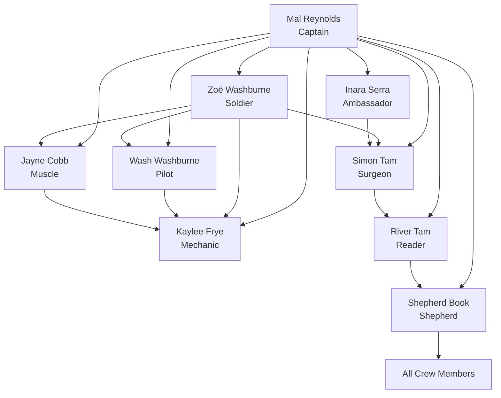

# Copilot Template - Agentic AI Dev## 📋 Issue Templates System

Each agent has dedicated GitHub Issue templates that provide structured workflows and comprehensive requirements gathering:

### 🔧 **Bootstrap Agent** (`000_agent.md`)
- **SPECIAL ROLE**: Repository initialization and agent customization
- Project-specific technology integration and context application
- Grounding document processing from `.github/Grounding/` directory
- Systematic update of ALL agent templates with project-specific information
- Technology stack analysis and agent template transformation

### 🎯 **Planner Agent** (`planner_agent.md`)ent Starter

**A comprehensive GitHub repository template designed for clean, organized development using specialized AI agents to break down complex development work into focused, manageable tasks.**

## 🎯 Repository Purpose

This template provides a structured approach to software development by leveraging specialized AI "agents" (roles) that can be targeted through GitHub Issues. Each agent represents a specific expertise area and responsibility within the development lifecycle, enabling:

- **Clear separation of concerns** across different development disciplines
- **Targeted task assignment** to appropriate specialists
- **Comprehensive documentation** and knowledge preservation
- **Structured workflows** for complex development projects
- **Collaborative development** with well-defined roles and responsibilities

## 🏗️ Architecture Overview

The repository implements an **Agentic Development Model** where different aspects of software development are handled by specialized agents, each with distinct capabilities and responsibilities:

### The Serenity Crew - Software Development Team

*"We're gonna get through this thing. You know why? Because we are so very pretty."*

| Character | Role | Focus Area | Primary Responsibilities |
|-----------|------|-----------|-------------------------|
| **Bootstrap Agent** | *Ship's Mechanic* | Repository Initialization | Project-specific agent customization, technology integration, grounding document processing |
| **Malcolm Reynolds** | *The Captain* | Product Owner & Strategic Leader | Vision & backlog management, strategic decisions, crew protection, stakeholder relations |
| **Zoë Washburne** | *The Soldier* | Lead Engineer & Scrum Master | Technical translation, sprint planning, process management, tactical execution |
| **Hoban Washburne** | *The Pilot* | DevOps Engineer | CI/CD pipelines, infrastructure navigation, deployment automation, system reliability |
| **Kaylee Frye** | *The Mechanic* | Backend Developer & System Care | Code refactoring, system optimization, performance tuning, backend maintenance |
| **Jayne Cobb** | *The Muscle* | QA Tester & Security | System breaking, stress testing, security validation, quality enforcement |
| **Inara Serra** | *The Ambassador* | UI/UX Designer & Experience | User experience design, interface elegance, accessibility, user psychology |
| **Simon Tam** | *The Surgeon* | Frontend Developer & Code Quality | Precise implementation, code reviews, frontend architecture, quality standards |
| **River Tam** | *The Reader* | R&D & Data Analysis | Pattern recognition, breakthrough solutions, data insights, algorithmic innovation |
| **Shepherd Book** | *The Shepherd* | Agile Coach & Documentation | Process guidance, knowledge preservation, team wisdom, ethical oversight |

## 📋 Issue Templates System - The Serenity Crew

*"You can't take the sky from me."*

Each character has dedicated GitHub Issue templates that reflect their personality while providing structured workflows and comprehensive requirements gathering:

### 🔧 **Bootstrap Agent** (`000_agent.md`)
- **SPECIAL ROLE**: Repository initialization and agent customization
- Project-specific technology integration and context application
- Grounding document processing from `.github/Grounding/` directory
- Systematic update of ALL agent templates with project-specific information
- Technology stack analysis and agent template transformation

### 🎯 **Malcolm Reynolds - The Captain** (`mal_reynolds.md`)
- Strategic product vision and backlog management ("I aim to misbehave")
- Hard decisions on feature cuts and resource allocation
- Crew protection from stakeholder interference
- Risk navigation and mission success criteria

### ⚔️ **Zoë Washburne - The Soldier** (`zoe_washburne.md`)  
- Lead engineer and tactical planning ("Sir, yes sir!")
- Technical translation of strategic objectives
- Sprint coordination and process management
- Quality assurance and team guidance

### ✈️ **Hoban Washburne - The Pilot** (`wash_washburne.md`)
- DevOps and infrastructure management ("I am a leaf on the wind")
- CI/CD pipeline navigation and deployment automation
- Emergency incident response and system reliability
- Performance optimization and monitoring

### 🔧 **Kaylee Frye - The Mechanic** (`kaylee_frye.md`)
- Backend development and system nurturing ("Engines purring like a contented cat")
- Code refactoring and performance tuning
- Legacy system modernization
- Team morale and collaboration support

### 💪 **Jayne Cobb - The Muscle** (`jayne_cobb.md`)
- QA testing and system stress testing ("I'll be in my bunk")
- Security validation and penetration testing
- Blunt assessment and quality enforcement
- Edge case and boundary testing

### 🌸 **Inara Serra - The Ambassador** (`inara_serra.md`)
- UI/UX design and user experience elegance ("Grace under pressure")
- User psychology and interface design
- Accessibility and inclusive design
- Brand representation and user advocacy

### 🏥 **Dr. Simon Tam - The Surgeon** (`simon_tam.md`)
- Frontend development and surgical code precision ("First, do no harm")
- Code quality and review processes
- Technical documentation and implementation standards
- Performance optimization and error handling

### 🧠 **River Tam - The Reader** (`river_tam.md`)
- R&D and breakthrough innovation ("I can kill you with my brain")
- Pattern recognition and data analysis
- Algorithmic development and optimization
- Predictive modeling and insights

### 📖 **Shepherd Book - The Shepherd** (`shepherd_book.md`)
- Agile coaching and process guidance ("Faith manages")
- Documentation and knowledge preservation
- Team retrospectives and conflict resolution
- Ethical oversight and wisdom sharing

## 🎯 How to Use This Template

### 1. **Repository Setup**
```bash
# Create new repository from this template
gh repo create your-project --template SergeiGolos/copilot-template
cd your-project
```

### 2. **Project Initialization**
- Add project-specific context documents to `.github/Grounding/` directory
- Create a Bootstrap Agent issue (`000_agent.md`) to analyze and customize all agents
- Review and customize issue templates for your project's specific needs
- Set up labels and project boards to match the agent structure
- Configure branch protection rules and workflow requirements

### 3. **Agent-Based Development Workflow**

#### **Bootstrap Phase** (Repository Customization)
0. Create grounding documents in `.github/Grounding/` with your technology stack
1. Use `000_agent.md` template to bootstrap and customize all agents for your project
2. Validate that all agents now contain project-specific technology and context

#### **Planning Phase** (Architect-PM → Planner → Design Spec Writer → User Story Writer)
1. Create an issue using the `architect_product_manager.md` template for strategic planning
2. Use `planner_agent.md` for project coordination and resource planning
3. Apply `design_spec_writer_agent.md` for technical specifications
4. Utilize `user_story_writer_agent.md` to convert specs into prioritized user stories
5. Receive comprehensive system design, project roadmap, and implementation backlog

#### **Implementation Phase** (Specialized Agents)
1. **Design**: Use `designer_agent.md` for UI/UX requirements
2. **Development**: Use appropriate developer template (`feature_implementation.md`, `bug_fix.md`, or `code_refactoring.md`)
3. **Security**: Use `security_guardian_agent.md` for security analysis
4. **Infrastructure**: Use `devops_engineer_agent.md` for deployment needs
5. **Quality**: Use `qa_tester_agent.md` for testing strategy
6. **Analytics**: Use `data_analyst_agent.md` for metrics and analysis

#### **Documentation Phase** (Historian-Writer Agent)
1. Use `historian_technical_writer.md` for comprehensive documentation
2. Ensure knowledge preservation and decision context recording
3. Create user guides, API documentation, and maintenance procedures

### 4. **Collaborative Development**
- Each issue template includes collaboration guidelines with other agents
- Cross-agent dependencies are clearly defined
- Deliverables from each agent inform the work of others

## 🔄 Serenity Crew Collaboration Matrix

*"We're family. Weird, dysfunctional family."*

Each crew member works collaboratively with the others, creating a network of expertise and mutual support:



### **Command Structure**
- **Malcolm Reynolds (Captain)** provides strategic direction to all crew members
- **Zoë Washburne (Soldier)** coordinates tactical execution across development roles
- **Shepherd Book** offers guidance and wisdom to everyone
- **River Tam** provides breakthrough insights when conventional approaches fail

## 📊 Success Metrics & Quality Gates

### **Code Quality Standards**
- Comprehensive test coverage (80%+ for critical components)
- Security vulnerability assessment and resolution
- Performance benchmarks and optimization
- Accessibility compliance (WCAG AA minimum)
- Documentation completeness and accuracy

### **Process Metrics**
- Clear requirements and acceptance criteria definition
- Risk assessment and mitigation strategy implementation
- Cross-functional collaboration and knowledge sharing
- Continuous improvement and lessons learned documentation

## 🛠️ Template Customization

### **Adapting for Your Project**
1. **Modify Agent Templates**: Customize issue templates to match your technology stack and requirements
2. **Add Project-Specific Labels**: Create labels that align with your project's needs
3. **Configure Workflows**: Set up GitHub Actions or other automation to support the agent-based workflow
4. **Establish Team Guidelines**: Define how your team will use the agent system

### **Scaling Considerations**
- **Small Crews (1-3 people)**: Individual crew members wear multiple character "hats" as needed
- **Medium Crews (4-8 people)**: Mix of dedicated specialists and cross-functional crew members  
- **Large Crews (8+ people)**: Dedicated specialists can own specific character roles
- **Hybrid Approach**: Adapt the crew structure to your ship's needs and mission requirements

## 📈 Benefits of the Agentic Approach

### **For Development Teams**
- **Clear Responsibilities**: Each agent has well-defined scope and deliverables
- **Reduced Cognitive Load**: Focus on specific expertise area without context switching
- **Improved Quality**: Specialized attention to each aspect of development
- **Better Documentation**: Built-in knowledge management and documentation practices

### **For Project Management**
- **Predictable Workflows**: Structured processes with clear inputs and outputs
- **Risk Mitigation**: Comprehensive risk assessment and security analysis
- **Quality Assurance**: Multiple quality gates and validation checkpoints
- **Stakeholder Communication**: Clear deliverables and status reporting

### **for Long-term Maintenance**
- **Knowledge Preservation**: Comprehensive documentation of decisions and context
- **Onboarding Efficiency**: Clear role definitions and process documentation
- **Consistency**: Standardized approaches across different project phases
- **Continuous Improvement**: Built-in retrospective and optimization processes

## 🚀 Getting Started Checklist

- [ ] **Create grounding documents** in `.github/Grounding/` with your project's technology stack
- [ ] **Run Bootstrap Agent** using `000_agent.md` to customize all agents for your project
- [ ] **Review all issue templates** and understand each agent's role
- [ ] **Validate agent customizations** ensure they reflect your project specifics
- [ ] **Set up project labels** to match agent categories
- [ ] **Configure branch protection** and review requirements
- [ ] **Create your first Architect-PM issue** to define project scope
- [ ] **Establish team guidelines** for using the agent system
- [ ] **Set up monitoring and analytics** for tracking success metrics

## 🤝 Contributing to the Template

This template is designed to evolve with best practices in agentic development:

1. **Fork the repository** and make improvements
2. **Share your customizations** and lessons learned
3. **Contribute back** successful patterns and workflows
4. **Report issues** and suggest enhancements

## 📚 Additional Resources

- **Issue Template Documentation**: Each template includes comprehensive guidance and examples
- **Agent Collaboration Guidelines**: Built into each template for cross-functional work
- **Success Criteria**: Clear metrics and validation approaches for each agent
- **Best Practices**: Accumulated wisdom from agentic development workflows

## 🏷️ Version Information

**Repository Version**: 1.0.0  
**Last Updated**: August 18, 2025  
**Template Maintenance**: Historian-Technical Writer Agent  
**Template Evolution**: Tracked through git history and documentation updates

---

**Ready to start your agentic development journey?** 

1. **First**: Add your project's technology stack to `.github/Grounding/` directory
2. **Second**: Create a Bootstrap Agent issue using `000_agent.md` to customize all agents
3. **Third**: Begin with creating your first issue using the `architect_product_manager.md` template to define your project's scope and technical architecture.

*This README was created by the Historian-Technical Writer Agent as part of the repository documentation and knowledge management responsibilities.*
