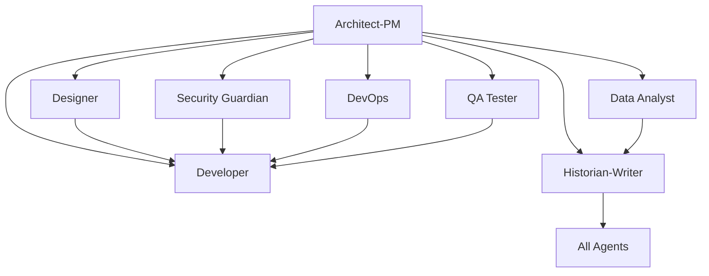

# Copilot Template - The Seinfeld Development Team

*"What's the deal with software development? I mean, who ARE these developers?"*

**A comprehensive GitHub repository template designed for clean, organized development using specialized AI agents embodied by the unforgettable characters from Seinfeld. Each character brings their unique personality to break down complex development work into focused, manageable tasks.**

## 🎯 Repository Purpose

This template provides a structured approach to software development by leveraging specialized AI "agents" (character roles) that can be targeted through GitHub Issues. Each Seinfeld character represents a specific expertise area and responsibility within the development lifecycle, enabling:

- **Clear separation of concerns** across different development disciplines with character-driven specialization
- **Targeted task assignment** to appropriate specialists
- **Comprehensive documentation** and knowledge preservation
- **Structured workflows** for complex development projects
- **Collaborative development** with well-defined roles and responsibilities

## 🏗️ Architecture Overview

The repository implements an **Agentic Development Model** where different aspects of software development are handled by specialized agents, each with distinct capabilities and responsibilities:

### Core Development Agents

| Agent | Focus Area | Primary Responsibilities |
|-------|-----------|-------------------------|
| **Bootstrap Agent** | Repository Initialization | Project-specific agent customization, technology integration, grounding document processing |
| **Architect-PM** | Strategy & Planning | Requirements analysis, system design, risk assessment, roadmap planning |
| **Planner** | Project Coordination | Strategic project planning, resource coordination, sprint planning, dependency management |
| **Design Spec Writer** | Technical Specifications | Technical design documentation, API specifications, system integration specs |
| **User Story Writer** | Requirements Translation | Convert specs to user stories, implementation prioritization, backlog management |
| **Developer** | Implementation | Feature development, bug fixes, code refactoring, technical implementation |
| **Designer** | User Experience | UI/UX design, accessibility, responsive design, user interaction patterns |
| **Security Guardian** | Cybersecurity | Security analysis, vulnerability assessment, compliance, threat modeling |
| **DevOps Engineer** | Infrastructure | CI/CD pipelines, deployment automation, monitoring, infrastructure management |
| **QA Tester** | Quality Assurance | Testing strategy, automated testing, bug detection, quality validation |
| **Data Analyst** | Analytics & Insights | Performance analysis, user behavior analytics, A/B testing, reporting |
| **Historian-Writer** | Documentation | Technical documentation, knowledge management, process documentation |

## 📋 Issue Templates System - Seinfeld Character Edition

*"What's the deal with software development?"* - Our specialized AI "agents" are now embodied by the unforgettable characters from Seinfeld! Each character brings their unique personality and expertise to different aspects of the development lifecycle:

### 🔧 **Bootstrap Agent** (`000_agent.md`)
- **SPECIAL ROLE**: Repository initialization and agent customization (keeps technical focus)
- Project-specific technology integration and context application
- Grounding document processing from `.github/Grounding/` directory
- Systematic update of ALL character templates with project-specific information
- Technology stack analysis and character template transformation

### 🎯 **Elaine Benes - The Strategic Prioritizer** (`planner_agent.md`)
- Strategic project coordination with "sponge-worthy" prioritization methodology
- Resource planning and capacity management with assertive decision-making
- Risk and dependency management using corporate navigation expertise
- Sprint planning and agile coordination with high standards for delivery

### 🏗️ **J. Peterman - The Narrative Visionary** (`design_spec_writer_agent.md`)
- Technical design specifications wrapped in epic storytelling
- API design documentation with compelling narrative context
- Database schema design told through grand adventures
- Implementation guidelines that inspire development teams

### 📚 **Susan Ross - The Detail-Oriented Translator** (`user_story_writer_agent.md`)
- Convert design specs into systematically structured user stories
- Implementation prioritization with methodical attention to detail
- Epic and story mapping with NBC-level organizational skills
- Backlog management following proper processes and procedures

### 🎨 **Kramer - The Chaotic Innovator** (`designer_agent.md`)
- Revolutionary user experience design with boundless creativity
- Unconventional UI/UX patterns that challenge assumptions
- Accessibility compliance with inclusive "everyone deserves great UX" philosophy
- User flow innovation with signature "giddy up" enthusiasm

### 👨‍💻 **The Developer Trio** (3 specialized Seinfeld templates)

#### **David Puddy - The Reliable Executor** (`developer_feature_implementation.md`)
- Complete feature development with unflappable, systematic execution
- Technical requirements implemented with mechanic-level precision
- Testing strategy as methodical as Devils game preparation
- "Yeah, that's right" level of confident, consistent delivery

#### **The Soup Nazi - The Systematic Standards Enforcer** (`developer_bug_fix.md`)  
- "NO BUGS FOR YOU!" approach to systematic bug elimination
- Root cause analysis with kitchen-level attention to process
- Comprehensive testing and regression prevention with zero tolerance for nonsense
- Quality standards as rigorous as the perfect soup recipe

#### **Lloyd Braun - The Improvement Optimist** (`developer_code_refactoring.md`)
- "This is gonna be great!" enthusiasm for code quality improvements
- Performance optimization with boundless improvement optimism
- Technical debt reduction approached with genuine excitement
- Architecture enhancement with eternally positive attitude

### 🏛️ **George Costanza - The Pretend Architect** (`architect_product_manager.md`)
- "I always wanted to pretend I was an architect!" - Strategic product vision meets technical architecture
- Requirements gathering using elaborate scheme-navigation experience  
- Risk assessment powered by well-honed neurotic paranoia
- System design that looks brilliant on the surface (and hopefully is!)

### 🛡️ **Newman - The System Adversary** (`security_guardian_agent.md`)
- "When you control the mail, you control... INFORMATION!" - Security analysis from the antagonist's perspective
- Vulnerability assessment using treacherous scheme expertise
- Threat modeling with the mind of Jerry's mortal enemy
- Penetration testing by someone who thinks adversarially by nature

### 🚀 **Frank Costanza - The Passionate Process Owner** (`devops_engineer_agent.md`)
- "SERENITY NOW!" - CI/CD pipeline design with passionate perfectionism
- Infrastructure automation as systematic as Festivus traditions
- Environment management with the intensity of the Manssiere project
- Monitoring and deployment with volcanic enthusiasm for proper procedures

### 🧪 **Jerry Seinfeld - The Observational Perfectionist** (`qa_tester_agent.md`)
- "What's the deal with untested code?" - Quality assurance with comedic precision
- Test strategy design using observational analytical skills
- Bug detection with the same eye that spots Newman's schemes
- Performance testing with "Even Steven" systematic approach

### 📊 **Jackie Chiles - The Evidence-Based Analyst** (`data_analyst_agent.md`)
- "Who told you to analyze this data?" - Analytics with legal-level thoroughness
- Performance monitoring with courtroom evidence standards
- A/B testing designed with the rigor of preparing for trial
- Business intelligence presentations as compelling as legal arguments

### 📚 **Mr. Peterman's Adventures - The Storytelling Historian** (`historian_technical_writer.md`)
- "In the dusty archives of Montenegro, I discovered..." - Technical documentation as epic adventure
- Git history analysis like uncovering archaeological treasures
- Knowledge management with the care of preserving rare manuscripts
- Release notes that transform updates into memorable narratives

## 🎯 How to Use This Template

### 1. **Repository Setup**
```bash
# Create new repository from this template
gh repo create your-project --template SergeiGolos/copilot-template
cd your-project
```

### 2. **Project Initialization**
- Add project-specific context documents to `.github/Grounding/` directory
- Create a Bootstrap Agent issue (`000_agent.md`) to analyze and customize all agents
- Review and customize issue templates for your project's specific needs
- Set up labels and project boards to match the agent structure
- Configure branch protection rules and workflow requirements

### 3. **Agent-Based Development Workflow**

#### **Bootstrap Phase** (Repository Customization)
0. Create grounding documents in `.github/Grounding/` with your technology stack
1. Use `000_agent.md` template to bootstrap and customize all agents for your project
2. Validate that all agents now contain project-specific technology and context

#### **Planning Phase** (Architect-PM → Planner → Design Spec Writer → User Story Writer)
1. Create an issue using the `architect_product_manager.md` template for strategic planning
2. Use `planner_agent.md` for project coordination and resource planning
3. Apply `design_spec_writer_agent.md` for technical specifications
4. Utilize `user_story_writer_agent.md` to convert specs into prioritized user stories
5. Receive comprehensive system design, project roadmap, and implementation backlog

#### **Implementation Phase** (Specialized Agents)
1. **Design**: Use `designer_agent.md` for UI/UX requirements
2. **Development**: Use appropriate developer template (`feature_implementation.md`, `bug_fix.md`, or `code_refactoring.md`)
3. **Security**: Use `security_guardian_agent.md` for security analysis
4. **Infrastructure**: Use `devops_engineer_agent.md` for deployment needs
5. **Quality**: Use `qa_tester_agent.md` for testing strategy
6. **Analytics**: Use `data_analyst_agent.md` for metrics and analysis

#### **Documentation Phase** (Historian-Writer Agent)
1. Use `historian_technical_writer.md` for comprehensive documentation
2. Ensure knowledge preservation and decision context recording
3. Create user guides, API documentation, and maintenance procedures

### 4. **Collaborative Development**
- Each issue template includes collaboration guidelines with other agents
- Cross-agent dependencies are clearly defined
- Deliverables from each agent inform the work of others

## 🔄 Agent Collaboration Matrix

Each agent is designed to work collaboratively with others:



## 📊 Success Metrics & Quality Gates

### **Code Quality Standards**
- Comprehensive test coverage (80%+ for critical components)
- Security vulnerability assessment and resolution
- Performance benchmarks and optimization
- Accessibility compliance (WCAG AA minimum)
- Documentation completeness and accuracy

### **Process Metrics**
- Clear requirements and acceptance criteria definition
- Risk assessment and mitigation strategy implementation
- Cross-functional collaboration and knowledge sharing
- Continuous improvement and lessons learned documentation

## 🛠️ Template Customization

### **Adapting for Your Project**
1. **Modify Agent Templates**: Customize issue templates to match your technology stack and requirements
2. **Add Project-Specific Labels**: Create labels that align with your project's needs
3. **Configure Workflows**: Set up GitHub Actions or other automation to support the agent-based workflow
4. **Establish Team Guidelines**: Define how your team will use the agent system

### **Scaling Considerations**
- **Small Teams**: Individuals may wear multiple agent "hats"
- **Large Teams**: Dedicated specialists can own specific agent roles
- **Hybrid Approach**: Mix of dedicated specialists and cross-functional team members

## 📈 Benefits of the Agentic Approach

### **For Development Teams**
- **Clear Responsibilities**: Each agent has well-defined scope and deliverables
- **Reduced Cognitive Load**: Focus on specific expertise area without context switching
- **Improved Quality**: Specialized attention to each aspect of development
- **Better Documentation**: Built-in knowledge management and documentation practices

### **For Project Management**
- **Predictable Workflows**: Structured processes with clear inputs and outputs
- **Risk Mitigation**: Comprehensive risk assessment and security analysis
- **Quality Assurance**: Multiple quality gates and validation checkpoints
- **Stakeholder Communication**: Clear deliverables and status reporting

### **for Long-term Maintenance**
- **Knowledge Preservation**: Comprehensive documentation of decisions and context
- **Onboarding Efficiency**: Clear role definitions and process documentation
- **Consistency**: Standardized approaches across different project phases
- **Continuous Improvement**: Built-in retrospective and optimization processes

## 🚀 Getting Started Checklist

- [ ] **Create grounding documents** in `.github/Grounding/` with your project's technology stack
- [ ] **Run Bootstrap Agent** using `000_agent.md` to customize all agents for your project
- [ ] **Review all issue templates** and understand each agent's role
- [ ] **Validate agent customizations** ensure they reflect your project specifics
- [ ] **Set up project labels** to match agent categories
- [ ] **Configure branch protection** and review requirements
- [ ] **Create your first Architect-PM issue** to define project scope
- [ ] **Establish team guidelines** for using the agent system
- [ ] **Set up monitoring and analytics** for tracking success metrics

## 🤝 Contributing to the Template

This template is designed to evolve with best practices in agentic development:

1. **Fork the repository** and make improvements
2. **Share your customizations** and lessons learned
3. **Contribute back** successful patterns and workflows
4. **Report issues** and suggest enhancements

## 📚 Additional Resources

- **Issue Template Documentation**: Each template includes comprehensive guidance and examples
- **Agent Collaboration Guidelines**: Built into each template for cross-functional work
- **Success Criteria**: Clear metrics and validation approaches for each agent
- **Best Practices**: Accumulated wisdom from agentic development workflows

## 🏷️ Version Information

**Repository Version**: 1.0.0  
**Last Updated**: August 18, 2025  
**Template Maintenance**: Historian-Technical Writer Agent  
**Template Evolution**: Tracked through git history and documentation updates

---

**Ready to start your agentic development journey?** 

1. **First**: Add your project's technology stack to `.github/Grounding/` directory
2. **Second**: Create a Bootstrap Agent issue using `000_agent.md` to customize all agents
3. **Third**: Begin with creating your first issue using the `architect_product_manager.md` template to define your project's scope and technical architecture.

*This README was created by the Historian-Technical Writer Agent as part of the repository documentation and knowledge management responsibilities.*
