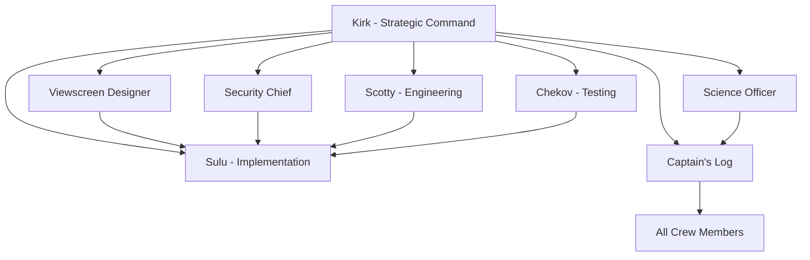

# Copilot Template - Agentic AI Dev## 📋 Issue Templates System

Each agent has dedicated GitHub Issue templates that provide structured workflows and comprehensive requirements gathering:

### 🔧 **Bootstrap Agent** (`000_agent.md`)
- **SPECIAL ROLE**: Repository initialization and agent customization
- Project-specific technology integration and context application
- Grounding document processing from `.github/Grounding/` directory
- Systematic update of ALL agent templates with project-specific information
- Technology stack analysis and crew template transformation

# Copilot Template - Enterprise Development Model

**A comprehensive GitHub repository template designed for clean, organized development using specialized Enterprise crew members to break down complex development work into focused, manageable missions.**

## 🎯 Repository Purpose

This template provides a structured approach to software development by leveraging specialized Enterprise "crew members" (roles) that can be targeted through GitHub Issues. Each crew member represents a specific expertise area and responsibility within the development lifecycle, enabling:

- **Clear separation of concerns** across different development disciplines
- **Targeted task assignment** to appropriate specialists
- **Comprehensive documentation** and knowledge preservation
- **Structured workflows** for complex development projects
- **Collaborative development** with well-defined roles and responsibilities

## 🏗️ Architecture Overview

The repository implements an **Enterprise Development Model** where different aspects of software development are handled by specialized crew members, each with distinct capabilities and responsibilities:

### Core Enterprise Bridge Crew

| Crew Member | Focus Area | Primary Responsibilities |
|-------|-----------|-------------------------|
| **Bootstrap Agent** | Repository Initialization | Project-specific crew customization, technology integration, grounding document processing |
| **Captain Kirk** | Strategic Command | Decisive leadership, requirements synthesis, risk assessment, mission planning |
| **Lt. Uhura** | Communications Coordination | Project communication, resource coordination, stakeholder management, information synthesis |
| **Commander Spock** | Logical Architecture | Technical design documentation, API specifications, logical system analysis |
| **Dr. McCoy** | Human-Centric Advocacy | User story creation, accessibility requirements, human-centered design validation |
| **Lt. Sulu** | Steady Implementation | Feature development, precise technical execution, reliable delivery |
| **Viewscreen Designer** | Visual Interface | UI/UX design, accessibility, responsive design, visual communication |
| **Security Chief** | Defense Systems | Security analysis, vulnerability assessment, compliance, threat modeling |
| **Scotty** | Engineering Operations | Infrastructure management, deployment automation, system reliability |
| **Ensign Chekov** | Quality Assurance | Enthusiastic testing, bug detection, comprehensive validation |
| **Science Officer** | Data Analysis | Performance analysis, user behavior analytics, scientific data research |
| **Captain's Log** | Knowledge Preservation | Technical documentation, knowledge management, historical record keeping |

## 📋 Issue Templates System

Each crew member has dedicated GitHub Issue templates that provide structured workflows and comprehensive requirements gathering:

### 🚀 **Captain Kirk - Strategic Command** (`kirk.md`)
- Strategic product vision and decisive leadership under pressure
- Requirements synthesis and stakeholder coordination
- Risk-taking for innovation and mission success
- Balancing logic, emotion, and practical constraints

### 🖖 **Commander Spock - Logical Architecture** (`spock.md`)
- Technical design specifications through logical analysis
- API design documentation with scientific precision
- Database schema design based on optimal data structures
- System architecture following logical principles

### 💊 **Dr. McCoy - Human-Centric Advocate** (`mccoy.md`)
- User story creation focused on real human needs
- Accessibility advocacy and inclusive design requirements
- User experience validation from a human perspective
- Ethical impact assessment of technical decisions

### ⚙️ **Scotty - Miracle-Working Engineer** (`scotty.md`)
- Infrastructure management and deployment automation
- System reliability and performance optimization beyond specifications
- "Miracle" solutions for complex technical challenges
- Resource management and capacity planning

### 📡 **Lt. Uhura - Master Communications** (`uhura.md`)
- Strategic project coordination and information synthesis
- Cross-team communication and stakeholder management
- Resource planning and timeline coordination
- Cultural translation between technical and business teams

### 🎯 **Lt. Sulu - Steady Implementation** (`sulu.md`)
- Feature development with precision and reliability
- Methodical implementation of complex technical requirements
- Quality-focused development with attention to detail
- Professional execution of challenging technical maneuvers

### ⭐ **Ensign Chekov - Enthusiastic Testing** (`chekov.md`)
- Comprehensive testing strategy with fresh perspective
- Quality validation and thorough edge case testing
- Bug detection with enthusiastic attention to detail
- User acceptance testing with genuine curiosity

### 🔧 **Scotty Emergency Repair** (`scotty_emergency_repair.md`)
- Critical bug investigation and emergency system repairs
- Root cause analysis under pressure
- Rapid resolution of mission-critical failures
- Creative problem-solving when standard approaches fail

### 🔬 **Spock Logic Optimization** (`spock_logic_optimization.md`)
- Systematic code refactoring through logical analysis
- Technical debt reduction based on measurable improvements
- Performance optimization using scientific methods
- Architecture improvement through systematic analysis

### 🛡️ **Security Chief - Shield Operations** (`security_chief.md`)
- Comprehensive security analysis and threat modeling
- Vulnerability assessment and defense system implementation
- Security architecture and incident response planning
- Compliance auditing and penetration testing

### 🔬 **Science Officer - Data Analysis** (`science_officer.md`)
- Analytics implementation and scientific data analysis
- User behavior research and A/B testing methodology
- Performance monitoring and statistical analysis
- Data-driven insights and predictive modeling

### 📚 **Captain's Log - Documentation** (`captains_log.md`)
- Comprehensive technical documentation and knowledge management
- Historical decision recording and institutional memory preservation
- Multi-audience content creation and training materials
- Process documentation and organizational knowledge capture

### 🖥️ **Viewscreen Designer - Visual Interface** (`viewscreen_designer.md`)
- User experience design and intuitive visual interface creation
- Accessibility compliance and universal design implementation
- Responsive design and cross-platform compatibility
- Visual hierarchy and information architecture optimization
- Comprehensive technical documentation and knowledge management
- Git history analysis and change documentation
- Multi-audience content creation and maintenance
- Process documentation and training materials

## 🎯 How to Use This Template

### 1. **Repository Setup**
```bash
# Create new repository from this template
gh repo create your-project --template SergeiGolos/copilot-template
cd your-project
```

### 2. **Project Initialization**
- Add project-specific context documents to `.github/Grounding/` directory
- Create a Bootstrap Agent issue (`000_agent.md`) to analyze and customize all crew members
- Review and customize issue templates for your project's specific needs
- Set up labels and project boards to match the agent structure
- Configure branch protection rules and workflow requirements

### 3. **Enterprise-Based Development Workflow**

#### **Bootstrap Phase** (Repository Customization)
0. Create grounding documents in `.github/Grounding/` with your technology stack
1. Use `000_agent.md` template to bootstrap and customize all agents for your project
2. Validate that all agents now contain project-specific technology and context

#### **Planning Phase** (Kirk → Uhura → Spock → McCoy)
1. Create an issue using the `kirk.md` template for strategic command decisions
2. Use `uhura.md` for project coordination and communication management
3. Apply `spock.md` for logical technical specifications
4. Utilize `mccoy.md` to convert specs into human-centered user stories
5. Receive comprehensive system design, project roadmap, and implementation backlog

#### **Implementation Phase** (Specialized Crew Members)
1. **Design**: Use `viewscreen_designer.md` for visual interface requirements
2. **Development**: Use appropriate crew member (`sulu.md`, `scotty_emergency_repair.md`, or `spock_logic_optimization.md`)
3. **Security**: Use `security_chief.md` for defense system analysis
4. **Infrastructure**: Use `scotty.md` for engineering and deployment needs
5. **Quality**: Use `chekov.md` for enthusiastic testing strategy
6. **Analytics**: Use `science_officer.md` for data analysis and metrics

#### **Documentation Phase** (Captain's Log)
1. Use `captains_log.md` for comprehensive mission documentation
2. Ensure knowledge preservation and decision context recording
3. Create user guides, API documentation, and maintenance procedures

### 4. **Collaborative Development**
- Each issue template includes collaboration guidelines with other crew members
- Cross-crew dependencies are clearly defined
- Deliverables from each crew member inform the work of others

## 🔄 Bridge Crew Collaboration Matrix

Each crew member is designed to work collaboratively with others:



## 📊 Success Metrics & Quality Gates

### **Code Quality Standards**
- Comprehensive test coverage (80%+ for critical components)
- Security vulnerability assessment and resolution
- Performance benchmarks and optimization
- Accessibility compliance (WCAG AA minimum)
- Documentation completeness and accuracy

### **Process Metrics**
- Clear requirements and acceptance criteria definition
- Risk assessment and mitigation strategy implementation
- Cross-functional collaboration and knowledge sharing
- Continuous improvement and lessons learned documentation

## 🛠️ Template Customization

### **Adapting for Your Project**
1. **Modify Crew Templates**: Customize issue templates to match your technology stack and requirements
2. **Add Project-Specific Labels**: Create labels that align with your project's needs
3. **Configure Workflows**: Set up GitHub Actions or other automation to support the crew-based workflow
4. **Establish Team Guidelines**: Define how your team will use the crew system

### **Scaling Considerations**
- **Small Teams**: Individuals may wear multiple crew member "hats"
- **Large Teams**: Dedicated specialists can own specific crew member roles
- **Hybrid Approach**: Mix of dedicated specialists and cross-functional team members

## 📈 Benefits of the Enterprise Approach

### **For Development Teams**
- **Clear Responsibilities**: Each crew member has well-defined scope and deliverables
- **Reduced Cognitive Load**: Focus on specific expertise area without context switching
- **Improved Quality**: Specialized attention to each aspect of development
- **Better Documentation**: Built-in knowledge management and documentation practices

### **For Project Management**
- **Predictable Workflows**: Structured processes with clear inputs and outputs
- **Risk Mitigation**: Comprehensive risk assessment and security analysis
- **Quality Assurance**: Multiple quality gates and validation checkpoints
- **Stakeholder Communication**: Clear deliverables and status reporting

### **for Long-term Maintenance**
- **Knowledge Preservation**: Comprehensive documentation of decisions and context
- **Onboarding Efficiency**: Clear role definitions and process documentation
- **Consistency**: Standardized approaches across different project phases
- **Continuous Improvement**: Built-in retrospective and optimization processes

## 🚀 Getting Started Checklist

- [ ] **Create grounding documents** in `.github/Grounding/` with your project's technology stack
- [ ] **Run Bootstrap Agent** using `000_agent.md` to customize all crew members for your project
- [ ] **Review all issue templates** and understand each agent's role
- [ ] **Validate agent customizations** ensure they reflect your project specifics
- [ ] **Set up project labels** to match agent categories
- [ ] **Configure branch protection** and review requirements
- [ ] **Create your first Architect-PM issue** to define project scope
- [ ] **Establish team guidelines** for using the agent system
- [ ] **Set up monitoring and analytics** for tracking success metrics

## 🤝 Contributing to the Template

This template is designed to evolve with best practices in agentic development:

1. **Fork the repository** and make improvements
2. **Share your customizations** and lessons learned
3. **Contribute back** successful patterns and workflows
4. **Report issues** and suggest enhancements

## 📚 Additional Resources

- **Issue Template Documentation**: Each template includes comprehensive guidance and examples
- **Crew Member Collaboration Guidelines**: Built into each template for cross-functional work
- **Success Criteria**: Clear metrics and validation approaches for each crew member
- **Best Practices**: Accumulated wisdom from agentic development workflows

## 🏷️ Version Information

**Repository Version**: 1.0.0  
**Last Updated**: August 18, 2025  
**Template Maintenance**: Captain's Log  
**Template Evolution**: Tracked through git history and documentation updates

---

**Ready to start your agentic development journey?** 

1. **First**: Add your project's technology stack to `.github/Grounding/` directory
2. **Second**: Create a Bootstrap Agent issue using `000_agent.md` to customize all crew members
3. **Third**: Begin with creating your first issue using the `kirk.md` template to define your project's scope and technical architecture.

*This README was created by the Captain's Log as part of the repository documentation and knowledge management responsibilities.*
