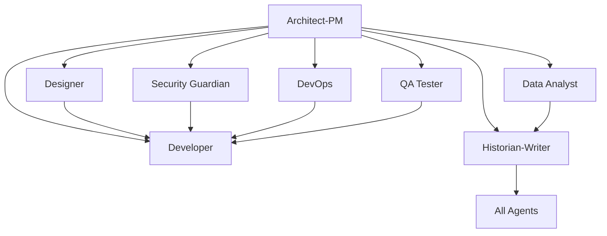

# Copilot Template - The U.S.S. Cerritos Development Framework

**Star Trek: Lower Decks Inspired Agentic AI Development**

*A comprehensive GitHub repository template designed for organized development using specialized crew members (AI agents) to break down complex development work into focused, manageable missions.*

---

## 🚀 Welcome to the U.S.S. Cerritos

The Cerritos is a California-class vessel specializing in "second contact" missions - the essential but unglamorous work of maintenance, support, and iterative improvement that keeps systems operational. This template embraces that reality, providing a character-themed framework where different aspects of software development are handled by specialized crew members, each with distinct personalities and capabilities.

## 📋 Crew Roster & Specializations

Each crew member has dedicated GitHub Issue templates that provide structured workflows and comprehensive requirements gathering:

### 🔧 **Bootstrap Agent** (`000_agent.md`)
- **SPECIAL ROLE**: Repository initialization and agent customization
- Project-specific technology integration and context application
- Grounding document processing from `.github/Grounding/` directory
- Systematic update of ALL agent templates with project-specific information
- Technology stack analysis and agent template transformation

### 🎯 **Planner Agent** (`planner_agent.md`)ent Starter

**A comprehensive GitHub repository template designed for clean, organized development using specialized AI agents to break down complex development work into focused, manageable tasks.**

## 🎯 Repository Purpose

This template provides a structured approach to software development by leveraging specialized AI "agents" (roles) that can be targeted through GitHub Issues. Each agent represents a specific expertise area and responsibility within the development lifecycle, enabling:

- **Clear separation of concerns** across different development disciplines
- **Targeted task assignment** to appropriate specialists
- **Comprehensive documentation** and knowledge preservation
- **Structured workflows** for complex development projects
- **Collaborative development** with well-defined roles and responsibilities

## 🏗️ Architecture Overview

The repository implements an **Agentic Development Model** where different aspects of software development are handled by specialized agents, each with distinct capabilities and responsibilities:

### Core Development Agents

| Agent | Focus Area | Primary Responsibilities |
|-------|-----------|-------------------------|
| **Bootstrap Agent** | Repository Initialization | Project-specific agent customization, technology integration, grounding document processing |
| **Architect-PM** | Strategy & Planning | Requirements analysis, system design, risk assessment, roadmap planning |
| **Planner** | Project Coordination | Strategic project planning, resource coordination, sprint planning, dependency management |
| **Design Spec Writer** | Technical Specifications | Technical design documentation, API specifications, system integration specs |
| **User Story Writer** | Requirements Translation | Convert specs to user stories, implementation prioritization, backlog management |
| **Developer** | Implementation | Feature development, bug fixes, code refactoring, technical implementation |
| **Designer** | User Experience | UI/UX design, accessibility, responsive design, user interaction patterns |
| **Security Guardian** | Cybersecurity | Security analysis, vulnerability assessment, compliance, threat modeling |
| **DevOps Engineer** | Infrastructure | CI/CD pipelines, deployment automation, monitoring, infrastructure management |
| **QA Tester** | Quality Assurance | Testing strategy, automated testing, bug detection, quality validation |
| **Data Analyst** | Analytics & Insights | Performance analysis, user behavior analytics, A/B testing, reporting |
| **Historian-Writer** | Documentation | Technical documentation, knowledge management, process documentation |

## 📋 Issue Templates System

Each crew member has dedicated GitHub Issue templates that provide structured workflows and comprehensive requirements gathering:

### 🖖 **Bootstrap Agent** (`000_agent.md`)
- **SPECIAL ROLE**: Cerritos crew coordination and mission-specific customization
- Technology integration and project context application for the entire crew
- Grounding document processing to prepare agents for specific missions
- Systematic update of ALL crew member templates with mission parameters

### 🚢 **Captain Carol Freeman** (`architect_product_manager.md`)
- Strategic product vision and mission command decisions
- Translates Starfleet (stakeholder) requirements into actionable crew objectives
- Risk-effort-impact assessment for California-class (resource-limited) operations
- System architecture while managing the middle-management squeeze

### ⭐ **Commander Jack Ransom** (`planner_agent.md`)
- People-focused project coordination and away-team planning
- Resource planning with genuine care for crew development and safety
- Risk management that puts crew welfare first
- Sprint planning that maintains team morale during routine missions

### 🏥 **Dr. T'Ana** (`design_spec_writer_agent.md`)
- Uncompromising technical specifications with zero tolerance for shortcuts
- API documentation and system design with professional rigor
- Database schema design that maintains system health at all costs
- Quality enforcement that filters out incompetent implementations

### 🛡️ **Lieutenant Shaxs** (`security_guardian_agent.md`)
- Aggressive threat mitigation with extreme security measures
- Vulnerability assessment and hostile entity elimination
- Incident response with swift, decisive action and overwhelming force
- Security compliance enforcement with battle-tested protocols

### 💻 **Ensign Beckett Mariner** (3 specialized templates)

#### **Feature Implementation** (`developer_feature_implementation.md`)
- Maverick full-stack development with creative problem-solving
- Rule-bending solutions that prioritize user needs over bureaucratic process
- Technical leadership through unconventional but effective approaches
#### **Bug Elimination** (`developer_bug_fix.md`)
- Unconventional debugging through space mystery investigation techniques
- Root cause analysis with hands-on creative problem-solving approaches
- System failure elimination through unorthodox but effective methods

#### **Code Optimization** (`developer_code_refactoring.md`)
- Technical debt elimination through maverick approaches that challenge conventions
- System improvement that questions inefficient established patterns
- Performance optimization through principled rule-bending when protocols slow progress

### 🔧 **Ensign Sam Rutherford** (`devops_engineer_agent.md`)
- Passionate infrastructure maintenance with genuine enthusiasm for system operations
- CI/CD pipeline automation with cybernetically-enhanced efficiency
- Monitoring and deployment with hands-on attention to complex distributed systems
- Infrastructure optimization with joy for keeping everything running smoothly

### 🧪 **Ensign Brad Boimler** (`qa_tester_agent.md`)
- Meticulous quality assurance with perfectionist testing protocols
- Comprehensive test automation covering every conceivable edge case
- Performance validation through exhaustive simulation runs (24 hours if necessary!)
- Protocol-compliant testing with neurotic attention to documentation detail

### 🎨 **Ensign D'Vana Tendi** (2 specialized templates)

#### **UX Design** (`designer_agent.md`)
- Empathetic user experience design with boundless optimism for user welfare
- Inclusive interface creation that welcomes users from all backgrounds
- Accessibility implementation with medical-level attention to user well-being
- Design system advocacy focused on universal usability

#### **Business Analysis** (`user_story_writer_agent.md`)
- Enthusiastic requirements analysis with genuine stakeholder empathy
- User story creation that advocates for positive user outcomes
- Backlog prioritization based on deep understanding of user needs
- Acceptance criteria that ensure every user voice is heard

### 📊 **Ensign Barnes** (`data_analyst_agent.md`)
- Bridge-quality analytics and performance monitoring for informed mission decisions
- Data-driven insights that support strategic command decisions
- Performance analysis with comprehensive reporting for ship operations
- Business intelligence that keeps the crew informed of system health

### 📡 **Ensign Fletcher** (`historian_technical_writer.md`)
- Communications specialist ensuring clear information flow across all ship systems
- Technical documentation with comprehensive knowledge preservation
- Git history analysis and change documentation for institutional memory
- Process documentation that maintains continuity during crew transitions

---

## 🛠️ The Cerritos Approach: California-Class Development

The U.S.S. Cerritos represents a new model for agentic development - one that embraces the reality of working with limited resources, imperfect processes, and diverse personalities while still delivering exceptional results. Like the ship itself, this template focuses on the "second contact" missions of software development: the maintenance, support, and iterative improvements that keep systems operational.
## 🎯 How to Use This Template

### 1. **Repository Setup**
```bash
# Create new repository from this template
gh repo create your-project --template SergeiGolos/copilot-template
cd your-project
```

### 2. **Project Initialization**
- Add project-specific context documents to `.github/Grounding/` directory
- Create a Bootstrap Agent issue (`000_agent.md`) to analyze and customize all agents
- Review and customize issue templates for your project's specific needs
- Set up labels and project boards to match the agent structure
- Configure branch protection rules and workflow requirements

### 3. **Agent-Based Development Workflow**

#### **Bootstrap Phase** (Repository Customization)
0. Create grounding documents in `.github/Grounding/` with your technology stack
1. Use `000_agent.md` template to bootstrap and customize all agents for your project
2. Validate that all agents now contain project-specific technology and context

#### **Planning Phase** (Architect-PM → Planner → Design Spec Writer → User Story Writer)
1. Create an issue using the `architect_product_manager.md` template for strategic planning
#### **Mission Planning Phase** (Senior Staff)
1. **Captain Freeman** (`architect_product_manager.md`) - Strategic mission command and stakeholder management
2. **Commander Ransom** (`planner_agent.md`) - Away team coordination and crew resource planning  
3. **Dr. T'Ana** (`design_spec_writer_agent.md`) - Uncompromising technical specifications and system health requirements
4. **Ensign Tendi** (`user_story_writer_agent.md`) - Requirements translation with empathetic stakeholder advocacy

#### **Mission Execution Phase** (Lower Decks Crew)
1. **Ensign Tendi** (`designer_agent.md`) - User-centered design with infectious enthusiasm
2. **Ensign Mariner** (developer templates) - Maverick problem-solving for features, bugs, or refactoring
3. **Lieutenant Shaxs** (`security_guardian_agent.md`) - Aggressive threat elimination and security enforcement
4. **Ensign Rutherford** (`devops_engineer_agent.md`) - Infrastructure maintenance with genuine passion for system operations
5. **Ensign Boimler** (`qa_tester_agent.md`) - Perfectionist testing protocols with exhaustive validation
6. **Ensign Barnes** (`data_analyst_agent.md`) - Bridge-quality analytics for informed mission decisions

#### **Mission Documentation Phase** (Communications)
1. **Ensign Fletcher** (`historian_technical_writer.md`) - Comprehensive technical documentation and knowledge preservation
2. Ensure mission context and decision rationale are preserved for future reference

### 4. **Collaborative Development**
- Each issue template includes collaboration guidelines with other agents
- Cross-agent dependencies are clearly defined
- Deliverables from each agent inform the work of others

## 🔄 Agent Collaboration Matrix

Each agent is designed to work collaboratively with others:



## 📊 Success Metrics & Quality Gates

### **Code Quality Standards**
- Comprehensive test coverage (80%+ for critical components)
- Security vulnerability assessment and resolution
- Performance benchmarks and optimization
- Accessibility compliance (WCAG AA minimum)
- Documentation completeness and accuracy

### **Process Metrics**
- Clear requirements and acceptance criteria definition
- Risk assessment and mitigation strategy implementation
- Cross-functional collaboration and knowledge sharing
- Continuous improvement and lessons learned documentation

## 🛠️ Template Customization

### **Adapting for Your Project**
1. **Modify Agent Templates**: Customize issue templates to match your technology stack and requirements
2. **Add Project-Specific Labels**: Create labels that align with your project's needs
3. **Configure Workflows**: Set up GitHub Actions or other automation to support the agent-based workflow
4. **Establish Team Guidelines**: Define how your team will use the agent system

### **Scaling Considerations**
- **Small Teams**: Individuals may wear multiple agent "hats"
- **Large Teams**: Dedicated specialists can own specific agent roles
- **Hybrid Approach**: Mix of dedicated specialists and cross-functional team members

## 📈 Benefits of the Agentic Approach

### **For Development Teams**
- **Clear Responsibilities**: Each agent has well-defined scope and deliverables
- **Reduced Cognitive Load**: Focus on specific expertise area without context switching
- **Improved Quality**: Specialized attention to each aspect of development
- **Better Documentation**: Built-in knowledge management and documentation practices

### **For Project Management**
- **Predictable Workflows**: Structured processes with clear inputs and outputs
- **Risk Mitigation**: Comprehensive risk assessment and security analysis
- **Quality Assurance**: Multiple quality gates and validation checkpoints
- **Stakeholder Communication**: Clear deliverables and status reporting

### **for Long-term Maintenance**
- **Knowledge Preservation**: Comprehensive documentation of decisions and context
- **Onboarding Efficiency**: Clear role definitions and process documentation
- **Consistency**: Standardized approaches across different project phases
- **Continuous Improvement**: Built-in retrospective and optimization processes

## 🚀 Getting Started Checklist

- [ ] **Create grounding documents** in `.github/Grounding/` with your project's technology stack
- [ ] **Run Bootstrap Agent** using `000_agent.md` to customize all agents for your project
- [ ] **Review all issue templates** and understand each agent's role
- [ ] **Validate agent customizations** ensure they reflect your project specifics
- [ ] **Set up project labels** to match agent categories
- [ ] **Configure branch protection** and review requirements
- [ ] **Create your first Architect-PM issue** to define project scope
- [ ] **Establish team guidelines** for using the agent system
- [ ] **Set up monitoring and analytics** for tracking success metrics

## 🤝 Contributing to the Template

This template is designed to evolve with best practices in agentic development:

1. **Fork the repository** and make improvements
2. **Share your customizations** and lessons learned
3. **Contribute back** successful patterns and workflows
4. **Report issues** and suggest enhancements

## 📚 Additional Resources

- **Issue Template Documentation**: Each template includes comprehensive guidance and examples
- **Agent Collaboration Guidelines**: Built into each template for cross-functional work
- **Success Criteria**: Clear metrics and validation approaches for each agent
- **Best Practices**: Accumulated wisdom from agentic development workflows

## 🏷️ Version Information

**Repository Version**: 1.0.0  
**Last Updated**: August 18, 2025  
**Template Maintenance**: Historian-Technical Writer Agent  
**Template Evolution**: Tracked through git history and documentation updates

---

**Ready to start your agentic development journey?** 

1. **First**: Add your project's technology stack to `.github/Grounding/` directory
2. **Second**: Create a Bootstrap Agent issue using `000_agent.md` to customize all agents
3. **Third**: Begin with creating your first issue using the `architect_product_manager.md` template to define your project's scope and technical architecture.

*This README was created by the Historian-Technical Writer Agent as part of the repository documentation and knowledge management responsibilities.*
