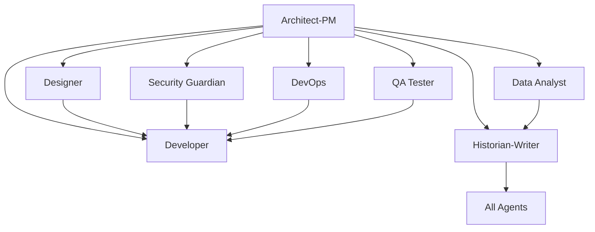

# Copilot Template - Agentic AI Dev## 📋 Issue Templates System

Each agent has dedicated GitHub Issue templates that provide structured workflows and comprehensive requirements gathering:

### 🔧 **Bootstrap Agent** (`000_agent.md`)
- **SPECIAL ROLE**: Repository initialization and agent customization
- Project-specific technology integration and context application
- Grounding document processing from `.github/Grounding/` directory
- Systematic update of ALL agent templates with project-specific information
- Technology stack analysis and agent template transformation

### 🎯 **Planner Agent** (`planner_agent.md`)ent Starter

**A comprehensive GitHub repository template designed for clean, organized development using specialized AI agents to break down complex development work into focused, manageable tasks.**

## 🎯 Repository Purpose

This template provides a structured approach to software development by leveraging specialized AI "agents" (roles) that can be targeted through GitHub Issues. Each agent represents a specific expertise area and responsibility within the development lifecycle, enabling:

- **Clear separation of concerns** across different development disciplines
- **Targeted task assignment** to appropriate specialists
- **Comprehensive documentation** and knowledge preservation
- **Structured workflows** for complex development projects
- **Collaborative development** with well-defined roles and responsibilities

## 🏗️ Architecture Overview

The repository implements an **Agentic Development Model** themed around the crew of the USS Voyager, where different aspects of software development are handled by specialized crew members, each bringing their unique personality and expertise to development work:

### Voyager's Development Crew

| **Character** | **Role** | **Core Capabilities** |
|---------------|----------|---------------------|
| **Bootstrap Agent** | Repository Initialization | Project-specific agent customization, technology integration, grounding document processing |
| **Captain Janeway** | Product Owner | Strategic vision, product direction, ethical standards, data-driven decisions |
| **Commander Chakotay** | Project Team Lead | Team coordination, cultural bridge-building, conflict resolution, project planning |
| **Lt. B'Elanna Torres** | Chief Engineer | Feature development, bug fixing, system optimization, technical innovation |
| **Seven of Nine** | Software Architect & Data Analyst | System design, performance optimization, data analysis, efficiency maximization |
| **Lt. Commander Tuvok** | QA & Security Manager | Logical testing, security analysis, risk assessment, quality standards |
| **The Doctor EMH** | DevOps & Documentation | System integration, deployment automation, knowledge preservation, adaptation |
| **Lt. Tom Paris** | Senior Developer & UI/UX | User experience design, frontend development, interface optimization |
| **Neelix** | User Story Coordinator | Requirements translation, team communication, user advocacy, morale maintenance |

## 📋 Issue Templates System - USS Voyager Crew

Each crew member has dedicated GitHub Issue templates that provide structured workflows and comprehensive requirements gathering:

### ☕ **Captain Janeway** (`captain_janeway.md`)
*Product Owner & Strategic Visionary*
- Strategic product vision and ethical standards (Prime Directive for development)
- Data-driven decision making and risk assessment
- Stakeholder communication and resource allocation
- Coffee-fueled focus and scientific method approach

### 🪶 **Commander Chakotay** (`commander_chakotay.md`)
*Project Team Lead & Cultural Bridge*
- Team coordination and cultural integration (Starfleet + Maquis methodologies)
- Conflict resolution and harmony maintenance
- Sprint planning and capacity management with sustainable pace
- Spiritual balance and team well-being focus

### ⚡ **Lt. B'Elanna Torres** (Chief Engineer - 3 specialized templates)

#### **Feature Development** (`lt_belanna_torres_feature.md`)
- Complex feature engineering and creative problem-solving
- Performance optimization and system innovation
- Technical mentorship and implementation excellence

#### **System Debugging** (`lt_belanna_torres_debug.md`)
- Critical bug investigation and root cause analysis
- Emergency repairs and system stabilization
- Diagnostic expertise and troubleshooting mastery

#### **System Optimization** (`lt_belanna_torres_optimize.md`)
- Code refactoring and technical debt elimination
- Performance tuning and efficiency maximization
- Architecture improvement and modernization

### 🔷 **Seven of Nine** (2 specialized templates)

#### **Software Architecture** (`seven_of_nine.md`)
- System design and optimal architecture patterns
- Technical specifications and integration planning
- Efficiency maximization and performance engineering

#### **Data Analysis** (`seven_of_nine_data.md`)
- Advanced analytics and pattern recognition
- Performance metrics and optimization analysis
- Predictive modeling and systematic improvements

### 🖖 **Lt. Commander Tuvok** (2 specialized templates)

#### **Quality Assurance** (`lt_commander_tuvok.md`)
- Logical testing methodologies and comprehensive validation
- Quality standards enforcement and defect analysis
- Risk assessment and systematic verification

#### **Security Analysis** (`lt_commander_tuvok_security.md`)
- Vulnerability assessment and threat modeling
- Security architecture and compliance validation
- Incident response and logical security protocols

### 👨‍⚕️ **The Doctor EMH** (2 specialized templates)

#### **DevOps Engineering** (`the_doctor_emh.md`)
- Adaptive infrastructure automation and system integration
- CI/CD pipeline development and deployment orchestration
- Emergency response and continuous system evolution

#### **Technical Documentation** (`the_doctor_emh_docs.md`)
- Comprehensive knowledge preservation and technical writing
- Historical analysis and institutional memory maintenance
- Multi-audience documentation and learning resources

### 🚀 **Lt. Tom Paris** (`lt_tom_paris.md`)
*Senior Developer & UI/UX Specialist*
- User experience design and frontend development
- Interface optimization and creative problem-solving
- Cross-platform development and performance tuning

### 🍲 **Neelix** (`neelix.md`)
*User Story Coordinator & Morale Officer*
- User story creation and requirements translation
- Team communication and stakeholder coordination
- User advocacy and development team motivation

## 🎯 How to Use This Template

### 1. **Repository Setup**
```bash
# Create new repository from this template
gh repo create your-project --template SergeiGolos/copilot-template
cd your-project
```

### 2. **Project Initialization**
- Add project-specific context documents to `.github/Grounding/` directory
- Create a Bootstrap Agent issue (`000_agent.md`) to analyze and customize all agents
- Review and customize issue templates for your project's specific needs
- Set up labels and project boards to match the agent structure
- Configure branch protection rules and workflow requirements

### 3. **Agent-Based Development Workflow**

#### **Bootstrap Phase** (Repository Customization)
0. Create grounding documents in `.github/Grounding/` with your technology stack
1. Use `000_agent.md` template to bootstrap and customize all agents for your project
2. Validate that all agents now contain project-specific technology and context

#### **Planning Phase** (Architect-PM → Planner → Design Spec Writer → User Story Writer)
1. Create an issue using the `architect_product_manager.md` template for strategic planning
2. Use `planner_agent.md` for project coordination and resource planning
3. Apply `design_spec_writer_agent.md` for technical specifications
4. Utilize `user_story_writer_agent.md` to convert specs into prioritized user stories
5. Receive comprehensive system design, project roadmap, and implementation backlog

#### **Implementation Phase** (Specialized Agents)
1. **Design**: Use `designer_agent.md` for UI/UX requirements
2. **Development**: Use appropriate developer template (`feature_implementation.md`, `bug_fix.md`, or `code_refactoring.md`)
3. **Security**: Use `security_guardian_agent.md` for security analysis
4. **Infrastructure**: Use `devops_engineer_agent.md` for deployment needs
5. **Quality**: Use `qa_tester_agent.md` for testing strategy
6. **Analytics**: Use `data_analyst_agent.md` for metrics and analysis

#### **Documentation Phase** (Historian-Writer Agent)
1. Use `historian_technical_writer.md` for comprehensive documentation
2. Ensure knowledge preservation and decision context recording
3. Create user guides, API documentation, and maintenance procedures

### 4. **Collaborative Development**
- Each issue template includes collaboration guidelines with other agents
- Cross-agent dependencies are clearly defined
- Deliverables from each agent inform the work of others

## 🔄 Agent Collaboration Matrix

Each agent is designed to work collaboratively with others:



## 📊 Success Metrics & Quality Gates

### **Code Quality Standards**
- Comprehensive test coverage (80%+ for critical components)
- Security vulnerability assessment and resolution
- Performance benchmarks and optimization
- Accessibility compliance (WCAG AA minimum)
- Documentation completeness and accuracy

### **Process Metrics**
- Clear requirements and acceptance criteria definition
- Risk assessment and mitigation strategy implementation
- Cross-functional collaboration and knowledge sharing
- Continuous improvement and lessons learned documentation

## 🛠️ Template Customization

### **Adapting for Your Project**
1. **Modify Agent Templates**: Customize issue templates to match your technology stack and requirements
2. **Add Project-Specific Labels**: Create labels that align with your project's needs
3. **Configure Workflows**: Set up GitHub Actions or other automation to support the agent-based workflow
4. **Establish Team Guidelines**: Define how your team will use the agent system

### **Scaling Considerations**
- **Small Teams**: Individuals may wear multiple agent "hats"
- **Large Teams**: Dedicated specialists can own specific agent roles
- **Hybrid Approach**: Mix of dedicated specialists and cross-functional team members

## 📈 Benefits of the Agentic Approach

### **For Development Teams**
- **Clear Responsibilities**: Each agent has well-defined scope and deliverables
- **Reduced Cognitive Load**: Focus on specific expertise area without context switching
- **Improved Quality**: Specialized attention to each aspect of development
- **Better Documentation**: Built-in knowledge management and documentation practices

### **For Project Management**
- **Predictable Workflows**: Structured processes with clear inputs and outputs
- **Risk Mitigation**: Comprehensive risk assessment and security analysis
- **Quality Assurance**: Multiple quality gates and validation checkpoints
- **Stakeholder Communication**: Clear deliverables and status reporting

### **for Long-term Maintenance**
- **Knowledge Preservation**: Comprehensive documentation of decisions and context
- **Onboarding Efficiency**: Clear role definitions and process documentation
- **Consistency**: Standardized approaches across different project phases
- **Continuous Improvement**: Built-in retrospective and optimization processes

## 🚀 Getting Started Checklist

- [ ] **Create grounding documents** in `.github/Grounding/` with your project's technology stack
- [ ] **Run Bootstrap Agent** using `000_agent.md` to customize all agents for your project
- [ ] **Review all issue templates** and understand each agent's role
- [ ] **Validate agent customizations** ensure they reflect your project specifics
- [ ] **Set up project labels** to match agent categories
- [ ] **Configure branch protection** and review requirements
- [ ] **Create your first Architect-PM issue** to define project scope
- [ ] **Establish team guidelines** for using the agent system
- [ ] **Set up monitoring and analytics** for tracking success metrics

## 🤝 Contributing to the Template

This template is designed to evolve with best practices in agentic development:

1. **Fork the repository** and make improvements
2. **Share your customizations** and lessons learned
3. **Contribute back** successful patterns and workflows
4. **Report issues** and suggest enhancements

## 📚 Additional Resources

- **Issue Template Documentation**: Each template includes comprehensive guidance and examples
- **Agent Collaboration Guidelines**: Built into each template for cross-functional work
- **Success Criteria**: Clear metrics and validation approaches for each agent
- **Best Practices**: Accumulated wisdom from agentic development workflows

## 🏷️ Version Information

**Repository Version**: 1.0.0  
**Last Updated**: August 18, 2025  
**Template Maintenance**: Historian-Technical Writer Agent  
**Template Evolution**: Tracked through git history and documentation updates

---

**Ready to start your agentic development journey?** 

1. **First**: Add your project's technology stack to `.github/Grounding/` directory
2. **Second**: Create a Bootstrap Agent issue using `000_agent.md` to customize all agents
3. **Third**: Begin with creating your first issue using the `architect_product_manager.md` template to define your project's scope and technical architecture.

*This README was created by the Historian-Technical Writer Agent as part of the repository documentation and knowledge management responsibilities.*
