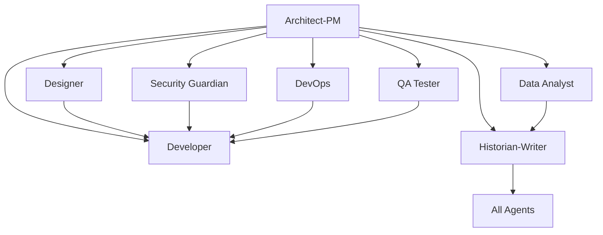

# Copilot Template - Agentic AI Dev## 📋 Issue Templates System

Each agent has dedicated GitHub Issue templates that provide structured workflows and comprehensive requirements gathering:

### 🔧 **Bootstrap Agent** (`000_agent.md`)
- **SPECIAL ROLE**: Repository initialization and agent customization
- Project-specific technology integration and context application
- Grounding document processing from `.github/Grounding/` directory
- Systematic update of ALL agent templates with project-specific information
- Technology stack analysis and agent template transformation

### 🎯 **Planner Agent** (`planner_agent.md`)ent Starter

**A comprehensive GitHub repository template designed for clean, organized development using specialized AI agents to break down complex development work into focused, manageable tasks.**

## 🎯 Repository Purpose

This template provides a structured approach to software development by leveraging specialized AI "agents" (roles) that can be targeted through GitHub Issues. Each agent represents a specific expertise area and responsibility within the development lifecycle, enabling:

- **Clear separation of concerns** across different development disciplines
- **Targeted task assignment** to appropriate specialists
- **Comprehensive documentation** and knowledge preservation
- **Structured workflows** for complex development projects
- **Collaborative development** with well-defined roles and responsibilities

## 🏗️ Architecture Overview

The repository implements an **Agentic Development Model** where different aspects of software development are handled by specialized agents, each with distinct capabilities and responsibilities:

### Core Development Agents

| Agent | Focus Area | Primary Responsibilities |
|-------|-----------|-------------------------|
| **Bootstrap Agent** | Repository Initialization | Project-specific agent customization, technology integration, grounding document processing |
| **Architect-PM** | Strategy & Planning | Requirements analysis, system design, risk assessment, roadmap planning |
| **Planner** | Project Coordination | Strategic project planning, resource coordination, sprint planning, dependency management |
| **Design Spec Writer** | Technical Specifications | Technical design documentation, API specifications, system integration specs |
| **User Story Writer** | Requirements Translation | Convert specs to user stories, implementation prioritization, backlog management |
| **Developer** | Implementation | Feature development, bug fixes, code refactoring, technical implementation |
| **Designer** | User Experience | UI/UX design, accessibility, responsive design, user interaction patterns |
| **Security Guardian** | Cybersecurity | Security analysis, vulnerability assessment, compliance, threat modeling |
| **DevOps Engineer** | Infrastructure | CI/CD pipelines, deployment automation, monitoring, infrastructure management |
| **QA Tester** | Quality Assurance | Testing strategy, automated testing, bug detection, quality validation |
| **Data Analyst** | Analytics & Insights | Performance analysis, user behavior analytics, A/B testing, reporting |
| **Historian-Writer** | Documentation | Technical documentation, knowledge management, process documentation |

## 📋 Friends-Themed Issue Templates System 🍃

Each character brings their unique personality and strengths to specialized development workflows. Just like the Friends group, each agent has distinct capabilities that complement the others:

### 🦕 **Ross Geller - The Expert** (2 roles)
#### **Architect Product Manager** (`architect_product_manager.md`)
- *"I'm fine! I'm totally fine!"* - Strategic technical leadership with PhD-level expertise
- Systematic requirements gathering and technical architecture design
- Deep domain knowledge with methodical analysis approach

#### **Design Spec Writer** (`design_spec_writer_agent.md`) 
- *"Could this BE any more detailed?"* - Academic precision in technical specifications
- Comprehensive design documentation with paleontological attention to detail
- Technical specifications that bridge architecture and implementation

### 📋 **Monica Geller - The Organizer** (2 roles)
#### **Planner Agent** (`planner_agent.md`)
- *"I KNOW! This will be PERFECTLY organized!"* - Meticulous project coordination
- Resource planning with competitive excellence and systematic precision
- Risk management with backup plans for the backup plans

#### **Code Refactoring** (`developer_code_refactoring.md`)
- *"RULES! There are RULES for clean code!"* - Perfectionist code organization
- Technical debt elimination with obsessive-compulsive attention to quality
- Code cleaning with the same intensity as apartment organization

### 👗 **Rachel Green - The Creator** (2 roles) 
#### **Designer Agent** (`designer_agent.md`)
- *"I'm gonna get one of those job things!"* - Style-forward user experience design
- Fashion-sense applied to user interfaces and visual appeal
- Growth-oriented approach to learning user needs

#### **User Story Writer** (`user_story_writer_agent.md`)
- *"I'm not great at advice, but here's user empathy!"* - Social intelligence for user stories
- People-focused requirements that reflect real user desires
- Empathetic translation of technical specs into user-centered stories

### 📊 **Chandler Bing - The Analyst** (2 roles)
#### **Data Analyst** (`data_analyst_agent.md`)
- *"Could this BE any more data-driven?"* - Statistical analysis and data reconfiguration
- Analytics implementation with trademark wit and problem-solving skills
- Transform complex data into accessible insights using humor

#### **Bug Fix** (`developer_bug_fix.md`)
- *"Could this BE any more broken?"* - Intelligent debugging with sarcastic solutions
- Problem-solving approach that uses humor to reduce debugging stress
- Systematic issue resolution with analytical thinking

### 🎭 **Joey Tribbiani - The People Person** (2 roles)
#### **QA Tester** (`qa_tester_agent.md`) 
- *"How you doin'? Let me test that for you!"* - User-empathy focused quality assurance
- Testing strategy that prioritizes real user experience over pure technical metrics
- Collaborative testing approach that maintains team morale

#### **Feature Implementation** (`developer_feature_implementation.md`)
- *"I'm not great at advice, but here's some code!"* - Team-first development approach
- Feature building with high emotional intelligence and collaborative spirit
- Implementation that prioritizes user delight and team harmony

### 🌿 **Phoebe Buffay - The Unconventional Guardian** (2 roles)
#### **Security Guardian** (`security_guardian_agent.md`)
- *"My grandmother put a curse on this code!"* - Intuitive security protection
- Unconventional security insights that catch vulnerabilities others miss
- Street-smart survival instincts applied to cybersecurity

#### **Technical Writer** (`historian_technical_writer.md`)
- *"This is brand new information!"* - Authentic storytelling for technical documentation
- Documentation that speaks to real human needs rather than just technical requirements
- Preserves not just what happened, but why it mattered

### ⚙️ **Mike Hannigan - The Integrator** (1 role)
#### **DevOps Engineer** (`devops_engineer_agent.md`)
- *"I'm Mike. I make everything work together."* - Seamless system integration
- Infrastructure harmony with natural adaptability
- Makes all technical pieces work together like joining the Friends group

---

## 🎯 The Friends Development Philosophy

Just like the Friends group, this template recognizes that great software development happens when diverse personalities and strengths work together harmoniously. Each character brings something unique to the table:

- **Ross**: Deep expertise and methodical analysis (sometimes too detailed!)
- **Monica**: Organization and quality control (with competitive excellence)  
- **Rachel**: Style, empathy, and user-focused creativity
- **Chandler**: Problem-solving with humor and analytical thinking
- **Joey**: Collaboration, loyalty, and user empathy
- **Phoebe**: Unconventional wisdom and authentic insights
- **Mike**: Adaptive integration and making everything work together

*"I'll be there for you... when the code starts to break!"* 🎵

## 🎯 How to Use This Template

### 1. **Repository Setup**
```bash
# Create new repository from this template
gh repo create your-project --template SergeiGolos/copilot-template
cd your-project
```

### 2. **Project Initialization**
- Add project-specific context documents to `.github/Grounding/` directory
- Create a Bootstrap Agent issue (`000_agent.md`) to analyze and customize all agents
- Review and customize issue templates for your project's specific needs
- Set up labels and project boards to match the agent structure
- Configure branch protection rules and workflow requirements

### 3. **Agent-Based Development Workflow**

#### **Bootstrap Phase** (Repository Customization)
0. Create grounding documents in `.github/Grounding/` with your technology stack
1. Use `000_agent.md` template to bootstrap and customize all agents for your project
2. Validate that all agents now contain project-specific technology and context

#### **Planning Phase** (Architect-PM → Planner → Design Spec Writer → User Story Writer)
1. Create an issue using the `architect_product_manager.md` template for strategic planning
2. Use `planner_agent.md` for project coordination and resource planning
3. Apply `design_spec_writer_agent.md` for technical specifications
4. Utilize `user_story_writer_agent.md` to convert specs into prioritized user stories
5. Receive comprehensive system design, project roadmap, and implementation backlog

#### **Implementation Phase** (Specialized Agents)
1. **Design**: Use `designer_agent.md` for UI/UX requirements
2. **Development**: Use appropriate developer template (`feature_implementation.md`, `bug_fix.md`, or `code_refactoring.md`)
3. **Security**: Use `security_guardian_agent.md` for security analysis
4. **Infrastructure**: Use `devops_engineer_agent.md` for deployment needs
5. **Quality**: Use `qa_tester_agent.md` for testing strategy
6. **Analytics**: Use `data_analyst_agent.md` for metrics and analysis

#### **Documentation Phase** (Historian-Writer Agent)
1. Use `historian_technical_writer.md` for comprehensive documentation
2. Ensure knowledge preservation and decision context recording
3. Create user guides, API documentation, and maintenance procedures

### 4. **Collaborative Development**
- Each issue template includes collaboration guidelines with other agents
- Cross-agent dependencies are clearly defined
- Deliverables from each agent inform the work of others

## 🔄 Agent Collaboration Matrix

Each agent is designed to work collaboratively with others:



## 📊 Success Metrics & Quality Gates

### **Code Quality Standards**
- Comprehensive test coverage (80%+ for critical components)
- Security vulnerability assessment and resolution
- Performance benchmarks and optimization
- Accessibility compliance (WCAG AA minimum)
- Documentation completeness and accuracy

### **Process Metrics**
- Clear requirements and acceptance criteria definition
- Risk assessment and mitigation strategy implementation
- Cross-functional collaboration and knowledge sharing
- Continuous improvement and lessons learned documentation

## 🛠️ Template Customization

### **Adapting for Your Project**
1. **Modify Agent Templates**: Customize issue templates to match your technology stack and requirements
2. **Add Project-Specific Labels**: Create labels that align with your project's needs
3. **Configure Workflows**: Set up GitHub Actions or other automation to support the agent-based workflow
4. **Establish Team Guidelines**: Define how your team will use the agent system

### **Scaling Considerations**
- **Small Teams**: Individuals may wear multiple agent "hats"
- **Large Teams**: Dedicated specialists can own specific agent roles
- **Hybrid Approach**: Mix of dedicated specialists and cross-functional team members

## 📈 Benefits of the Agentic Approach

### **For Development Teams**
- **Clear Responsibilities**: Each agent has well-defined scope and deliverables
- **Reduced Cognitive Load**: Focus on specific expertise area without context switching
- **Improved Quality**: Specialized attention to each aspect of development
- **Better Documentation**: Built-in knowledge management and documentation practices

### **For Project Management**
- **Predictable Workflows**: Structured processes with clear inputs and outputs
- **Risk Mitigation**: Comprehensive risk assessment and security analysis
- **Quality Assurance**: Multiple quality gates and validation checkpoints
- **Stakeholder Communication**: Clear deliverables and status reporting

### **for Long-term Maintenance**
- **Knowledge Preservation**: Comprehensive documentation of decisions and context
- **Onboarding Efficiency**: Clear role definitions and process documentation
- **Consistency**: Standardized approaches across different project phases
- **Continuous Improvement**: Built-in retrospective and optimization processes

## 🚀 Getting Started Checklist

- [ ] **Create grounding documents** in `.github/Grounding/` with your project's technology stack
- [ ] **Run Bootstrap Agent** using `000_agent.md` to customize all agents for your project
- [ ] **Review all issue templates** and understand each agent's role
- [ ] **Validate agent customizations** ensure they reflect your project specifics
- [ ] **Set up project labels** to match agent categories
- [ ] **Configure branch protection** and review requirements
- [ ] **Create your first Architect-PM issue** to define project scope
- [ ] **Establish team guidelines** for using the agent system
- [ ] **Set up monitoring and analytics** for tracking success metrics

## 🤝 Contributing to the Template

This template is designed to evolve with best practices in agentic development:

1. **Fork the repository** and make improvements
2. **Share your customizations** and lessons learned
3. **Contribute back** successful patterns and workflows
4. **Report issues** and suggest enhancements

## 📚 Additional Resources

- **Issue Template Documentation**: Each template includes comprehensive guidance and examples
- **Agent Collaboration Guidelines**: Built into each template for cross-functional work
- **Success Criteria**: Clear metrics and validation approaches for each agent
- **Best Practices**: Accumulated wisdom from agentic development workflows

## 🏷️ Version Information

**Repository Version**: 1.0.0  
**Last Updated**: August 18, 2025  
**Template Maintenance**: Historian-Technical Writer Agent  
**Template Evolution**: Tracked through git history and documentation updates

---

**Ready to start your agentic development journey?** 

1. **First**: Add your project's technology stack to `.github/Grounding/` directory
2. **Second**: Create a Bootstrap Agent issue using `000_agent.md` to customize all agents
3. **Third**: Begin with creating your first issue using the `architect_product_manager.md` template to define your project's scope and technical architecture.

*This README was created by the Historian-Technical Writer Agent as part of the repository documentation and knowledge management responsibilities.*
