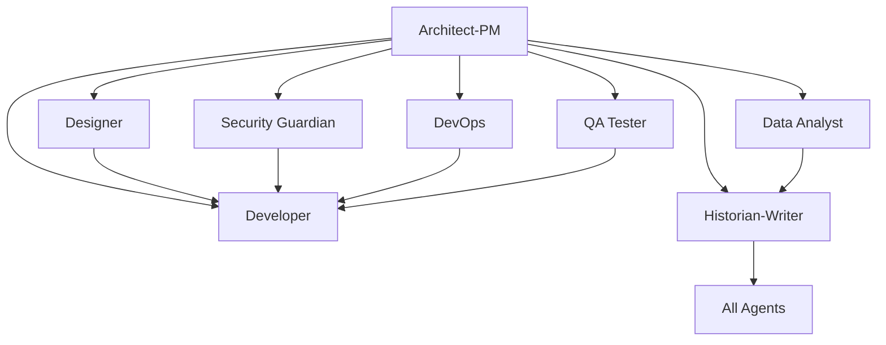

# Copilot Template - SG-1 Agentic Development System

**"Indeed. This development approach is... effective."** - *Teal'c*

A GitHub repository template featuring **Stargate SG-1** themed AI agents for structured, cross-functional development. Each agent represents a specialized role based on the iconic SG-1 team members, bringing their unique expertise and personality to your development workflow.

### 🔧 **Bootstrap Agent** (`000_agent.md`)
- **SPECIAL ROLE**: Repository initialization and agent customization
- Project-specific technology integration and context application
- Grounding document processing from `.github/Grounding/` directory
- Systematic update of ALL agent templates with project-specific information
- Technology stack analysis and agent template transformation

### 🎯 **Planner Agent** (`planner_agent.md`)ent Starter

**A comprehensive GitHub repository template designed for clean, organized development using specialized AI agents to break down complex development work into focused, manageable tasks.**

## 🎯 Repository Purpose

This template provides a structured approach to software development by leveraging specialized AI "agents" (roles) that can be targeted through GitHub Issues. Each agent represents a specific expertise area and responsibility within the development lifecycle, enabling:

- **Clear separation of concerns** across different development disciplines
- **Targeted task assignment** to appropriate specialists
- **Comprehensive documentation** and knowledge preservation
- **Structured workflows** for complex development projects
- **Collaborative development** with well-defined roles and responsibilities

## 🏗️ Architecture Overview

The repository implements an **Agentic Development Model** where different aspects of software development are handled by specialized agents, each with distinct capabilities and responsibilities:

### Core Development Agents

| Agent | Focus Area | Primary Responsibilities |
|-------|-----------|-------------------------|
| **Bootstrap Agent** | Repository Initialization | Project-specific agent customization, technology integration, grounding document processing |
| **Architect-PM** | Strategy & Planning | Requirements analysis, system design, risk assessment, roadmap planning |
| **Planner** | Project Coordination | Strategic project planning, resource coordination, sprint planning, dependency management |
| **Design Spec Writer** | Technical Specifications | Technical design documentation, API specifications, system integration specs |
| **User Story Writer** | Requirements Translation | Convert specs to user stories, implementation prioritization, backlog management |
| **Developer** | Implementation | Feature development, bug fixes, code refactoring, technical implementation |
## 🌌 SG-1 Themed Agent System

**"We came, we saw, we coded!"**

This template now features **Stargate SG-1** themed agent roles based on the elite four-person team that exemplifies perfect cross-functional collaboration. Each character archetype maps naturally to essential development roles:

| **SG-1 Character** | **Role Archetype** | **Development Responsibilities** |
|---|---|---|
| **Colonel Jack O'Neill** | Pragmatic Leader | Strategic planning, mission coordination, stakeholder management, operational leadership |
| **Dr. Samantha Carter** | Technical Architect | All technical implementation, system engineering, performance optimization, infrastructure |
| **Dr. Daniel Jackson** | Empathetic Advocate | User experience, cultural context, documentation, knowledge preservation |
| **Teal'c** | Quality Guardian | Security assessment, quality assurance, system reliability, disciplined testing |

*The original agent functionality remains unchanged - only the presentation is themed with lighthearted, office-appropriate character references.*

## 📋 Issue Templates System - The SG-1 Team

Each agent has dedicated GitHub Issue templates that provide structured workflows and comprehensive requirements gathering:

### 🎖️ **Colonel Jack O'Neill - Mission Planning** (`planner_agent.md`)
- Operational planning and mission coordination
- Resource deployment and capacity management  
- Threat assessment and dependency management with countermeasures
- Strategic coordination and tactical execution

### 🧪 **Dr. Samantha Carter - Technical Specifications** (`design_spec_writer_agent.md`)
- Technical design specifications and system documentation
- Engineering standards and interface documentation
- System architecture design and integration specifications
- Implementation guidelines and development standards

### 📖 **Dr. Daniel Jackson - User Story Advocate** (`user_story_writer_agent.md`)
- Convert technical specs into human-centered user stories
- User advocacy and cultural context analysis
- Requirements translation and empathy documentation
- User journey mapping with cultural considerations

### 🌍 **Dr. Daniel Jackson - User Experience Advocate** (`designer_agent.md`)
- User experience design through cultural understanding
- Accessibility advocacy and inclusive design
- User research and empathy mapping
- Cultural analysis and communication design

### ⚙️ **Dr. Samantha Carter - Technical Implementation** (3 specialized templates)

#### **Technical Implementation** (`developer_feature_implementation.md`)
- Complex technical solution development
- Scientific approach to feature implementation
- Performance optimization and system integration
- Technical research and prototype development

#### **Technical Debugging** (`developer_bug_fix.md`)
- Systematic malfunction investigation
- Root cause analysis with scientific methodology
- System repair and stability restoration
- Technical diagnostics and problem resolution

#### **System Optimization** (`developer_code_refactoring.md`)
- Code architecture improvement and performance enhancement
- Technical debt reduction and system efficiency
- Engineering optimization and maintainability enhancement  
- System redesign and architectural improvements

### 🎖️ **Colonel Jack O'Neill - Strategic Mission Commander** (`architect_product_manager.md`)
- Strategic mission planning and operational leadership
- Stakeholder management and objective setting
- Risk assessment and resource allocation
- Mission architecture and tactical coordination

### 🛡️ **Teal'c - Security Guardian** (`security_guardian_agent.md`)
- Security threat assessment based on deep knowledge of attack patterns
- Vulnerability analysis and defensive architecture
- Security protocol enforcement and incident response
- Threat intelligence and system protection strategies

### 🚀 **Dr. Samantha Carter - Infrastructure & Deployment** (`devops_engineer_agent.md`)
- Deployment automation and infrastructure engineering
- System resource management and operational optimization
- Performance monitoring and scalability engineering
- Infrastructure security and disaster recovery planning

### 🛡️ **Teal'c - Quality Assurance Guardian** (`qa_tester_agent.md`)
- Systematic quality validation and reliability testing
- Disciplined testing methodologies and failure analysis
- System resilience testing and quality standards enforcement
- Quality protocol establishment and validation processes

### 🧪 **Dr. Samantha Carter - Data Analysis & Performance** (`data_analyst_agent.md`)
- Technical performance analysis and system metrics monitoring
- Data-driven optimization insights and predictive analysis
- System efficiency analysis and performance recommendations
- Technical monitoring systems and alert implementation

### 📖 **Dr. Daniel Jackson - Documentation & Knowledge Preservation** (`historian_technical_writer.md`)
- Knowledge preservation and cultural documentation
- Multi-audience technical communication and context capture
- Institutional memory preservation and decision documentation
- Training materials and knowledge sharing facilitation

## 🎯 How to Use This Template

### 1. **Repository Setup**
```bash
# Create new repository from this template
gh repo create your-project --template SergeiGolos/copilot-template
cd your-project
```

### 2. **Project Initialization**
- Add project-specific context documents to `.github/Grounding/` directory
- Create a Bootstrap Agent issue (`000_agent.md`) to analyze and customize all agents
- Review and customize issue templates for your project's specific needs
- Set up labels and project boards to match the agent structure
- Configure branch protection rules and workflow requirements

### 3. **Agent-Based Development Workflow**

#### **Bootstrap Phase** (Repository Customization)
0. Create grounding documents in `.github/Grounding/` with your technology stack
1. Use `000_agent.md` template to bootstrap and customize all agents for your project
2. Validate that all agents now contain project-specific technology and context

#### **Planning Phase** (Architect-PM → Planner → Design Spec Writer → User Story Writer)
1. Create an issue using the `architect_product_manager.md` template for strategic planning
2. Use `planner_agent.md` for project coordination and resource planning
3. Apply `design_spec_writer_agent.md` for technical specifications
4. Utilize `user_story_writer_agent.md` to convert specs into prioritized user stories
5. Receive comprehensive system design, project roadmap, and implementation backlog

#### **Implementation Phase** (Specialized Agents)
1. **Design**: Use `designer_agent.md` for UI/UX requirements
2. **Development**: Use appropriate developer template (`feature_implementation.md`, `bug_fix.md`, or `code_refactoring.md`)
3. **Security**: Use `security_guardian_agent.md` for security analysis
4. **Infrastructure**: Use `devops_engineer_agent.md` for deployment needs
5. **Quality**: Use `qa_tester_agent.md` for testing strategy
6. **Analytics**: Use `data_analyst_agent.md` for metrics and analysis

#### **Documentation Phase** (Historian-Writer Agent)
1. Use `historian_technical_writer.md` for comprehensive documentation
2. Ensure knowledge preservation and decision context recording
3. Create user guides, API documentation, and maintenance procedures

### 4. **Collaborative Development**
- Each issue template includes collaboration guidelines with other agents
- Cross-agent dependencies are clearly defined
- Deliverables from each agent inform the work of others

## 🔄 Agent Collaboration Matrix

Each agent is designed to work collaboratively with others:



## 📊 Success Metrics & Quality Gates

### **Code Quality Standards**
- Comprehensive test coverage (80%+ for critical components)
- Security vulnerability assessment and resolution
- Performance benchmarks and optimization
- Accessibility compliance (WCAG AA minimum)
- Documentation completeness and accuracy

### **Process Metrics**
- Clear requirements and acceptance criteria definition
- Risk assessment and mitigation strategy implementation
- Cross-functional collaboration and knowledge sharing
- Continuous improvement and lessons learned documentation

## 🛠️ Template Customization

### **Adapting for Your Project**
1. **Modify Agent Templates**: Customize issue templates to match your technology stack and requirements
2. **Add Project-Specific Labels**: Create labels that align with your project's needs
3. **Configure Workflows**: Set up GitHub Actions or other automation to support the agent-based workflow
4. **Establish Team Guidelines**: Define how your team will use the agent system

### **Scaling Considerations**
- **Small Teams**: Individuals may wear multiple agent "hats"
- **Large Teams**: Dedicated specialists can own specific agent roles
- **Hybrid Approach**: Mix of dedicated specialists and cross-functional team members

## 📈 Benefits of the Agentic Approach

### **For Development Teams**
- **Clear Responsibilities**: Each agent has well-defined scope and deliverables
- **Reduced Cognitive Load**: Focus on specific expertise area without context switching
- **Improved Quality**: Specialized attention to each aspect of development
- **Better Documentation**: Built-in knowledge management and documentation practices

### **For Project Management**
- **Predictable Workflows**: Structured processes with clear inputs and outputs
- **Risk Mitigation**: Comprehensive risk assessment and security analysis
- **Quality Assurance**: Multiple quality gates and validation checkpoints
- **Stakeholder Communication**: Clear deliverables and status reporting

### **for Long-term Maintenance**
- **Knowledge Preservation**: Comprehensive documentation of decisions and context
- **Onboarding Efficiency**: Clear role definitions and process documentation
- **Consistency**: Standardized approaches across different project phases
- **Continuous Improvement**: Built-in retrospective and optimization processes

## 🚀 Getting Started Checklist

- [ ] **Create grounding documents** in `.github/Grounding/` with your project's technology stack
- [ ] **Run Bootstrap Agent** using `000_agent.md` to customize all agents for your project
- [ ] **Review all issue templates** and understand each agent's role
- [ ] **Validate agent customizations** ensure they reflect your project specifics
- [ ] **Set up project labels** to match agent categories
- [ ] **Configure branch protection** and review requirements
- [ ] **Create your first Architect-PM issue** to define project scope
- [ ] **Establish team guidelines** for using the agent system
- [ ] **Set up monitoring and analytics** for tracking success metrics

## 🤝 Contributing to the Template

This template is designed to evolve with best practices in agentic development:

1. **Fork the repository** and make improvements
2. **Share your customizations** and lessons learned
3. **Contribute back** successful patterns and workflows
4. **Report issues** and suggest enhancements

## 📚 Additional Resources

- **Issue Template Documentation**: Each template includes comprehensive guidance and examples
- **Agent Collaboration Guidelines**: Built into each template for cross-functional work
- **Success Criteria**: Clear metrics and validation approaches for each agent
- **Best Practices**: Accumulated wisdom from agentic development workflows

## 🏷️ Version Information

**Repository Version**: 1.0.0  
**Last Updated**: August 18, 2025  
**Template Maintenance**: Historian-Technical Writer Agent  
**Template Evolution**: Tracked through git history and documentation updates

---

**Ready to start your agentic development journey?** 

1. **First**: Add your project's technology stack to `.github/Grounding/` directory
2. **Second**: Create a Bootstrap Agent issue using `000_agent.md` to customize all agents
3. **Third**: Begin with creating your first issue using the `architect_product_manager.md` template to define your project's scope and technical architecture.

*This README was created by the Historian-Technical Writer Agent as part of the repository documentation and knowledge management responsibilities.*
