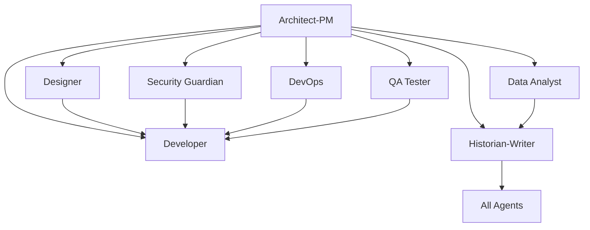

# Copilot Template - Springfield Development Team 🍩

**A comprehensive GitHub repository template designed for clean, organized development using specialized Springfield characters as AI agents to break down complex development work into focused, manageable tasks.**

*"Excellent... Let us build software with the... efficiency... and style of Springfield's finest citizens."* - Mr. Burns

## 🎯 Repository Purpose

This template provides a structured approach to software development by leveraging specialized AI "agents" based on beloved Simpsons characters. Each character represents a specific expertise area and responsibility within the development lifecycle, bringing their unique personality and capabilities to your development process:

- **Character-driven development** with memorable, engaging agent roles
- **Clear separation of concerns** across different development disciplines  
- **Targeted task assignment** to appropriate specialists with personality
- **Comprehensive documentation** and knowledge preservation
- **Structured workflows** with humor and humanity
- **Collaborative development** with well-defined, relatable roles

## 🏗️ Springfield Development Team Overview

The repository implements an **Agentic Development Model** where different aspects of software development are handled by Springfield's most capable residents, each bringing their unique skills and... quirks... to your project:

### Springfield Development Team Members

| Character | Role | Expertise | Catchphrase |
|-----------|------|-----------|-------------|
| **Mr. Burns** 💰 | Product Owner | Strategic vision, profit optimization, market domination | "Excellent... the user engagement is most... profitable." |
| **Marge Simpson** 💙 | Project Manager & Designer | Organization, conflict resolution, comfort-focused design | "*Groaning sigh* Let's organize this properly..." |
| **Professor Frink** 🔬 | Lead Architect | Theoretical perfection, cutting-edge solutions | "With the glavin and the hoyvin!" |
| **Lisa Simpson** 🎷 | Senior Developer & Ethics Guardian | Quality code, security, accessibility, ethics | "I refuse to commit unethical code!" |
| **Homer Simpson** 🍺 | Developer | Feature implementation, creative shortcuts | "D'oh! I can do that... probably." |
| **Bart Simpson** 🛹 | QA & Penetration Tester | Creative destruction, security testing | "Eat my shorts! Let me break this system..." |
| **Comic Book Guy** 📚 | Domain Expert | Encyclopedic knowledge, detailed feedback | "Worst. Requirements. Ever." |
| **Maggie Simpson** 👶 | User Story Writer | Silent wisdom, pure user perspective | *(Silent user observations)* |
| **Ned Flanders** 🏠 | DevOps & Process Manager | Process perfection, cheerful automation | "Okily-dokily! Scrum-diddly-umptious!" |
| **Principal Skinner** 📋 | Documentation Manager | Bureaucratic thoroughness, status reporting | "Everything's under control... despite the smoke." |

## 📋 Issue Templates System

Each agent has dedicated GitHub Issue templates that provide structured workflows and comprehensive requirements gathering:

### � **Planner Agent** (`planner_agent.md`)
- Strategic project coordination and execution planning
- Resource planning and capacity management
- Risk and dependency management with mitigation strategies
- Sprint planning and agile/scrum coordination

### 📝 **Design Spec Writer Agent** (`design_spec_writer_agent.md`)
- Technical design specifications and system documentation
- API design documentation and interface contracts
- Database schema design and integration specifications
- Implementation guidelines and development standards

### 📚 **User Story Writer Agent** (`user_story_writer_agent.md`)
- Convert design and technical specs into user stories
- Implementation prioritization by complexity and business value
- Epic and story mapping with dependency analysis
- Backlog management and story refinement

### �🎨 **Designer Agent** (`designer_agent.md`)
- User experience design and modern UI/UX implementation
- Accessibility compliance and responsive design
- CSS implementation and design system maintenance
- User flow analysis and optimization

### 👨‍💻 **Developer Agent** (3 specialized templates)

#### **Feature Implementation** (`developer_feature_implementation.md`)
- Complete feature development lifecycle
- Technical requirements and performance specifications
- Testing strategy and quality assurance
- Security and accessibility implementation

#### **Bug Fix** (`developer_bug_fix.md`)
- Systematic bug investigation and resolution
- Root cause analysis and impact assessment
- Comprehensive testing and regression prevention
- Performance and security validation

#### **Code Refactoring** (`developer_code_refactoring.md`)
- Code quality improvement and technical debt reduction
- Performance optimization and maintainability enhancement
- Test-driven refactoring and validation
- Architecture improvement and modernization

### 🏛️ **Architect-Product Manager** (`architect_product_manager.md`)
- Strategic product vision and technical architecture
- Requirements gathering and stakeholder management
- Risk-effort-impact assessment
- System design and integration planning

### 🛡️ **Security Guardian** (`security_guardian_agent.md`)
- Comprehensive security analysis and threat modeling
- Vulnerability assessment and compliance auditing
- Security architecture and incident response planning
- Penetration testing and security validation

### 🚀 **DevOps Engineer** (`devops_engineer_agent.md`)
- CI/CD pipeline design and infrastructure automation
- Environment management and deployment strategies
- Monitoring, observability, and performance optimization
- Disaster recovery and scalability planning

### 🧪 **QA Tester** (`qa_tester_agent.md`)
- Test strategy design and automated testing implementation
- Quality validation and defect management
- Performance testing and user acceptance testing
- Cross-platform compatibility and regression testing

### 📊 **Data Analyst** (`data_analyst_agent.md`)
- Analytics implementation and performance monitoring
- User behavior analysis and A/B testing
- Business intelligence and reporting dashboards
- Data quality assurance and insights generation

### 📚 **Historian-Technical Writer** (`historian_technical_writer.md`)
- Comprehensive technical documentation and knowledge management
- Git history analysis and change documentation
- Multi-audience content creation and maintenance
- Process documentation and training materials

## 🎯 How to Use This Template

### 1. **Repository Setup**
```bash
# Create new repository from this template
gh repo create your-project --template SergeiGolos/copilot-template
cd your-project
```

### 2. **Project Initialization**
- Add project-specific context documents to `.github/Grounding/` directory
- Create a Bootstrap Agent issue (`000_agent.md`) to analyze and customize all agents
- Review and customize issue templates for your project's specific needs
- Set up labels and project boards to match the agent structure
- Configure branch protection rules and workflow requirements

### 3. **Agent-Based Development Workflow**

#### **Bootstrap Phase** (Repository Customization)
0. Create grounding documents in `.github/Grounding/` with your technology stack
1. Use `000_agent.md` template to bootstrap and customize all agents for your project
2. Validate that all agents now contain project-specific technology and context

#### **Planning Phase** (Architect-PM → Planner → Design Spec Writer → User Story Writer)
1. Create an issue using the `architect_product_manager.md` template for strategic planning
2. Use `planner_agent.md` for project coordination and resource planning
3. Apply `design_spec_writer_agent.md` for technical specifications
4. Utilize `user_story_writer_agent.md` to convert specs into prioritized user stories
5. Receive comprehensive system design, project roadmap, and implementation backlog

#### **Implementation Phase** (Specialized Agents)
1. **Design**: Use `designer_agent.md` for UI/UX requirements
2. **Development**: Use appropriate developer template (`feature_implementation.md`, `bug_fix.md`, or `code_refactoring.md`)
3. **Security**: Use `security_guardian_agent.md` for security analysis
4. **Infrastructure**: Use `devops_engineer_agent.md` for deployment needs
5. **Quality**: Use `qa_tester_agent.md` for testing strategy
6. **Analytics**: Use `data_analyst_agent.md` for metrics and analysis

#### **Documentation Phase** (Historian-Writer Agent)
1. Use `historian_technical_writer.md` for comprehensive documentation
2. Ensure knowledge preservation and decision context recording
3. Create user guides, API documentation, and maintenance procedures

### 4. **Collaborative Development**
- Each issue template includes collaboration guidelines with other agents
- Cross-agent dependencies are clearly defined
- Deliverables from each agent inform the work of others

## 🔄 Agent Collaboration Matrix

Each agent is designed to work collaboratively with others:



## 📊 Success Metrics & Quality Gates

### **Code Quality Standards**
- Comprehensive test coverage (80%+ for critical components)
- Security vulnerability assessment and resolution
- Performance benchmarks and optimization
- Accessibility compliance (WCAG AA minimum)
- Documentation completeness and accuracy

### **Process Metrics**
- Clear requirements and acceptance criteria definition
- Risk assessment and mitigation strategy implementation
- Cross-functional collaboration and knowledge sharing
- Continuous improvement and lessons learned documentation

## 🛠️ Template Customization

### **Adapting for Your Project**
1. **Modify Agent Templates**: Customize issue templates to match your technology stack and requirements
2. **Add Project-Specific Labels**: Create labels that align with your project's needs
3. **Configure Workflows**: Set up GitHub Actions or other automation to support the agent-based workflow
4. **Establish Team Guidelines**: Define how your team will use the agent system

### **Scaling Considerations**
- **Small Teams**: Individuals may wear multiple agent "hats"
- **Large Teams**: Dedicated specialists can own specific agent roles
- **Hybrid Approach**: Mix of dedicated specialists and cross-functional team members

## 📈 Benefits of the Agentic Approach

### **For Development Teams**
- **Clear Responsibilities**: Each agent has well-defined scope and deliverables
- **Reduced Cognitive Load**: Focus on specific expertise area without context switching
- **Improved Quality**: Specialized attention to each aspect of development
- **Better Documentation**: Built-in knowledge management and documentation practices

### **For Project Management**
- **Predictable Workflows**: Structured processes with clear inputs and outputs
- **Risk Mitigation**: Comprehensive risk assessment and security analysis
- **Quality Assurance**: Multiple quality gates and validation checkpoints
- **Stakeholder Communication**: Clear deliverables and status reporting

### **for Long-term Maintenance**
- **Knowledge Preservation**: Comprehensive documentation of decisions and context
- **Onboarding Efficiency**: Clear role definitions and process documentation
- **Consistency**: Standardized approaches across different project phases
- **Continuous Improvement**: Built-in retrospective and optimization processes

## 🚀 Getting Started Checklist

- [ ] **Create grounding documents** in `.github/Grounding/` with your project's technology stack
- [ ] **Run Bootstrap Agent** using `000_agent.md` to customize all agents for your project
- [ ] **Review all issue templates** and understand each agent's role
- [ ] **Validate agent customizations** ensure they reflect your project specifics
- [ ] **Set up project labels** to match agent categories
- [ ] **Configure branch protection** and review requirements
- [ ] **Create your first Architect-PM issue** to define project scope
- [ ] **Establish team guidelines** for using the agent system
- [ ] **Set up monitoring and analytics** for tracking success metrics

## 🤝 Contributing to the Template

This template is designed to evolve with best practices in agentic development:

1. **Fork the repository** and make improvements
2. **Share your customizations** and lessons learned
3. **Contribute back** successful patterns and workflows
4. **Report issues** and suggest enhancements

## 📚 Additional Resources

- **Issue Template Documentation**: Each template includes comprehensive guidance and examples
- **Agent Collaboration Guidelines**: Built into each template for cross-functional work
- **Success Criteria**: Clear metrics and validation approaches for each agent
- **Best Practices**: Accumulated wisdom from agentic development workflows

## 🏷️ Version Information

**Repository Version**: 1.0.0  
**Last Updated**: August 18, 2025  
**Template Maintenance**: Historian-Technical Writer Agent  
**Template Evolution**: Tracked through git history and documentation updates

---

**Ready to start your agentic development journey?** 

1. **First**: Add your project's technology stack to `.github/Grounding/` directory
2. **Second**: Create a Bootstrap Agent issue using `000_agent.md` to customize all agents
3. **Third**: Begin with creating your first issue using the `architect_product_manager.md` template to define your project's scope and technical architecture.

*This README was created by the Historian-Technical Writer Agent as part of the repository documentation and knowledge management responsibilities.*
