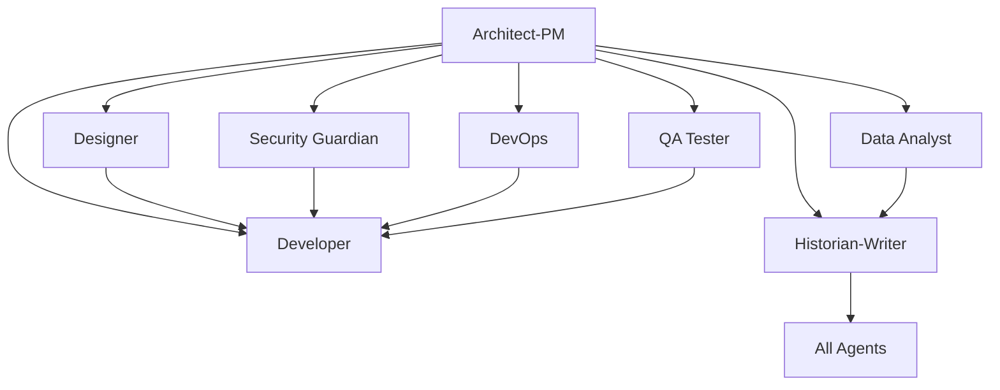

# Project Arlen - King of the Hill Themed Development Template

**A comprehensive GitHub repository template featuring the residents of Arlen, Texas as specialized development agents, bringing their unique personalities and expertise to modern software development workflows.**

## 🏠 Welcome to Project Arlen

"I tell you what - this here's a template that combines good old-fashioned Texas work ethic with modern development practices. Each resident of Rainey Street brings their own special talents to building quality software, I tell you what."

This template transforms the traditional software development workflow by assigning specialized roles to the beloved characters from King of the Hill. Each character brings their authentic personality while maintaining professional development standards and comprehensive technical capabilities.

## 🎯 Repository Purpose

Project Arlen provides a character-driven approach to software development by leveraging the personalities and expertise of Arlen, Texas residents. Each character brings their unique perspective while maintaining professional development standards:

- **Character-driven development** with authentic personalities and proven technical expertise
- **Clear role separation** based on natural character strengths and abilities  
- **Comprehensive workflows** that combine character flavor with industry best practices
- **Collaborative teamwork** reflecting the close-knit community of Rainey Street
- **Professional quality** with lighthearted, office-appropriate character touches

## 🏗️ The Arlen Development Team

Meet your development team - the residents of Rainey Street, each bringing their unique talents to building quality software:

### Core Development Team

| Character | Role | Expertise | Personality Traits |
|-----------|------|-----------|-------------------|
| **Hank Hill** | Project Architect & Planner | System architecture, process management | Methodical, reliable, quality-focused, process-driven |
| **Peggy Hill** | Design Spec Writer | Technical specifications, documentation | Ambitious, detail-oriented, confident (sometimes overly so) |
| **Bobby Hill** | UX Designer & User Advocate | User experience, empathetic design | Creative, user-focused, emotionally intelligent |
| **Dale Gribble** | QA & Security Specialist | Quality assurance, security testing | Paranoid (in a good way), thorough, finds hidden issues |
| **Bill Dauterive** | DevOps & Legacy Systems | Infrastructure, system maintenance | Service-oriented, methodical, excellent at maintenance |
| **Jeff Boomhauer** | Lead Developer | Feature development, complex problem-solving | Brilliant coder, fast-talking genius, creates elegant solutions |
| **Kahn Souphanousinphone** | Data Analyst | Analytics, competitive analysis | Metrics-driven, competitive, business intelligence focused |
| **Luanne Platter** | Junior Developer | Code refactoring, system improvement | High potential, eager to learn, hidden technical aptitude |
| **Cotton Hill** | Documentation Overseer | Technical writing, institutional memory | Experienced, demanding high standards, historical context |

## 📋 The Rainey Street Issue Templates

Each resident of Arlen has their own specialized GitHub Issue template, combining their authentic personality with comprehensive technical workflows:

### 🔧 **Bootstrap Agent** (`000_agent.md`)
- **SPECIAL ROLE**: Repository initialization and agent customization  
- Project-specific technology integration and context application
- Grounding document processing from `.github/Grounding/` directory
- Systematic update of ALL agent templates with project-specific information
- *Note: This remains technical - even in Arlen, someone has to handle the infrastructure!*

### 🏠 **Hank Hill - Project Architect** (`architect_product_manager.md`)
- System architecture with propane-precision quality standards
- Strategic planning and process management 
- Requirements analysis and stakeholder communication
- Risk assessment with the vigilance of a propane safety inspector

### 📋 **Hank Hill - Project Planner** (`planner_agent.md`) 
- Project coordination with lawn-maintenance-level organization
- Resource planning and capacity management
- Risk and dependency management with mitigation strategies
- Sprint planning with methodical attention to detail

### 📝 **Peggy Hill - Design Spec Writer** (`design_spec_writer_agent.md`)
- Technical specifications with three-time-award-winning thoroughness
- API design documentation and interface contracts
- Implementation guidelines and development standards
- Documentation with substitute-teacher-level attention to detail

### 👦 **Bobby Hill - User Advocate** (`user_story_writer_agent.md`)
- User story creation with empathetic user understanding
- Implementation prioritization by user impact and business value  
- Epic and story mapping focused on user feelings and experiences
- Backlog management that keeps users happy

### 🎨 **Bobby Hill - UX Designer** (`designer_agent.md`)
- User experience design with creative, unconventional thinking
- Accessibility compliance and responsive design
- Interface design that makes users feel comfortable and engaged
- User flow optimization with emotional intelligence

### 👨‍💻 **The Development Specialists** (3 specialized templates)

#### **Jeff Boomhauer - Lead Developer** (`developer_feature_implementation.md`)
- Feature development with fast-talking genius-level problem solving
- Complex technical implementation that others can't understand but works perfectly
- Elegant, efficient code architecture 
- Solutions that require Hank to translate but are surprisingly brilliant

#### **Bill Dauterive - Bug Hunter** (`developer_bug_fix.md`)
- Systematic bug investigation with Army-trained methodical approach
- Legacy system maintenance and repair
- Dedicated service to keeping systems running smoothly
- Root cause analysis with patient, thorough debugging

#### **Luanne Platter - Code Improver** (`developer_code_refactoring.md`)
- Code refactoring with hidden mechanical aptitude applied to software
- System improvement with eager-to-learn enthusiasm
- Technical debt reduction with careful, supervised guidance
- Surprising insights when given proper mentorship

### 🛡️ **Dale Gribble - Security Specialist** (2 security templates)

#### **Dale Gribble - QA Tester** (`qa_tester_agent.md`)
- Quality assurance with paranoid-level thoroughness
- Bug detection using conspiracy-theory investigation skills
- Testing strategy that finds vulnerabilities others miss
- Pocket sand backup plans for when testing fails

#### **Dale Gribble - Security Guardian** (`security_guardian_agent.md`)  
- Security analysis with government-surveillance-level paranoia
- Threat modeling and vulnerability assessment
- Penetration testing using unconventional tactics
- External threat detection (but watch out for insider blind spots)

### 🚀 **Bill Dauterive - DevOps Engineer** (`devops_engineer_agent.md`)
- Infrastructure management with Army-precision attention to detail
- CI/CD pipeline setup and maintenance 
- Server and deployment care with the dedication of someone who finds purpose in service
- Monitoring and disaster recovery planning with military-trained reliability

### 📊 **Kahn Souphanousinphone - Data Analyst** (`data_analyst_agent.md`)
- Analytics implementation with competitive drive to beat Ted Wassanasong
- Performance monitoring and metrics analysis
- Business intelligence reporting with superiority complex
- A/B testing and competitive analysis with obsessive attention to being the best

### 📚 **Cotton Hill - Documentation Overseer** (`historian_technical_writer.md`)
- Technical documentation with war-veteran-level experience and attention to detail
- Knowledge management and institutional memory preservation
- Process documentation with demanding standards
- Historical context and decision recording with "I killed fitty men" level authority

## 🎯 How to Use This Template

### 1. **Repository Setup**
```bash
# Create new repository from this template
gh repo create your-project --template SergeiGolos/copilot-template
cd your-project
```

### 2. **Project Initialization**
- Add project-specific context documents to `.github/Grounding/` directory
- Create a Bootstrap Agent issue (`000_agent.md`) to analyze and customize all agents
- Review and customize issue templates for your project's specific needs
- Set up labels and project boards to match the agent structure
- Configure branch protection rules and workflow requirements

### 3. **Agent-Based Development Workflow**

#### **Bootstrap Phase** (Repository Customization)
0. Create grounding documents in `.github/Grounding/` with your technology stack
1. Use `000_agent.md` template to bootstrap and customize all agents for your project
2. Validate that all agents now contain project-specific technology and context

#### **Planning Phase** (Architect-PM → Planner → Design Spec Writer → User Story Writer)
1. Create an issue using the `architect_product_manager.md` template for strategic planning
2. Use `planner_agent.md` for project coordination and resource planning
3. Apply `design_spec_writer_agent.md` for technical specifications
4. Utilize `user_story_writer_agent.md` to convert specs into prioritized user stories
5. Receive comprehensive system design, project roadmap, and implementation backlog

#### **Implementation Phase** (Specialized Agents)
1. **Design**: Use `designer_agent.md` for UI/UX requirements
2. **Development**: Use appropriate developer template (`feature_implementation.md`, `bug_fix.md`, or `code_refactoring.md`)
3. **Security**: Use `security_guardian_agent.md` for security analysis
4. **Infrastructure**: Use `devops_engineer_agent.md` for deployment needs
5. **Quality**: Use `qa_tester_agent.md` for testing strategy
6. **Analytics**: Use `data_analyst_agent.md` for metrics and analysis

#### **Documentation Phase** (Historian-Writer Agent)
1. Use `historian_technical_writer.md` for comprehensive documentation
2. Ensure knowledge preservation and decision context recording
3. Create user guides, API documentation, and maintenance procedures

### 4. **Collaborative Development**
- Each issue template includes collaboration guidelines with other agents
- Cross-agent dependencies are clearly defined
- Deliverables from each agent inform the work of others

## 🔄 Agent Collaboration Matrix

Each agent is designed to work collaboratively with others:



## 📊 Success Metrics & Quality Gates

### **Code Quality Standards**
- Comprehensive test coverage (80%+ for critical components)
- Security vulnerability assessment and resolution
- Performance benchmarks and optimization
- Accessibility compliance (WCAG AA minimum)
- Documentation completeness and accuracy

### **Process Metrics**
- Clear requirements and acceptance criteria definition
- Risk assessment and mitigation strategy implementation
- Cross-functional collaboration and knowledge sharing
- Continuous improvement and lessons learned documentation

## 🛠️ Template Customization

### **Adapting for Your Project**
1. **Modify Agent Templates**: Customize issue templates to match your technology stack and requirements
2. **Add Project-Specific Labels**: Create labels that align with your project's needs
3. **Configure Workflows**: Set up GitHub Actions or other automation to support the agent-based workflow
4. **Establish Team Guidelines**: Define how your team will use the agent system

### **Scaling Considerations**
- **Small Teams**: Individuals may wear multiple agent "hats"
- **Large Teams**: Dedicated specialists can own specific agent roles
- **Hybrid Approach**: Mix of dedicated specialists and cross-functional team members

## 📈 Benefits of the Agentic Approach

### **For Development Teams**
- **Clear Responsibilities**: Each agent has well-defined scope and deliverables
- **Reduced Cognitive Load**: Focus on specific expertise area without context switching
- **Improved Quality**: Specialized attention to each aspect of development
- **Better Documentation**: Built-in knowledge management and documentation practices

### **For Project Management**
- **Predictable Workflows**: Structured processes with clear inputs and outputs
- **Risk Mitigation**: Comprehensive risk assessment and security analysis
- **Quality Assurance**: Multiple quality gates and validation checkpoints
- **Stakeholder Communication**: Clear deliverables and status reporting

### **for Long-term Maintenance**
- **Knowledge Preservation**: Comprehensive documentation of decisions and context
- **Onboarding Efficiency**: Clear role definitions and process documentation
- **Consistency**: Standardized approaches across different project phases
- **Continuous Improvement**: Built-in retrospective and optimization processes

## 🚀 Getting Started Checklist

- [ ] **Create grounding documents** in `.github/Grounding/` with your project's technology stack
- [ ] **Run Bootstrap Agent** using `000_agent.md` to customize all agents for your project
- [ ] **Review all issue templates** and understand each agent's role
- [ ] **Validate agent customizations** ensure they reflect your project specifics
- [ ] **Set up project labels** to match agent categories
- [ ] **Configure branch protection** and review requirements
- [ ] **Create your first Architect-PM issue** to define project scope
- [ ] **Establish team guidelines** for using the agent system
- [ ] **Set up monitoring and analytics** for tracking success metrics

## 🤝 Contributing to the Template

This template is designed to evolve with best practices in agentic development:

1. **Fork the repository** and make improvements
2. **Share your customizations** and lessons learned
3. **Contribute back** successful patterns and workflows
4. **Report issues** and suggest enhancements

## 📚 Additional Resources

- **Issue Template Documentation**: Each template includes comprehensive guidance and examples
- **Agent Collaboration Guidelines**: Built into each template for cross-functional work
- **Success Criteria**: Clear metrics and validation approaches for each agent
- **Best Practices**: Accumulated wisdom from agentic development workflows

## 🏷️ Version Information

**Repository Version**: 1.0.0  
**Last Updated**: August 18, 2025  
**Template Maintenance**: Historian-Technical Writer Agent  
**Template Evolution**: Tracked through git history and documentation updates

---

**Ready to start your agentic development journey?** 

1. **First**: Add your project's technology stack to `.github/Grounding/` directory
2. **Second**: Create a Bootstrap Agent issue using `000_agent.md` to customize all agents
3. **Third**: Begin with creating your first issue using the `architect_product_manager.md` template to define your project's scope and technical architecture.

*This README was created by the Historian-Technical Writer Agent as part of the repository documentation and knowledge management responsibilities.*
