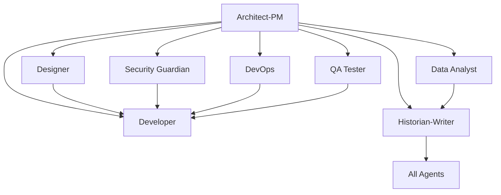

# Copilot Template - Agentic Development ⭐ Star Trek Enterprise Edition

**A comprehensive GitHub repository template designed for clean, organized development using specialized AI agents themed around the crew and systems of Enterprise NX-01 🚀**

*"Space: the final frontier. These are the development workflows of the starship Enterprise..."*

## 🎯 Repository Purpose

This template provides a structured approach to software development by leveraging specialized AI "agents" (roles) that can be targeted through GitHub Issues. Each agent represents a specific expertise area and responsibility within the development lifecycle, now themed around the iconic characters and systems of Star Trek Enterprise, enabling:

- **Clear separation of concerns** across different development disciplines (like specialized crew roles)
- **Targeted task assignment** to appropriate specialists (each with their unique personality and expertise)
- **Comprehensive documentation** and knowledge preservation (maintained by Ship's Computer)
- **Structured workflows** for complex development projects (coordinated by the Bridge crew)
- **Collaborative development** with well-defined roles and responsibilities (like a well-functioning starship)
- **Targeted task assignment** to appropriate specialists
- **Comprehensive documentation** and knowledge preservation
- **Structured workflows** for complex development projects
- **Collaborative development** with well-defined roles and responsibilities

## 🏗️ Architecture Overview

The repository implements an **Agentic Development Model** where different aspects of software development are handled by specialized agents, each with distinct capabilities and responsibilities:

### Core Development Agents

| Agent | Focus Area | Primary Responsibilities |
|-------|-----------|-------------------------|
| **Bootstrap Agent** | Repository Initialization | Project-specific agent customization, technology integration, grounding document processing |
| **Architect-PM** | Strategy & Planning | Requirements analysis, system design, risk assessment, roadmap planning |
| **Planner** | Project Coordination | Strategic project planning, resource coordination, sprint planning, dependency management |
| **Design Spec Writer** | Technical Specifications | Technical design documentation, API specifications, system integration specs |
| **User Story Writer** | Requirements Translation | Convert specs to user stories, implementation prioritization, backlog management |
| **Developer** | Implementation | Feature development, bug fixes, code refactoring, technical implementation |
| **Designer** | User Experience | UI/UX design, accessibility, responsive design, user interaction patterns |
| **Security Guardian** | Cybersecurity | Security analysis, vulnerability assessment, compliance, threat modeling |
| **DevOps Engineer** | Infrastructure | CI/CD pipelines, deployment automation, monitoring, infrastructure management |
| **QA Tester** | Quality Assurance | Testing strategy, automated testing, bug detection, quality validation |
| **Data Analyst** | Analytics & Insights | Performance analysis, user behavior analytics, A/B testing, reporting |
| **Historian-Writer** | Documentation | Technical documentation, knowledge management, process documentation |

## 🔧 Special Bootstrap Agent

### **Bootstrap Agent** (`000_agent.md`) - Unchanged
- **SPECIAL ROLE**: Repository initialization and agent customization  
- Project-specific technology integration and context application
- Grounding document processing from `.github/Grounding/` directory
- Systematic update of ALL agent templates with project-specific information
- Technology stack analysis and agent template transformation
- *Note: This agent maintains its original technical focus and is not themed*

## 📋 Issue Templates System - Star Trek Enterprise Themed

Each specialized role is now themed around the crew and systems of Enterprise NX-01, bringing personality and character to your development workflow while maintaining all technical functionality:

### 🚀 **Captain Archer - Strategic Vision & Architecture** (`architect_product_manager.md`)
- Strategic product vision and technical architecture leadership
- Requirements gathering and stakeholder management (balancing competing interests)
- Risk-effort-impact assessment and mission planning
- System design and integration planning with bold exploration mindset

### 🖖 **Sub-commander T'Pol - Logical Planning & Process** (`planner_agent.md`)
- Systematic project coordination and logical execution planning
- Data-driven resource planning and capacity management
- Risk analysis and dependency management with statistical precision
- Sprint planning and process frameworks with methodical approach

### 🔧 **Commander Tucker - Feature Engineering** (`developer_feature_implementation.md`)
- Hands-on feature development with Southern engineering charm
- Technical implementation with intuitive problem-solving
- Testing strategy and quality assurance with practical experience
- Engineering solutions that "just work" under any conditions

### 🛡️ **Lieutenant Reed - Security & Quality Assurance** (`security_guardian_agent.md`)
- Comprehensive security analysis with military precision
- Tactical threat assessment and vulnerability management
- Protocol adherence and systematic quality validation
- Defense systems and compliance with "Tactical Alert" rigor

### 🌐 **Ensign Sato - UI/UX & Communication Design** (`designer_agent.md`)
- User experience design with linguistic and cultural sensitivity
- Interface communication and accessibility across diverse users
- User research and empathetic design practices
- Translation of complex systems into understandable interfaces

### 🚀 **Ensign Mayweather - Navigation & Bug Resolution** (`developer_bug_fix.md`)
- Frontend troubleshooting with instinctive system knowledge
- Navigation issue resolution and user journey debugging
- Systematic bug investigation with practical "boomer" experience
- Performance optimization with quiet, competent efficiency

### 🏥 **Dr. Phlox - Diagnostic Testing & System Health** (`qa_tester_agent.md`)
- Comprehensive system diagnostics with medical thoroughness
- Quality validation and systematic health assessment
- Performance testing and stress condition validation
- Preventive care and ongoing system health monitoring

### 📡 **Ship's Sensors - Data Analysis & Performance Metrics** (`data_analyst_agent.md`)
- Advanced data pattern detection and analysis
- Performance monitoring with sensor array precision
- User behavior insights and system intelligence reports
- Comprehensive metrics collection and trend analysis

### 💾 **Ship's Computer - Knowledge Archives & Mission Logs** (`historian_technical_writer.md`)
- Comprehensive documentation with perfect knowledge preservation
- Technical specifications and operational procedures
- Mission log maintenance and historical record keeping
- Multi-audience content creation with systematic organization

### ⚙️ **Engineering Systems - Infrastructure & Operations** (`devops_engineer_agent.md`)
- Infrastructure management with engineering system reliability
- Deployment automation and operational excellence
- Environment management from development to production
- System optimization and performance engineering

### 🔧 **Engineering Maintenance - System Optimization** (`developer_code_refactoring.md`)
- Code refactoring with mechanical precision and care
- Technical debt reduction and performance optimization
- System maintenance with engineering best practices
- Long-term codebase health and sustainability

### 📐 **Technical Specifications - Engineering Blueprints** (`design_spec_writer_agent.md`)
- Detailed technical specifications with blueprint precision
- API design documentation and interface contracts
- System integration specifications and implementation guides
- Engineering documentation with starship-quality accuracy

### 📋 **Mission Briefings - Operational Requirements** (`user_story_writer_agent.md`)
- Requirements translation with mission briefing clarity
- Implementation prioritization and task organization
- Epic and story mapping with operational precision
- Backlog management and mission objective refinement

## 🎯 How to Use This Template

### 1. **Repository Setup**
```bash
# Create new repository from this template
gh repo create your-project --template SergeiGolos/copilot-template
cd your-project
```

### 2. **Project Initialization**
- Add project-specific context documents to `.github/Grounding/` directory
- Create a Bootstrap Agent issue (`000_agent.md`) to analyze and customize all agents
- Review and customize issue templates for your project's specific needs
- Set up labels and project boards to match the agent structure
- Configure branch protection rules and workflow requirements

### 3. **Agent-Based Development Workflow**

#### **Bootstrap Phase** (Repository Customization)
0. Create grounding documents in `.github/Grounding/` with your technology stack
1. Use `000_agent.md` template to bootstrap and customize all agents for your project
2. Validate that all agents now contain project-specific technology and context

#### **Planning Phase** (Architect-PM → Planner → Design Spec Writer → User Story Writer)
1. Create an issue using the `architect_product_manager.md` template for strategic planning
2. Use `planner_agent.md` for project coordination and resource planning
3. Apply `design_spec_writer_agent.md` for technical specifications
4. Utilize `user_story_writer_agent.md` to convert specs into prioritized user stories
5. Receive comprehensive system design, project roadmap, and implementation backlog

#### **Implementation Phase** (Specialized Agents)
1. **Design**: Use `designer_agent.md` for UI/UX requirements
2. **Development**: Use appropriate developer template (`feature_implementation.md`, `bug_fix.md`, or `code_refactoring.md`)
3. **Security**: Use `security_guardian_agent.md` for security analysis
4. **Infrastructure**: Use `devops_engineer_agent.md` for deployment needs
5. **Quality**: Use `qa_tester_agent.md` for testing strategy
6. **Analytics**: Use `data_analyst_agent.md` for metrics and analysis

#### **Documentation Phase** (Historian-Writer Agent)
1. Use `historian_technical_writer.md` for comprehensive documentation
2. Ensure knowledge preservation and decision context recording
3. Create user guides, API documentation, and maintenance procedures

### 4. **Collaborative Development**
- Each issue template includes collaboration guidelines with other agents
- Cross-agent dependencies are clearly defined
- Deliverables from each agent inform the work of others

## 🔄 Agent Collaboration Matrix

Each agent is designed to work collaboratively with others:



## 📊 Success Metrics & Quality Gates

### **Code Quality Standards**
- Comprehensive test coverage (80%+ for critical components)
- Security vulnerability assessment and resolution
- Performance benchmarks and optimization
- Accessibility compliance (WCAG AA minimum)
- Documentation completeness and accuracy

### **Process Metrics**
- Clear requirements and acceptance criteria definition
- Risk assessment and mitigation strategy implementation
- Cross-functional collaboration and knowledge sharing
- Continuous improvement and lessons learned documentation

## 🛠️ Template Customization

### **Adapting for Your Project**
1. **Modify Agent Templates**: Customize issue templates to match your technology stack and requirements
2. **Add Project-Specific Labels**: Create labels that align with your project's needs
3. **Configure Workflows**: Set up GitHub Actions or other automation to support the agent-based workflow
4. **Establish Team Guidelines**: Define how your team will use the agent system

### **Scaling Considerations**
- **Small Teams**: Individuals may wear multiple agent "hats"
- **Large Teams**: Dedicated specialists can own specific agent roles
- **Hybrid Approach**: Mix of dedicated specialists and cross-functional team members

## 📈 Benefits of the Agentic Approach

### **For Development Teams**
- **Clear Responsibilities**: Each agent has well-defined scope and deliverables
- **Reduced Cognitive Load**: Focus on specific expertise area without context switching
- **Improved Quality**: Specialized attention to each aspect of development
- **Better Documentation**: Built-in knowledge management and documentation practices

### **For Project Management**
- **Predictable Workflows**: Structured processes with clear inputs and outputs
- **Risk Mitigation**: Comprehensive risk assessment and security analysis
- **Quality Assurance**: Multiple quality gates and validation checkpoints
- **Stakeholder Communication**: Clear deliverables and status reporting

### **for Long-term Maintenance**
- **Knowledge Preservation**: Comprehensive documentation of decisions and context
- **Onboarding Efficiency**: Clear role definitions and process documentation
- **Consistency**: Standardized approaches across different project phases
- **Continuous Improvement**: Built-in retrospective and optimization processes

## 🚀 Getting Started Checklist

- [ ] **Create grounding documents** in `.github/Grounding/` with your project's technology stack
- [ ] **Run Bootstrap Agent** using `000_agent.md` to customize all agents for your project
- [ ] **Review all issue templates** and understand each agent's role
- [ ] **Validate agent customizations** ensure they reflect your project specifics
- [ ] **Set up project labels** to match agent categories
- [ ] **Configure branch protection** and review requirements
- [ ] **Create your first Architect-PM issue** to define project scope
- [ ] **Establish team guidelines** for using the agent system
- [ ] **Set up monitoring and analytics** for tracking success metrics

## 🤝 Contributing to the Template

This template is designed to evolve with best practices in agentic development:

1. **Fork the repository** and make improvements
2. **Share your customizations** and lessons learned
3. **Contribute back** successful patterns and workflows
4. **Report issues** and suggest enhancements

## 📚 Additional Resources

- **Issue Template Documentation**: Each template includes comprehensive guidance and examples
- **Agent Collaboration Guidelines**: Built into each template for cross-functional work
- **Success Criteria**: Clear metrics and validation approaches for each agent
- **Best Practices**: Accumulated wisdom from agentic development workflows

## 🏷️ Version Information

**Repository Version**: 1.0.0  
**Last Updated**: August 18, 2025  
**Template Maintenance**: Historian-Technical Writer Agent  
**Template Evolution**: Tracked through git history and documentation updates

---

**Ready to start your agentic development journey?** 

1. **First**: Add your project's technology stack to `.github/Grounding/` directory
2. **Second**: Create a Bootstrap Agent issue using `000_agent.md` to customize all agents
3. **Third**: Begin with creating your first issue using the `architect_product_manager.md` template to define your project's scope and technical architecture.

*This README was created by the Historian-Technical Writer Agent as part of the repository documentation and knowledge management responsibilities.*
