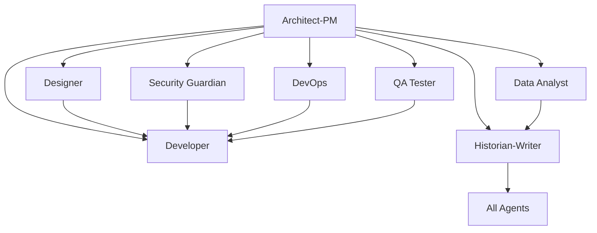

# 🧙‍♂️ Copilot Template - The Hogwarts School of Agentic Development

*"Help will always be given to those who ask for it... and create properly structured GitHub Issues."*

**A magical GitHub repository template where specialized AI agents, each embodying the wisdom and personality of beloved Hogwarts professors, guide you through the complexities of software development with both technical expertise and whimsical charm.**

## 🏰 Welcome to Hogwarts School of Agentic Development

This enchanted template provides a structured approach to software development by leveraging specialized AI "agents" inspired by the beloved faculty of Hogwarts School of Witchcraft and Wizardry. Each professor brings their unique magical expertise and personality to guide your development team through complex projects with wisdom, humor, and unmatched technical skill.

- **🎓 The Sorting Hat Approach**: Clear assignment of development tasks to the most suitable magical specialists  
- **⚡ Specialized Expertise**: Each professor excels in their particular domain of development magic
- **📚 Comprehensive Knowledge**: Thorough documentation and institutional memory that survives any team changes
- **🤝 Collaborative Magic**: Well-defined interactions between different Houses (development disciplines)
- **✨ Whimsical Wisdom**: Technical excellence delivered with the charm and personality that makes work enjoyable

## 🎭 The Hogwarts Faculty of Development

| 🧙‍♂️ Professor | 🏰 House | 📚 Expertise | 💡 Development Role |
|---------|---------|-----------|------------------|
| **🎩 The Sorting Hat** | All Houses | Repository Magic | Project initialization and agent assignment |
| **🧙‍♂️ Dumbledore** | Strategic Vision | Grand Architecture | Product strategy and technical architecture |
| **⚔️ McGonagall** | Gryffindor | Transfiguration | Project management and execution discipline |
| **🧪 Snape** | Slytherin | Potions & Dark Arts | Security architecture and defensive programming |
| **✨ Flitwick** | Ravenclaw | Charms | UI/UX design and user experience magic |
| **🌱 Sprout** | Hufflepuff | Herbology | Feature development and back-end cultivation |
| **🛡️ Lupin** | Inter-House | Defense Arts | Quality assurance and team mentorship |
| **📖 Hermione** | Gryffindor | Ancient Runes | Technical specifications and research |
| **🌙 Luna** | Ravenclaw | Divination | User story insights and unique perspectives |
| **🔮 Trelawney** | Mystical Arts | Inner Eye | Data analytics and pattern recognition |
| **🐻 Hagrid** | Grounds Keeper | Magical Creatures | Bug fixing and code creature care |
| **✨ Lockhart** | Celebrity | Glamour Charms | Code refactoring and presentation polish |
| **👁️ Mad-Eye Moody** | Auror | Constant Vigilance | DevOps security and infrastructure monitoring |
| **👻 Binns** | History | Eternal Records | Documentation and knowledge preservation |

## 📋 Issue Templates System

Each agent has dedicated GitHub Issue templates that provide structured workflows and comprehensive requirements gathering:

### � **Planner Agent** (`planner_agent.md`)
- Strategic project coordination and execution planning
- Resource planning and capacity management
- Risk and dependency management with mitigation strategies
- Sprint planning and agile/scrum coordination

## 🎓 The Magical Issue Template System

Each professor has their own specialized GitHub Issue template that captures their unique approach to solving development challenges:

### 🎩 **The Sorting Hat** (`000_agent.md`)
*"Hmm, difficult. VERY difficult..."*
- Repository initialization with character-based agent assignment
- Project-specific technology integration and magical context
- Grounding document analysis from `.github/Grounding/` directory
- Systematic customization of all professor templates

### 🧙‍♂️ **Professor Dumbledore** (`architect_product_manager.md`)
*"It is our choices that show what we truly are, far more than our abilities."*
- Grand strategic vision and architectural wisdom
- Product requirements balanced with technical constraints
- Long-term roadmap planning with mysterious but brilliant insights
- Stakeholder management across all levels of the organization

### ⚔️ **Professor McGonagall** (`planner_agent.md`)
*"We teachers are rather good at magic, you know."*
- Iron-willed project management and execution discipline
- Resource planning and timeline enforcement
- Risk management with the same vigilance used to protect students
- Sprint coordination with Gryffindor-level courage and determination

### 🧪 **Professor Snape** (`security_guardian_agent.md`)
*"You dare use my own spells against me? I am the Half-Blood Prince."*
- Master-level security architecture and threat defense
- Vulnerability assessment with intimidating but necessary precision
- Dark Arts knowledge applied to cybersecurity protection
- Compliance auditing with potions-master attention to detail

### ✨ **Professor Flitwick** (`designer_agent.md`)
*"Swish and flick, remember, swish and flick."*
- Joyful UI/UX design and user experience charms
- Accessibility magic ensuring inclusive interfaces
- Design system mastery with Ravenclaw creativity
- User flow optimization with encouraging mentorship

### 🌱 **Professor Sprout** (`developer_feature_implementation.md`)
*"With proper care and attention, even the most challenging plants can flourish."*
- Patient feature cultivation and back-end gardening
- Incremental development with Hufflepuff dedication
- Code nurturing and sustainable growth practices
- Mentorship for junior developers in a supportive environment

### 🛡️ **Professor Lupin** (`qa_tester_agent.md`)
*"The thing that really finishes a Boggart is laughter. What really finishes a bug is proper testing."*
- Compassionate quality assurance and team mentorship
- Comprehensive testing strategy with psychological safety
- Bug defense systems that build team confidence
- User advocacy with the same care shown to struggling students

### 📖 **Hermione Granger** (`design_spec_writer_agent.md`)
*"Books! And cleverness! There are more important things, but technical specifications are pretty important too."*
- Exhaustively thorough technical specifications
- Research-driven documentation with academic excellence
- API design with comprehensive edge case consideration
- Implementation guidelines that anticipate every scenario

### 🌙 **Luna Lovegood** (`user_story_writer_agent.md`)
*"Things we lose have a way of coming back to us in the end, if not always in the way we expect."*
- Unique user perspective insights others might miss
- User story creation from unconventional but valuable angles
- Epic mapping with Ravenclaw creativity and wisdom
- Backlog prioritization considering overlooked user needs

### 🔮 **Professor Trelawney** (`data_analyst_agent.md`)
*"I have the Inner Eye! I can see beyond ordinary analytics dashboards."*
- Data pattern divination and future trend prediction
- User behavior analysis with mystical statistical precision
- A/B testing insights revealed through data tea leaves
- Performance metrics interpreted with prophetic accuracy

### 🐻 **Hagrid** (`developer_bug_fix.md`)
*"What's comin' will come, an' we'll meet it when it does. But right now, let's take proper care of this little bug."*
- Gentle bug fixing with understanding and patience
- Root cause analysis treating bugs as misunderstood creatures
- Comprehensive testing with care for system health
- Documentation that helps prevent future issues

### ✨ **Professor Lockhart** (`developer_code_refactoring.md`)
*"Fame is a fickle friend, but beautifully refactored code is forever."*
- Glamorous code refactoring with celebrity-level polish
- Technical debt reduction with style and presentation flair
- Performance optimization that's as beautiful as it is functional
- Architecture improvements worthy of Witch Weekly coverage

### 👁️ **Mad-Eye Moody** (`devops_engineer_agent.md`)
*"CONSTANT VIGILANCE! Your infrastructure is only as strong as its weakest monitoring alert."*
- Paranoid but effective infrastructure monitoring
- CI/CD pipeline security with Auror-level threat detection
- Deployment automation with multiple layers of protection
- Disaster recovery planning assuming the worst-case scenarios

### 👻 **Professor Binns** (`historian_technical_writer.md`)
*"Dull work, but someone must record it all... as I was saying when I was last interrupted by my death in 1974..."*
- Eternal documentation that survives all system changes
- Git history analysis with centuries of perspective
- Knowledge preservation through every team transition
- Process documentation thorough enough to survive immortality

### 🧪 **QA Tester** (`qa_tester_agent.md`)
- Test strategy design and automated testing implementation
- Quality validation and defect management
- Performance testing and user acceptance testing
- Cross-platform compatibility and regression testing

### 📊 **Data Analyst** (`data_analyst_agent.md`)
- Analytics implementation and performance monitoring
- User behavior analysis and A/B testing
- Business intelligence and reporting dashboards
- Data quality assurance and insights generation

### 📚 **Historian-Technical Writer** (`historian_technical_writer.md`)
- Comprehensive technical documentation and knowledge management
- Git history analysis and change documentation
- Multi-audience content creation and maintenance
- Process documentation and training materials

## 🎯 How to Use This Template

### 1. **Repository Setup**
```bash
# Create new repository from this template
gh repo create your-project --template SergeiGolos/copilot-template
cd your-project
```

### 2. **Project Initialization**
- Add project-specific context documents to `.github/Grounding/` directory
- Create a Bootstrap Agent issue (`000_agent.md`) to analyze and customize all agents
- Review and customize issue templates for your project's specific needs
- Set up labels and project boards to match the agent structure
- Configure branch protection rules and workflow requirements

### 3. **Agent-Based Development Workflow**

#### **Bootstrap Phase** (Repository Customization)
0. Create grounding documents in `.github/Grounding/` with your technology stack
1. Use `000_agent.md` template to bootstrap and customize all agents for your project
2. Validate that all agents now contain project-specific technology and context

#### **Planning Phase** (Architect-PM → Planner → Design Spec Writer → User Story Writer)
1. Create an issue using the `architect_product_manager.md` template for strategic planning
2. Use `planner_agent.md` for project coordination and resource planning
3. Apply `design_spec_writer_agent.md` for technical specifications
4. Utilize `user_story_writer_agent.md` to convert specs into prioritized user stories
5. Receive comprehensive system design, project roadmap, and implementation backlog

#### **Implementation Phase** (Specialized Agents)
1. **Design**: Use `designer_agent.md` for UI/UX requirements
2. **Development**: Use appropriate developer template (`feature_implementation.md`, `bug_fix.md`, or `code_refactoring.md`)
3. **Security**: Use `security_guardian_agent.md` for security analysis
4. **Infrastructure**: Use `devops_engineer_agent.md` for deployment needs
5. **Quality**: Use `qa_tester_agent.md` for testing strategy
6. **Analytics**: Use `data_analyst_agent.md` for metrics and analysis

#### **Documentation Phase** (Historian-Writer Agent)
1. Use `historian_technical_writer.md` for comprehensive documentation
2. Ensure knowledge preservation and decision context recording
3. Create user guides, API documentation, and maintenance procedures

### 4. **Collaborative Development**
- Each issue template includes collaboration guidelines with other agents
- Cross-agent dependencies are clearly defined
- Deliverables from each agent inform the work of others

## 🔄 Agent Collaboration Matrix

Each agent is designed to work collaboratively with others:



## 📊 Success Metrics & Quality Gates

### **Code Quality Standards**
- Comprehensive test coverage (80%+ for critical components)
- Security vulnerability assessment and resolution
- Performance benchmarks and optimization
- Accessibility compliance (WCAG AA minimum)
- Documentation completeness and accuracy

### **Process Metrics**
- Clear requirements and acceptance criteria definition
- Risk assessment and mitigation strategy implementation
- Cross-functional collaboration and knowledge sharing
- Continuous improvement and lessons learned documentation

## 🛠️ Template Customization

### **Adapting for Your Project**
1. **Modify Agent Templates**: Customize issue templates to match your technology stack and requirements
2. **Add Project-Specific Labels**: Create labels that align with your project's needs
3. **Configure Workflows**: Set up GitHub Actions or other automation to support the agent-based workflow
4. **Establish Team Guidelines**: Define how your team will use the agent system

### **Scaling Considerations**
- **Small Teams**: Individuals may wear multiple agent "hats"
- **Large Teams**: Dedicated specialists can own specific agent roles
- **Hybrid Approach**: Mix of dedicated specialists and cross-functional team members

## 📈 Benefits of the Agentic Approach

### **For Development Teams**
- **Clear Responsibilities**: Each agent has well-defined scope and deliverables
- **Reduced Cognitive Load**: Focus on specific expertise area without context switching
- **Improved Quality**: Specialized attention to each aspect of development
- **Better Documentation**: Built-in knowledge management and documentation practices

### **For Project Management**
- **Predictable Workflows**: Structured processes with clear inputs and outputs
- **Risk Mitigation**: Comprehensive risk assessment and security analysis
- **Quality Assurance**: Multiple quality gates and validation checkpoints
- **Stakeholder Communication**: Clear deliverables and status reporting

### **for Long-term Maintenance**
- **Knowledge Preservation**: Comprehensive documentation of decisions and context
- **Onboarding Efficiency**: Clear role definitions and process documentation
- **Consistency**: Standardized approaches across different project phases
- **Continuous Improvement**: Built-in retrospective and optimization processes

## 🚀 Getting Started Checklist

- [ ] **Create grounding documents** in `.github/Grounding/` with your project's technology stack
- [ ] **Run Bootstrap Agent** using `000_agent.md` to customize all agents for your project
- [ ] **Review all issue templates** and understand each agent's role
- [ ] **Validate agent customizations** ensure they reflect your project specifics
- [ ] **Set up project labels** to match agent categories
- [ ] **Configure branch protection** and review requirements
- [ ] **Create your first Architect-PM issue** to define project scope
- [ ] **Establish team guidelines** for using the agent system
- [ ] **Set up monitoring and analytics** for tracking success metrics

## 🤝 Contributing to the Template

This template is designed to evolve with best practices in agentic development:

1. **Fork the repository** and make improvements
2. **Share your customizations** and lessons learned
3. **Contribute back** successful patterns and workflows
4. **Report issues** and suggest enhancements

## 📚 Additional Resources

- **Issue Template Documentation**: Each template includes comprehensive guidance and examples
- **Agent Collaboration Guidelines**: Built into each template for cross-functional work
- **Success Criteria**: Clear metrics and validation approaches for each agent
- **Best Practices**: Accumulated wisdom from agentic development workflows

## 🏷️ Version Information

**Repository Version**: 1.0.0  
**Last Updated**: August 18, 2025  
**Template Maintenance**: Historian-Technical Writer Agent  
**Template Evolution**: Tracked through git history and documentation updates

---

**Ready to start your agentic development journey?** 

1. **First**: Add your project's technology stack to `.github/Grounding/` directory
2. **Second**: Create a Bootstrap Agent issue using `000_agent.md` to customize all agents
3. **Third**: Begin with creating your first issue using the `architect_product_manager.md` template to define your project's scope and technical architecture.

*This README was created by the Historian-Technical Writer Agent as part of the repository documentation and knowledge management responsibilities.*
