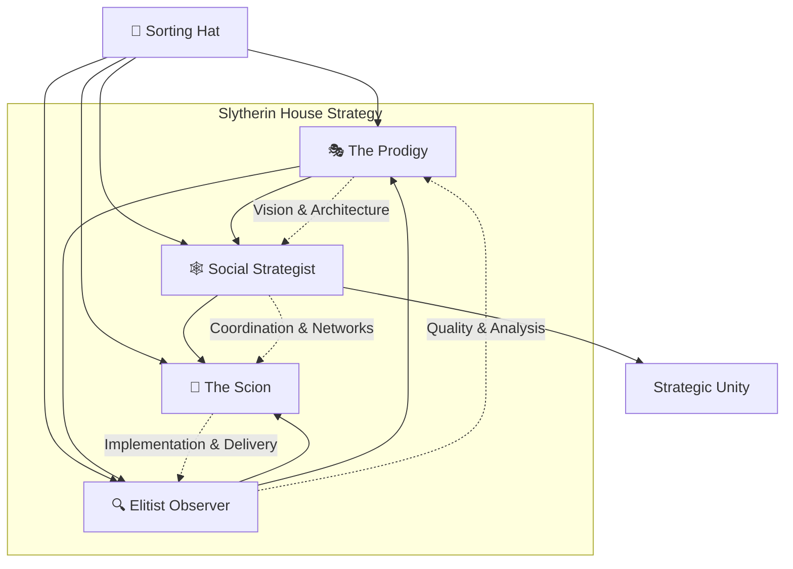

# Copilot Template - Slytherin House Development

**"Or perhaps in Slytherin, you'll make your real friends. Those cunning folk use any means to achieve their ends."**

A comprehensive GitHub repository template designed for strategic, ambitious development using specialized Slytherin-themed AI agents who leverage cunning, resourcefulness, and determination to achieve exceptional results.

## 🐍 Repository Purpose

This template provides a Slytherin House approach to software development by leveraging specialized AI "agents" based on strategic character archetypes. Each agent embodies specific Slytherin traits that drive success in different aspects of development:

- **Strategic ambition** focused on competitive advantage and market disruption
- **Cunning problem-solving** that finds unconventional solutions to complex challenges  
- **Resourceful implementation** that maximizes efficiency and minimizes waste
- **Determined execution** that perseveres through obstacles to achieve goals
- **Pragmatic leadership** that makes calculated decisions for long-term success

## 🏗️ The Slytherin Development Model

The repository implements a **Strategic Slytherin Development Model** where different aspects of software development are handled by agents embodying distinct Slytherin archetypes, each leveraging their natural strengths for maximum effectiveness:

### Slytherin House Development Agents

| Agent | Archetype | Strategic Strengths | Primary Responsibilities |
|-------|----------|---------------------|--------------------------|
| **🎭 The Prodigy** | Tom Riddle | Visionary ambition, strategic thinking, system mastery | Revolutionary architecture, market disruption, long-term strategic planning |
| **👑 The Scion** | Draco Malfoy | Structured excellence, process adherence, resource access | Reliable implementation, quality delivery, corporate compliance |
| **🕸️ The Social Strategist** | Pansy Parkinson | Network building, team coordination, stakeholder management | Project coordination, consensus building, team optimization |
| **🔍 The Elitist Observer** | Blaise Zabini | Critical analysis, quality standards, risk assessment | Quality assurance, security analysis, strategic evaluation |
| **🎩 The Sorting Hat** | Bootstrap Agent | Project analysis, specialization assignment, strategic customization | Repository initialization, agent optimization, strategic alignment |

## 📋 Slytherin Issue Templates System

Each agent has specialized GitHub Issue templates designed around their strategic strengths and natural abilities:

### 🎩 **The Sorting Hat - Bootstrap Agent** (`000_agent.md`)
*"I sort you into houses... or rather, I sort your project into the right Slytherin specializations"*
- **SPECIAL ROLE**: Repository initialization and strategic agent customization
- Analyzes project characteristics to determine optimal Slytherin agent distribution
- Processes grounding documents with strategic perspective and cunning efficiency
- Customizes all agents with project-specific technical context and ambitious goals

### 🎭 **The Prodigy - Tom Riddle** (`the_prodigy_tom_riddle.md`)
*"I am probably the most brilliant student this school has ever seen."*
- Strategic vision and architectural mastery for revolutionary system design
- Long-term planning and market disruption strategies
- Technical innovation leadership and complex system architecture
- Stakeholder influence and visionary product development

### 👑 **The Scion - Draco Malfoy** (`the_scion_draco_malfoy.md`)
*"My father will hear about this!"*
- Structured development with established excellence and proven patterns
- Corporate compliance and process adherence with quality delivery
- Reliable implementation using best practices and industry standards
- Resource optimization through strategic connections and proper procedures

### 🕸️ **The Social Strategist - Pansy Parkinson** (`the_social_strategist_pansy_parkinson.md`)
*"You and your bleeding heart, Granger!"*
- Team coordination and strategic networking for maximum collaborative effectiveness
- Project planning with stakeholder management and consensus building
- Resource orchestration and team dynamics optimization
- Cross-functional coordination and communication hub management

### 🔍 **The Elitist Observer - Blaise Zabini** (`the_elitist_observer_blaise_zabini.md`)
*"I'm staying neutral. I'm not particularly loyal to any side."*
- Critical analysis and quality assessment with uncompromising standards
- Security analysis and vulnerability assessment with pragmatic risk evaluation
- Performance analysis and system optimization with objective metrics
- Compliance auditing and strategic evaluation with detached professionalism

### 🛡️ **Security Guardian** (`security_guardian_agent.md`)
- Comprehensive security analysis and threat modeling
- Vulnerability assessment and compliance auditing
- Security architecture and incident response planning
- Penetration testing and security validation

### 🚀 **DevOps Engineer** (`devops_engineer_agent.md`)
- CI/CD pipeline design and infrastructure automation
- Environment management and deployment strategies
- Monitoring, observability, and performance optimization
- Disaster recovery and scalability planning

### 🧪 **QA Tester** (`qa_tester_agent.md`)
- Test strategy design and automated testing implementation
- Quality validation and defect management
- Performance testing and user acceptance testing
- Cross-platform compatibility and regression testing

### 📊 **Data Analyst** (`data_analyst_agent.md`)
- Analytics implementation and performance monitoring
- User behavior analysis and A/B testing
- Business intelligence and reporting dashboards
- Data quality assurance and insights generation

### 📚 **Historian-Technical Writer** (`historian_technical_writer.md`)
- Comprehensive technical documentation and knowledge management
- Git history analysis and change documentation
- Multi-audience content creation and maintenance
- Process documentation and training materials

## 🎯 How to Use This Template

### 1. **Repository Setup - Claiming Your Domain**
```bash
# Create new repository from this template
gh repo create your-project --template SergeiGolos/copilot-template
cd your-project
```

### 2. **Strategic Initialization - The Sorting Ceremony**
- Add project-specific context documents to `.github/Grounding/` directory
- Create a Sorting Hat issue (`000_agent.md`) to analyze your project and assign optimal Slytherin specializations
- Review customized templates to ensure each agent understands your strategic objectives
- Set up labels and project boards that reflect your house's ambitious goals
- Configure protection rules worthy of maintaining your competitive advantage

### 3. **Slytherin Development Workflow**

#### **🎩 Sorting Phase** (Strategic Project Analysis)
0. Create grounding documents in `.github/Grounding/` with your technology stack and strategic objectives
1. Use The Sorting Hat template to analyze project needs and customize all Slytherin agents
2. Validate that each agent understands their role in achieving your ambitious goals

#### **🎭 Strategic Planning Phase** (The Prodigy's Domain)
1. Create an issue using The Prodigy template for revolutionary architecture and strategic vision
2. Receive comprehensive system design that positions you for competitive advantage
3. Obtain long-term strategic roadmap with market disruption opportunities

#### **🕸️ Coordination Phase** (The Social Strategist's Network)  
1. Use The Social Strategist template for team coordination and stakeholder management
2. Build consensus and optimize team dynamics for maximum collaborative effectiveness
3. Ensure all resources and relationships are strategically aligned

#### **👑 Implementation Phase** (The Scion's Structured Excellence)
1. Apply The Scion template for reliable, high-quality feature development
2. Follow established patterns and best practices for consistent delivery
3. Leverage proper procedures and corporate standards for professional results

#### **🔍 Quality Assurance Phase** (The Elitist Observer's Critical Analysis)
1. Use The Elitist Observer template for comprehensive quality analysis and security assessment
2. Apply rigorous standards and critical evaluation to ensure excellence
3. Identify and address potential weaknesses before they become vulnerabilities

### 4. **Strategic Collaboration - House Unity**
- Each Slytherin agent template includes collaboration guidelines leveraging house strengths
- Cross-agent dependencies are strategically designed for maximum effectiveness
- Deliverables from each agent build upon each other for cumulative competitive advantage

## 🔄 Slytherin Collaboration Matrix

Each agent leverages their natural Slytherin strengths while working strategically with others:



## 📊 Strategic Success Metrics & Ambitious Quality Gates

### **Slytherin Excellence Standards**
- **Competitive Advantage**: Solutions that provide clear market differentiation
- **Strategic Quality**: 90%+ test coverage for critical competitive features
- **Security Mastery**: Zero high-severity vulnerabilities in production systems
- **Performance Superiority**: Sub-second response times for core user interactions  
- **Professional Excellence**: Documentation that enables seamless knowledge transfer

### **House Achievement Metrics**
- **Strategic Vision Execution**: Architectural decisions align with long-term competitive goals
- **Resource Optimization**: Maximum value delivered with minimum waste and inefficiency
- **Network Effectiveness**: Stakeholder satisfaction and collaborative success rates
- **Quality Dominance**: Defect rates significantly below industry standards
- **Ambitious Goal Achievement**: Delivery of features previously deemed "impossible"

## 🛠️ Strategic Template Customization

### **Adapting for Your Ambitions**
1. **Slytherin Agent Specialization**: Customize templates to leverage your team's specific Slytherin strengths
2. **Strategic Labels**: Create labels that reflect your competitive objectives and house priorities
3. **Cunning Workflows**: Set up GitHub Actions that automate the mundane and amplify the strategic
4. **House Guidelines**: Define how your team will use their Slytherin traits for maximum effectiveness

### **Scaling Your Influence**
- **Solo Strategist**: One ambitious individual can embody multiple Slytherin archetypes as needed
- **Elite Teams**: Dedicated specialists who master their chosen Slytherin archetype
- **House Approach**: Strategic mix where everyone understands their role in the greater ambition

## 📈 Benefits of the Slytherin Approach

### **For Ambitious Development Teams**
- **Strategic Focus**: Each agent leverages their natural Slytherin strengths for maximum effectiveness
- **Competitive Advantage**: Specialized attention creates superior results that outshine the competition
- **Resourceful Problem-Solving**: Cunning approaches that find solutions others miss
- **Professional Excellence**: Quality that reflects the high standards expected of Slytherin House

### **For Cunning Project Leadership**
- **Strategic Workflows**: Predictable processes designed for achieving ambitious goals efficiently
- **Risk Mastery**: Comprehensive analysis that prevents problems before they derail success
- **Quality Dominance**: Multiple layers of excellence that ensure competitive superiority
- **Stakeholder Influence**: Clear communication that builds confidence and secures resources

### **For Long-term Strategic Success**
- **Knowledge as Power**: Comprehensive documentation becomes a lasting competitive asset
- **Elite Onboarding**: New team members quickly understand how to contribute to house excellence
- **Sustainable Excellence**: Consistent approaches that scale with growing ambitions
- **Continuous Advancement**: Built-in optimization that keeps you ahead of the competition

## 🚀 House Initiation Checklist

- [ ] **🏰 Establish Your Domain**: Create grounding documents in `.github/Grounding/` with strategic objectives
- [ ] **🎩 Begin the Sorting**: Use The Sorting Hat (`000_agent.md`) to customize agents for your house
- [ ] **📜 Study the House Rules**: Review all Slytherin agent templates and understand their strategic strengths
- [ ] **✅ Validate Your Sorting**: Ensure customizations reflect your project's ambitious goals
- [ ] **🏷️ Create House Labels**: Set up project labels that reflect Slytherin priorities and excellence
- [ ] **🛡️ Establish Protections**: Configure branch protection worthy of safeguarding your competitive advantage
- [ ] **🎭 Summon The Prodigy**: Create your first strategic vision issue to define revolutionary objectives  
- [ ] **📋 Unite Your House**: Establish team guidelines for leveraging each member's Slytherin strengths
- [ ] **📊 Monitor Your Dominance**: Set up analytics to track your competitive advantages and market position

## 🤝 Contributing to House Excellence

This template evolves through the strategic collaboration of ambitious developers:

1. **Fork and Enhance**: Take the template and make it even more strategically effective
2. **Share Your Victories**: Document successful patterns and cunning solutions you've discovered
3. **Contribute Your Innovations**: Submit improvements that benefit the entire Slytherin development community
4. **Report Strategic Opportunities**: Identify areas where the template could be more ambitious or effective

## 📚 Additional Strategic Resources

- **Slytherin Agent Documentation**: Each template includes strategic guidance and house-appropriate examples
- **House Collaboration Guidelines**: Built-in coordination patterns that maximize collective effectiveness
- **Excellence Criteria**: Clear metrics and validation approaches worthy of Slytherin standards
- **Strategic Wisdom**: Accumulated knowledge from successful Slytherin development teams

## 🏷️ Version Information

**Repository Version**: 2.0.0 - Slytherin House Edition  
**Last Updated**: August 18, 2025  
**House Historian**: The Elitist Observer - Documentation Specialist  
**Strategic Evolution**: Tracked through git history and continuous house improvement

---

**Ready to join Slytherin House and achieve development excellence?**

1. **🏰 First**: Add your strategic objectives and technology stack to `.github/Grounding/` directory
2. **🎩 Second**: Create a Sorting Hat issue using `000_agent.md` to customize your house agents  
3. **🎭 Third**: Begin your ascent with The Prodigy template to define your revolutionary technical vision

*"Greatness inspires envy, envy engenders spite, spite spawns lies." - Let your code quality and strategic thinking speak louder than any criticism.*

*This README was strategically crafted by The Elitist Observer as part of comprehensive house documentation and knowledge preservation responsibilities.*
