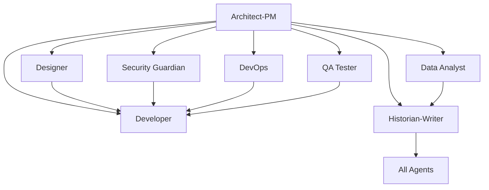

# Copilot Template - Agentic AI Dev## 📋 Issue Templates System

Each agent has dedicated GitHub Issue templates that provide structured workflows and comprehensive requirements gathering:

### 🔧 **Bootstrap Agent** (`000_agent.md`)
- **SPECIAL ROLE**: Repository initialization and agent customization
- Project-specific technology integration and context application
- Grounding document processing from `.github/Grounding/` directory
- Systematic update of ALL agent templates with project-specific information
- Technology stack analysis and agent template transformation

### 🎯 **Planner Agent** (`planner_agent.md`)ent Starter

**A comprehensive GitHub repository template designed for clean, organized development using specialized AI agents to break down complex development work into focused, manageable tasks.**

## 🎯 Repository Purpose

This template provides a structured approach to software development by leveraging specialized AI "agents" (roles) that can be targeted through GitHub Issues. Each agent represents a specific expertise area and responsibility within the development lifecycle, enabling:

- **Clear separation of concerns** across different development disciplines
- **Targeted task assignment** to appropriate specialists
- **Comprehensive documentation** and knowledge preservation
- **Structured workflows** for complex development projects
- **Collaborative development** with well-defined roles and responsibilities

## 🏗️ Architecture Overview

The repository implements an **Agentic Development Model** where different aspects of software development are handled by specialized agents, each with distinct capabilities and responsibilities:

### Core Development Agents

| Agent | Focus Area | Primary Responsibilities |
|-------|-----------|-------------------------|
| **Bootstrap Agent** | Repository Initialization | Project-specific agent customization, technology integration, grounding document processing |
| **Architect-PM** | Strategy & Planning | Requirements analysis, system design, risk assessment, roadmap planning |
| **Planner** | Project Coordination | Strategic project planning, resource coordination, sprint planning, dependency management |
| **Design Spec Writer** | Technical Specifications | Technical design documentation, API specifications, system integration specs |
| **User Story Writer** | Requirements Translation | Convert specs to user stories, implementation prioritization, backlog management |
| **Developer** | Implementation | Feature development, bug fixes, code refactoring, technical implementation |
| **Designer** | User Experience | UI/UX design, accessibility, responsive design, user interaction patterns |
| **Security Guardian** | Cybersecurity | Security analysis, vulnerability assessment, compliance, threat modeling |
| **DevOps Engineer** | Infrastructure | CI/CD pipelines, deployment automation, monitoring, infrastructure management |
| **QA Tester** | Quality Assurance | Testing strategy, automated testing, bug detection, quality validation |
| **Data Analyst** | Analytics & Insights | Performance analysis, user behavior analytics, A/B testing, reporting |
| **Historian-Writer** | Documentation | Technical documentation, knowledge management, process documentation |

## 📋 The Gryffindor Development Team

*"It is our choices that show what we truly are, far more than our abilities."* - Each character template provides structured workflows and comprehensive requirements gathering with the courage and determination of Gryffindor house!

### ⚡ **Harry Potter - The Visionary Team Lead** (`harry_potter.md`)
*"The Boy Who Lived" now leads your development destiny!*
- Strategic product vision and technical architecture leadership
- Requirements gathering and stakeholder management with heroic determination
- Risk assessment and system design with the courage of a true Gryffindor
- Team inspiration and obstacle removal like clearing the path to victory

### 📚 **Hermione Granger - The Brilliant Architect** (`hermione_granger.md`) 
*The brightest witch of her age brings research excellence to technical specifications!*
- Meticulous technical design specifications and system documentation
- API design documentation and interface contracts with scholarly precision
- Database schema design and integration specifications backed by thorough research
- Implementation guidelines and development standards worthy of top marks

### ♟️ **Ron Weasley - The Strategic Coordinator** (`ron_weasley.md`)
*Your most loyal friend provides the reliable foundation for project success!*
- Strategic project coordination and execution planning with steadfast dedication
- Resource planning and capacity management like organizing family logistics
- Risk and dependency management with practical wisdom
- Sprint planning and team coordination as the dependable backbone

### 🌱 **Neville Longbottom - The Quality Guardian** (`neville_longbottom.md`)
*From forgetful first-year to brave quality champion!*
- Comprehensive testing strategy and quality assurance with patient persistence
- Automated testing frameworks and manual testing execution with meticulous care
- Performance testing and user acceptance validation with moral courage
- Bug detection and quality standards enforcement when no one else will

### 🔥 **Ginny Weasley - The Frontend Specialist** (`ginny_weasley.md`)
*The fierce independent who masters user experience magic!*
- User experience design and modern UI/UX implementation with confident flair
- Accessibility compliance and responsive design that works for everyone
- CSS implementation and design system maintenance with artistic talent
- Frontend development that's as impressive as her Bat-Bogey Hex

### 🎆 **Fred & George Weasley - The Innovation Duo** (`fred_and_george_weasley.md`)
*The entrepreneurs of automation who make everything work like magic!*
- Infrastructure automation and deployment optimization through brilliant innovation
- CI/CD pipeline design and container orchestration that's better than Skiving Snackboxes
- Monitoring and observability implementation with entrepreneurial creativity
- DevOps solutions that turn tedious processes into automated magic

### 🦅 **Luna Lovegood - The Creative Story Visionary** (`luna_lovegood.md`)
*Wonderfully different perspectives on user needs that others miss!*
- User story creation with unique insights and creative problem-solving
- Requirements translation from unconventional angles that reveal hidden needs
- Epic and story mapping with the ability to see connections others don't
- User empathy and edge case identification like spotting Thestrals

### 📊 **Percy Weasley - The Methodical Data Analyst** (`percy_weasley.md`)
*By-the-book analytics and compliance with Ministry-approved precision!*
- Analytics implementation and business intelligence with bureaucratic thoroughness
- Performance monitoring and user behavior analysis following proper procedures
- A/B testing and statistical analysis with mathematical precision
- Compliance reporting and data governance that satisfies any audit

### 🎓 **Professor McGonagall - The Documentation Master** (`professor_mcgonagall.md`)
*Transfiguration expertise applied to transforming complex information into knowledge!*
- Technical documentation and knowledge management with academic authority
- API documentation and user guides that teach as effectively as any Hogwarts lesson
- System architecture documentation with the clarity of Transfiguration theory
- Institutional memory and standards enforcement worthy of a Head of House

### 👁️ **Mad-Eye Moody - The Security Guardian** (`mad_eye_moody.md`)
*CONSTANT VIGILANCE in cybersecurity and threat detection!*
- Comprehensive security analysis and threat modeling with paranoid precision
- Vulnerability assessment and penetration testing like an experienced Auror
- Security architecture and compliance auditing with magical eye insight
- Incident response planning and security education for the whole team

### 🏆 **Oliver Wood - The Feature Champion** (`oliver_wood.md`)
*Relentless pursuit of feature excellence with championship dedication!*
- Complete feature development lifecycle with training-camp intensity
- Technical requirements and performance specifications worthy of Quidditch Cup victory
- Testing strategy and quality assurance that never accepts less than perfection
- Implementation execution focused on delivering championship-quality results

### 💥 **Seamus Finnigan - The Bug Detective** (`seamus_finnigan.md`)
*From explosive mishaps to systematic debugging expertise!*
- Bug investigation and resolution with hard-won experience in what goes wrong
- Root cause analysis and impact assessment learned through trial and error
- Systematic debugging approach developed from dealing with magical accidents
- Prevention strategies based on understanding how things can explode

### 🎨 **Dean Thomas - The Code Artist** (`dean_thomas.md`)
*Artistic flair applied to beautiful, maintainable code!*
- Code quality improvement and technical debt reduction with creative vision
- Refactoring and architecture enhancement that makes code as beautiful as art
- Performance optimization while maintaining elegant code structure
- Design pattern implementation that creates genuinely attractive solutions

## 🎯 How to Use This Template

### 1. **Repository Setup**
```bash
# Create new repository from this template
gh repo create your-project --template SergeiGolos/copilot-template
cd your-project
```

### 2. **Project Initialization**
- Add project-specific context documents to `.github/Grounding/` directory
- Create a Bootstrap Agent issue (`000_agent.md`) to analyze and customize all agents
- Review and customize issue templates for your project's specific needs
- Set up labels and project boards to match the agent structure
- Configure branch protection rules and workflow requirements

### 3. **Agent-Based Development Workflow**

#### **Bootstrap Phase** (Repository Customization)
0. Create grounding documents in `.github/Grounding/` with your technology stack
1. Use `000_agent.md` template to bootstrap and customize all agents for your project
2. Validate that all agents now contain project-specific technology and context

#### **Planning Phase** (Architect-PM → Planner → Design Spec Writer → User Story Writer)
1. Create an issue using the `architect_product_manager.md` template for strategic planning
2. Use `planner_agent.md` for project coordination and resource planning
3. Apply `design_spec_writer_agent.md` for technical specifications
4. Utilize `user_story_writer_agent.md` to convert specs into prioritized user stories
5. Receive comprehensive system design, project roadmap, and implementation backlog

#### **Implementation Phase** (Specialized Agents)
1. **Design**: Use `designer_agent.md` for UI/UX requirements
2. **Development**: Use appropriate developer template (`feature_implementation.md`, `bug_fix.md`, or `code_refactoring.md`)
3. **Security**: Use `security_guardian_agent.md` for security analysis
4. **Infrastructure**: Use `devops_engineer_agent.md` for deployment needs
5. **Quality**: Use `qa_tester_agent.md` for testing strategy
6. **Analytics**: Use `data_analyst_agent.md` for metrics and analysis

#### **Documentation Phase** (Historian-Writer Agent)
1. Use `historian_technical_writer.md` for comprehensive documentation
2. Ensure knowledge preservation and decision context recording
3. Create user guides, API documentation, and maintenance procedures

### 4. **Collaborative Development**
- Each issue template includes collaboration guidelines with other agents
- Cross-agent dependencies are clearly defined
- Deliverables from each agent inform the work of others

## 🔄 Agent Collaboration Matrix

Each agent is designed to work collaboratively with others:



## 📊 Success Metrics & Quality Gates

### **Code Quality Standards**
- Comprehensive test coverage (80%+ for critical components)
- Security vulnerability assessment and resolution
- Performance benchmarks and optimization
- Accessibility compliance (WCAG AA minimum)
- Documentation completeness and accuracy

### **Process Metrics**
- Clear requirements and acceptance criteria definition
- Risk assessment and mitigation strategy implementation
- Cross-functional collaboration and knowledge sharing
- Continuous improvement and lessons learned documentation

## 🛠️ Template Customization

### **Adapting for Your Project**
1. **Modify Agent Templates**: Customize issue templates to match your technology stack and requirements
2. **Add Project-Specific Labels**: Create labels that align with your project's needs
3. **Configure Workflows**: Set up GitHub Actions or other automation to support the agent-based workflow
4. **Establish Team Guidelines**: Define how your team will use the agent system

### **Scaling Considerations**
- **Small Teams**: Individuals may wear multiple agent "hats"
- **Large Teams**: Dedicated specialists can own specific agent roles
- **Hybrid Approach**: Mix of dedicated specialists and cross-functional team members

## 📈 Benefits of the Agentic Approach

### **For Development Teams**
- **Clear Responsibilities**: Each agent has well-defined scope and deliverables
- **Reduced Cognitive Load**: Focus on specific expertise area without context switching
- **Improved Quality**: Specialized attention to each aspect of development
- **Better Documentation**: Built-in knowledge management and documentation practices

### **For Project Management**
- **Predictable Workflows**: Structured processes with clear inputs and outputs
- **Risk Mitigation**: Comprehensive risk assessment and security analysis
- **Quality Assurance**: Multiple quality gates and validation checkpoints
- **Stakeholder Communication**: Clear deliverables and status reporting

### **for Long-term Maintenance**
- **Knowledge Preservation**: Comprehensive documentation of decisions and context
- **Onboarding Efficiency**: Clear role definitions and process documentation
- **Consistency**: Standardized approaches across different project phases
- **Continuous Improvement**: Built-in retrospective and optimization processes

## 🚀 Getting Started Checklist

- [ ] **Create grounding documents** in `.github/Grounding/` with your project's technology stack
- [ ] **Run Bootstrap Agent** using `000_agent.md` to customize all agents for your project
- [ ] **Review all issue templates** and understand each agent's role
- [ ] **Validate agent customizations** ensure they reflect your project specifics
- [ ] **Set up project labels** to match agent categories
- [ ] **Configure branch protection** and review requirements
- [ ] **Create your first Architect-PM issue** to define project scope
- [ ] **Establish team guidelines** for using the agent system
- [ ] **Set up monitoring and analytics** for tracking success metrics

## 🤝 Contributing to the Template

This template is designed to evolve with best practices in agentic development:

1. **Fork the repository** and make improvements
2. **Share your customizations** and lessons learned
3. **Contribute back** successful patterns and workflows
4. **Report issues** and suggest enhancements

## 📚 Additional Resources

- **Issue Template Documentation**: Each template includes comprehensive guidance and examples
- **Agent Collaboration Guidelines**: Built into each template for cross-functional work
- **Success Criteria**: Clear metrics and validation approaches for each agent
- **Best Practices**: Accumulated wisdom from agentic development workflows

## 🏷️ Version Information

**Repository Version**: 1.0.0  
**Last Updated**: August 18, 2025  
**Template Maintenance**: Historian-Technical Writer Agent  
**Template Evolution**: Tracked through git history and documentation updates

---

**Ready to start your agentic development journey?** 

1. **First**: Add your project's technology stack to `.github/Grounding/` directory
2. **Second**: Create a Bootstrap Agent issue using `000_agent.md` to customize all agents
3. **Third**: Begin with creating your first issue using the `architect_product_manager.md` template to define your project's scope and technical architecture.

*This README was created by the Historian-Technical Writer Agent as part of the repository documentation and knowledge management responsibilities.*
