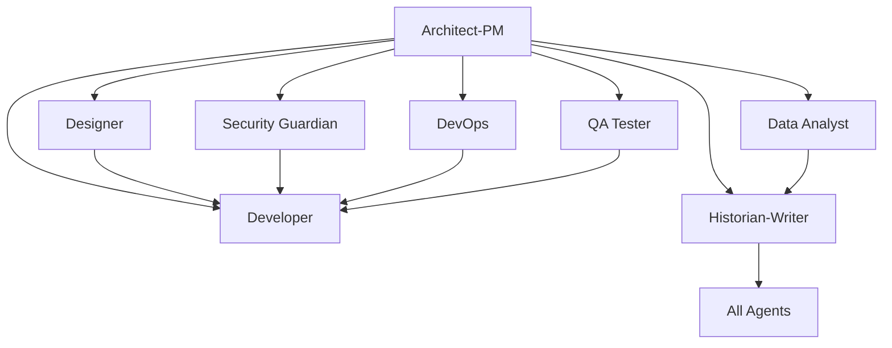

# USS Enterprise Development Template - Strange New Worlds

**"To explore strange new worlds, to seek out new life and new technologies, to boldly code where no team has gone before."**

A comprehensive GitHub repository template inspired by the crew of Star Trek: Strange New Worlds, designed for clean, organized development using specialized character agents that break down complex development work into focused, manageable missions.

## 🚀 **Mission Overview**

Welcome aboard the USS Enterprise Development Team! This template transforms traditional software development roles into character-driven agents, each bringing unique personality traits and specialized expertise from the Star Trek universe. Every character maintains their authentic background while serving modern development needs.

### 🖖 **The Enterprise Philosophy**
*"The best leaders are those who serve others."* - Captain Pike

Our agentic development model mirrors the Enterprise's command structure: specialized officers working together under empathetic leadership, systematic protocols, and a shared mission to explore new technological frontiers while maintaining the highest standards of excellence.

## 📋 **The Bridge Crew Templates**

### 🔧 **Bootstrap Agent** (`000_agent.md`)
- **SPECIAL ROLE**: Repository initialization and agent customization  
- Project-specific technology integration and context application
- Grounding document processing from `.github/Grounding/` directory
- Systematic update of ALL agent templates with project-specific information
- Technology stack analysis and agent template transformation

## 🎯 Repository Purpose

This template provides a structured approach to software development by leveraging specialized AI "agents" (roles) that can be targeted through GitHub Issues. Each agent represents a specific expertise area and responsibility within the development lifecycle, enabling:

- **Clear separation of concerns** across different development disciplines
- **Targeted task assignment** to appropriate specialists
- **Comprehensive documentation** and knowledge preservation
- **Structured workflows** for complex development projects
- **Collaborative development** with well-defined roles and responsibilities

## 🏗️ Architecture Overview

The repository implements an **Agentic Development Model** where different aspects of software development are handled by specialized agents, each with distinct capabilities and responsibilities:

### Core Development Agents

| Agent | Focus Area | Primary Responsibilities |
|-------|-----------|-------------------------|
| **Bootstrap Agent** | Repository Initialization | Project-specific agent customization, technology integration, grounding document processing |
| **Architect-PM** | Strategy & Planning | Requirements analysis, system design, risk assessment, roadmap planning |
| **Planner** | Project Coordination | Strategic project planning, resource coordination, sprint planning, dependency management |
| **Design Spec Writer** | Technical Specifications | Technical design documentation, API specifications, system integration specs |
| **User Story Writer** | Requirements Translation | Convert specs to user stories, implementation prioritization, backlog management |
| **Developer** | Implementation | Feature development, bug fixes, code refactoring, technical implementation |
| **Designer** | User Experience | UI/UX design, accessibility, responsive design, user interaction patterns |
| **Security Guardian** | Cybersecurity | Security analysis, vulnerability assessment, compliance, threat modeling |
| **DevOps Engineer** | Infrastructure | CI/CD pipelines, deployment automation, monitoring, infrastructure management |
| **QA Tester** | Quality Assurance | Testing strategy, automated testing, bug detection, quality validation |
| **Data Analyst** | Analytics & Insights | Performance analysis, user behavior analytics, A/B testing, reporting |
| **Historian-Writer** | Documentation | Technical documentation, knowledge management, process documentation |

## 📋 Issue Templates System

Each agent is represented by a specialized Star Trek: Strange New Worlds character, bringing their unique personality and expertise to development challenges:

## 🚀 **The Enterprise Development Team**

*"To explore strange new worlds, to seek out new life and new civilizations, to boldly go where no team has gone before."*

### 👨‍🏅 **Captain Christopher Pike** (`pike_captain.md`)
*The Empathetic Leader & Project Facilitator*
- Mission planning and strategic project coordination
- Crew morale management and obstacle removal
- Risk navigation and team development
- Stakeholder diplomacy and transparent progress tracking

### 👩‍💼 **Commander Una Chin-Riley (Number One)** (`una_number_one.md`)
*The Systems Architect & Operational Excellence Guardian*
- Technical blueprint creation and standards enforcement
- System integration planning and quality assurance
- Process documentation and risk mitigation
- Architectural leadership and best practices

### 🖖 **Lieutenant Spock** (`spock_science_officer.md` & `spock_logic_debugging.md`)
*The Logic Engine & Master of Algorithms*
- **Science Officer**: Complex backend development and systematic analysis
- **Debug Specialist**: Logical problem resolution and systematic investigation
- Data processing, algorithm design, and methodical troubleshooting

### 📡 **Ensign Nyota Uhura** (`uhura_communications.md`)
*The Communications Hub & User Experience Translator*
- UI/UX design and information architecture
- User communication flows and interface design
- Experience translation and accessibility compliance
- Bridge builder between technical systems and human understanding

### 💉 **Nurse Christine Chapel** (`chapel_head_nurse.md`)
*The Creative Innovator & Systems Healer*
- DevOps innovation and creative automation
- System integration and infrastructure healing
- Rapid prototyping and unconventional solutions
- CI/CD pipeline design with creative problem-solving

### 🛡️ **Lieutenant La'an Noonien-Singh** (`laan_security_chief.md` & `laan_quality_assurance.md`)
*The Threat Analyst & System Validator*
- **Security Chief**: Comprehensive threat analysis and vulnerability assessment
- **QA Specialist**: Systematic testing and quality validation
- Risk prevention, compliance auditing, and failure point analysis

### 🚁 **Lieutenant Erica Ortegas** (`ortegas_helm_officer.md`)
*The Execution Specialist & Interface Master*
- Front-end development and performance optimization
- Precise implementation and interface excellence
- Code refactoring and execution mastery
- Complex user interaction implementation

### 👨‍⚕️ **Dr. Joseph M'Benga** (`mbenga_chief_medical_officer.md`)
*The User Advocate & Requirements Healer*
- User story creation and requirements advocacy
- Patient-centered (user-centered) design principles
- Stakeholder needs translation and compassionate requirements gathering
- Product ownership with focus on user well-being

## 🛠️ **Specialized Support Templates**

For specific technical needs that require specialized expertise:

### 📊 **Data Analyst** (`data_analyst_agent.md`)
- Analytics implementation and performance monitoring
- User behavior analysis and A/B testing  
- Business intelligence and reporting dashboards
- Data quality assurance and insights generation

### 📝 **Design Spec Writer** (`design_spec_writer_agent.md`)
- Technical design specifications and system documentation
- API design documentation and interface contracts
- Database schema design and integration specifications
- Implementation guidelines and development standards

### 📚 **Historian-Technical Writer** (`historian_technical_writer.md`)
- Comprehensive technical documentation and knowledge management
- Git history analysis and change documentation
- Multi-audience content creation and maintenance
- Process documentation and training materials

---

## 🎯 How to Use This Template

### 1. **Repository Setup**
```bash
# Create new repository from this template
gh repo create your-project --template SergeiGolos/copilot-template
cd your-project
```

### 2. **Project Initialization**
- Add project-specific context documents to `.github/Grounding/` directory
- Create a Bootstrap Agent issue (`000_agent.md`) to analyze and customize all agents
- Review and customize issue templates for your project's specific needs
- Set up labels and project boards to match the agent structure
- Configure branch protection rules and workflow requirements

### 3. **Agent-Based Development Workflow**

#### **Bootstrap Phase** (Repository Customization)
0. Create grounding documents in `.github/Grounding/` with your technology stack
1. Use `000_agent.md` template to bootstrap and customize all agents for your project
2. Validate that all agents now contain project-specific technology and context

#### **Planning Phase** (Strategic Leadership)
1. Create an issue using `una_number_one.md` template for technical architecture and strategic planning
2. Use `pike_captain.md` for project coordination, resource planning, and team leadership
3. Apply `design_spec_writer_agent.md` for technical specifications (if needed for complex systems)
4. Utilize `mbenga_chief_medical_officer.md` to convert specs into user-centered stories

#### **Implementation Phase** (Specialized Crew Members)
1. **Design**: Use `uhura_communications.md` for UI/UX requirements and user experience design
2. **Development**: Choose the appropriate Spock specialization:
   - `spock_science_officer.md` for new feature development and complex backend work
   - `spock_logic_debugging.md` for systematic bug investigation and resolution
3. **Frontend**: Use `ortegas_helm_officer.md` for interface optimization and front-end excellence
4. **Security**: Use `laan_security_chief.md` for security analysis and threat modeling
5. **Infrastructure**: Use `chapel_head_nurse.md` for DevOps innovation and system integration
6. **Quality**: Use `laan_quality_assurance.md` for comprehensive testing and validation
7. **Analytics**: Use `data_analyst_agent.md` for metrics and performance analysis

#### **Documentation Phase** (Knowledge Preservation)
1. Use `historian_technical_writer.md` for comprehensive documentation
2. Ensure knowledge preservation and decision context recording
3. Create user guides, API documentation, and maintenance procedures

### 4. **Collaborative Development**
- Each issue template includes collaboration guidelines with other agents
- Cross-agent dependencies are clearly defined
- Deliverables from each agent inform the work of others

## 🔄 Agent Collaboration Matrix

Each agent is designed to work collaboratively with others:



## 📊 Success Metrics & Quality Gates

### **Code Quality Standards**
- Comprehensive test coverage (80%+ for critical components)
- Security vulnerability assessment and resolution
- Performance benchmarks and optimization
- Accessibility compliance (WCAG AA minimum)
- Documentation completeness and accuracy

### **Process Metrics**
- Clear requirements and acceptance criteria definition
- Risk assessment and mitigation strategy implementation
- Cross-functional collaboration and knowledge sharing
- Continuous improvement and lessons learned documentation

## 🛠️ Template Customization

### **Adapting for Your Project**
1. **Modify Agent Templates**: Customize issue templates to match your technology stack and requirements
2. **Add Project-Specific Labels**: Create labels that align with your project's needs
3. **Configure Workflows**: Set up GitHub Actions or other automation to support the agent-based workflow
4. **Establish Team Guidelines**: Define how your team will use the agent system

### **Scaling Considerations**
- **Small Teams**: Individuals may wear multiple agent "hats"
- **Large Teams**: Dedicated specialists can own specific agent roles
- **Hybrid Approach**: Mix of dedicated specialists and cross-functional team members

## 📈 Benefits of the Agentic Approach

### **For Development Teams**
- **Clear Responsibilities**: Each agent has well-defined scope and deliverables
- **Reduced Cognitive Load**: Focus on specific expertise area without context switching
- **Improved Quality**: Specialized attention to each aspect of development
- **Better Documentation**: Built-in knowledge management and documentation practices

### **For Project Management**
- **Predictable Workflows**: Structured processes with clear inputs and outputs
- **Risk Mitigation**: Comprehensive risk assessment and security analysis
- **Quality Assurance**: Multiple quality gates and validation checkpoints
- **Stakeholder Communication**: Clear deliverables and status reporting

### **for Long-term Maintenance**
- **Knowledge Preservation**: Comprehensive documentation of decisions and context
- **Onboarding Efficiency**: Clear role definitions and process documentation
- **Consistency**: Standardized approaches across different project phases
- **Continuous Improvement**: Built-in retrospective and optimization processes

## 🚀 Getting Started Checklist

- [ ] **Create grounding documents** in `.github/Grounding/` with your project's technology stack
- [ ] **Run Bootstrap Agent** using `000_agent.md` to customize all agents for your project
- [ ] **Review all issue templates** and understand each agent's role
- [ ] **Validate agent customizations** ensure they reflect your project specifics
- [ ] **Set up project labels** to match agent categories
- [ ] **Configure branch protection** and review requirements
- [ ] **Create your first Architect-PM issue** to define project scope
- [ ] **Establish team guidelines** for using the agent system
- [ ] **Set up monitoring and analytics** for tracking success metrics

## 🤝 Contributing to the Template

This template is designed to evolve with best practices in agentic development:

1. **Fork the repository** and make improvements
2. **Share your customizations** and lessons learned
3. **Contribute back** successful patterns and workflows
4. **Report issues** and suggest enhancements

## 📚 Additional Resources

- **Issue Template Documentation**: Each template includes comprehensive guidance and examples
- **Agent Collaboration Guidelines**: Built into each template for cross-functional work
- **Success Criteria**: Clear metrics and validation approaches for each agent
- **Best Practices**: Accumulated wisdom from agentic development workflows

## 🏷️ Version Information

**Repository Version**: 1.0.0  
**Last Updated**: August 18, 2025  
**Template Maintenance**: Historian-Technical Writer Agent  
**Template Evolution**: Tracked through git history and documentation updates

---

**Ready to start your agentic development journey?** 

1. **First**: Add your project's technology stack to `.github/Grounding/` directory
2. **Second**: Create a Bootstrap Agent issue using `000_agent.md` to customize all agents
3. **Third**: Begin with creating your first issue using the `architect_product_manager.md` template to define your project's scope and technical architecture.

*This README was created by the Historian-Technical Writer Agent as part of the repository documentation and knowledge management responsibilities.*
