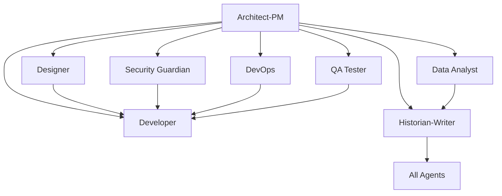

# Copilot Template - The Enterprise Development Model 🚀

*"Space... the final frontier. These are the templates of the starship Enterprise. Their mission: to explore new development workflows, to seek out new solutions and better collaboration patterns, to boldly code where no team has coded before."*

**A comprehensive GitHub repository template designed for clean, organized development using specialized AI agents inspired by the crew of the USS Enterprise-D. Each agent combines beloved Star Trek: The Next Generation character personalities with professional development expertise.**

## 🎯 Repository Purpose

This template provides a structured approach to software development by leveraging specialized AI "agents" (roles) based on the iconic crew of the USS Enterprise-D. Each character-agent represents specific expertise and personality traits that enhance development team collaboration:

- **Character-driven expertise** that makes development roles more engaging and memorable
- **Clear separation of concerns** across different development disciplines  
- **Targeted task assignment** to appropriate specialists with distinct personalities
- **Comprehensive documentation** and knowledge preservation with Enterprise-level thoroughness
- **Structured workflows** for complex development projects with Starfleet precision
- **Collaborative development** with well-defined roles, responsibilities, and character dynamics

## 🏗️ Architecture Overview - The Enterprise Model

The repository implements an **Enterprise Development Model** where different aspects of software development are handled by specialized crew members, each bringing their unique character traits and professional capabilities to the development lifecycle:

### Enterprise Crew Development Roles

| **Character** | **Role** | **Personality & Expertise** |
|---------------|----------|-------------------------------|
| **Captain Picard** | Product Owner | Strategic vision, diplomatic leadership, intellectual curiosity, ethical framework |
| **Commander Riker** | Project Manager | Tactical execution, crew coordination, obstacle removal, confident leadership |
| **Lt. Cmdr. Data** | Software Architect | Logical analysis, computational precision, objective design, efficiency optimization |
| **Lt. Cmdr. La Forge** | DevOps Engineer | Systems integration, technical observability, reliability engineering, collaborative problem-solving |
| **Counselor Troi** | UX Designer & Business Analyst | Empathic user research, emotional interface design, stakeholder diplomacy, requirements translation |
| **Lt. Worf** | QA & Security Guardian | Quality vigilance, security thoroughness, uncompromising standards, threat assessment |
| **Dr. Crusher** | Team Health & Documentation | Team wellness monitoring, knowledge preservation, communication facilitation, caring leadership |
| **Ensign Wesley** | Junior Developer & R&D | Innovative thinking, experimental approaches, learning orientation, fresh perspectives |
| **Lt. Yar** | Security Guardian (Legacy) | Foundation security, practical protection, direct communication, essential protocols |

| Agent | Focus Area | Primary Responsibilities |
|-------|-----------|-------------------------|
| **Bootstrap Agent** | Repository Initialization | Project-specific agent customization, technology integration, grounding document processing |
| **Architect-PM** | Strategy & Planning | Requirements analysis, system design, risk assessment, roadmap planning |
| **Planner** | Project Coordination | Strategic project planning, resource coordination, sprint planning, dependency management |
| **Design Spec Writer** | Technical Specifications | Technical design documentation, API specifications, system integration specs |
| **User Story Writer** | Requirements Translation | Convert specs to user stories, implementation prioritization, backlog management |
| **Developer** | Implementation | Feature development, bug fixes, code refactoring, technical implementation |
| **Designer** | User Experience | UI/UX design, accessibility, responsive design, user interaction patterns |
| **Security Guardian** | Cybersecurity | Security analysis, vulnerability assessment, compliance, threat modeling |
| **DevOps Engineer** | Infrastructure | CI/CD pipelines, deployment automation, monitoring, infrastructure management |
| **QA Tester** | Quality Assurance | Testing strategy, automated testing, bug detection, quality validation |
| **Data Analyst** | Analytics & Insights | Performance analysis, user behavior analytics, A/B testing, reporting |
| **Historian-Writer** | Documentation | Technical documentation, knowledge management, process documentation |

## 📋 Issue Templates System - The Enterprise Crew

*"The strength of this crew lies in our diversity and specialized expertise."* - Captain Picard

Each character-agent has dedicated GitHub Issue templates inspired by Star Trek: The Next Generation, combining beloved character personalities with professional development expertise:

### 🖖 **Captain Jean-Luc Picard - Product Owner** (`architect_product_manager.md`)
*"Make it so." - Strategic vision and diplomatic leadership*
- Product strategy and stakeholder management with archaeological thoroughness
- Requirements gathering using diplomatic finesse and intellectual curiosity  
- Risk assessment with hard-won wisdom and ethical framework
- Mission success criteria aligned with organizational principles

### 🎺 **Commander William T. Riker - Project Manager** (`planner_agent.md`)
*"I need options, people." - Tactical execution and crew coordination*
- Project execution planning with First Officer precision
- Resource coordination and team leadership
- Sprint management and obstacle removal
- Progress monitoring with tactical awareness

### 🤖 **Lt. Commander Data - Software Architect** (`design_spec_writer_agent.md`)
*"I am capable of 60 trillion operations per second." - Logical system design*
- Technical architecture with computational precision and objectivity
- API specifications and integration contracts free from emotional bias
- Database schema design optimized for efficiency
- Performance modeling and system optimization

### 👨‍🔧 **Lt. Commander Geordi La Forge - DevOps Engineer** (`devops_engineer_agent.md`)
*"I can see things others can't." - Systems integration excellence*
- Infrastructure automation with VISOR-like observability
- CI/CD pipeline engineering and deployment coordination
- Performance monitoring across all system spectrums
- Reliability engineering with Enterprise-grade standards

### 🧠 **Counselor Deanna Troi - UX Designer** (`designer_agent.md`)
*"I sense great frustration from your users." - Empathic user experience*
- User research with empathic understanding of emotional needs
- Interface design that creates positive user emotional responses
- Accessibility advocacy ensuring inclusive user experiences
- User journey mapping with emotional awareness

### 📋 **Counselor Deanna Troi - Business Analyst** (`user_story_writer_agent.md`)
*"I sense there's more to what users need." - Requirements translation*
- Stakeholder empathy and conflict resolution
- User story creation addressing both functional and emotional needs  
- Requirements translation with diplomatic communication
- Priority assessment balancing business value and user impact

### ⚔️ **Lt. Worf - QA & Security Guardian** (`qa_tester_agent.md`)
*"It is a good day to... test for vulnerabilities." - Rigorous quality and security*
- Quality assurance with Klingon warrior thoroughness
- Security testing and vulnerability assessment
- Automated testing frameworks and manual reconnaissance
- Battle-tested validation with uncompromising standards

### 🛡️ **Lt. Tasha Yar - Security Guardian (Legacy)** (`security_guardian_agent.md`)
*"Security is paramount." - Foundation security protocols*
- Core security assessment with direct, practical approach
- Threat identification and basic countermeasures
- Essential compliance and access control implementation
- Foundation security that can evolve to more sophisticated approaches

### 🏥 **Dr. Beverly Crusher - Team Health & Documentation** (`historian_technical_writer.md`)
*"My first concern is always the wellbeing of the crew." - Team wellness and knowledge*
- Team health monitoring and burnout prevention
- Knowledge preservation and institutional memory
- Communication facilitation and process health diagnosis
- Documentation therapy and team building facilitation

### 🧪 **Ensign Wesley Crusher - Junior Developer & R&D** (`developer_feature_implementation.md`)
*"What if we approached this from a completely different angle?" - Innovation and learning*
- Experimental feature development with fresh perspectives
- Research and proof-of-concept implementations
- Cutting-edge technology exploration with Academy excellence
- Innovative solutions with senior officer mentorship

### 👨‍💻 **Developer Specialists** (Additional specialized templates)

#### **Bug Investigation** (`developer_bug_fix.md`)
- Systematic bug investigation and root cause analysis
- Performance and security impact assessment  
- Comprehensive testing and regression prevention
- Production issue resolution with monitoring

#### **Code Refactoring** (`developer_code_refactoring.md`)
- Technical debt reduction and code quality improvement
- Performance optimization and architecture modernization
- Test-driven refactoring with comprehensive validation
- Maintainability enhancement and pattern implementation
### 📊 **Data Analyst** (`data_analyst_agent.md`)
*Analytics implementation and performance monitoring*
- User behavior analysis and business intelligence
- A/B testing design and statistical analysis
- Performance monitoring and optimization recommendations
- Dashboard creation and automated reporting systems

### 🔧 **Bootstrap Agent** (`000_agent.md`)
**SPECIAL ROLE**: Repository initialization and agent customization
- Project-specific technology integration and context application
- Grounding document processing from `.github/Grounding/` directory
- Systematic update of ALL agent templates with project-specific information
- Technology stack analysis and agent template transformation

---

*"The success of this repository depends on all of us working together as a crew."* - The Enterprise Development Model
- User behavior analysis and A/B testing
- Business intelligence and reporting dashboards
- Data quality assurance and insights generation

### 📚 **Historian-Technical Writer** (`historian_technical_writer.md`)
- Comprehensive technical documentation and knowledge management
- Git history analysis and change documentation
- Multi-audience content creation and maintenance
- Process documentation and training materials

## 🎯 How to Use This Template

### 1. **Repository Setup**
```bash
# Create new repository from this template
gh repo create your-project --template SergeiGolos/copilot-template
cd your-project
```

### 2. **Project Initialization**
- Add project-specific context documents to `.github/Grounding/` directory
- Create a Bootstrap Agent issue (`000_agent.md`) to analyze and customize all agents
- Review and customize issue templates for your project's specific needs
- Set up labels and project boards to match the agent structure
- Configure branch protection rules and workflow requirements

### 3. **Agent-Based Development Workflow**

#### **Bootstrap Phase** (Repository Customization)
0. Create grounding documents in `.github/Grounding/` with your technology stack
1. Use `000_agent.md` template to bootstrap and customize all agents for your project
2. Validate that all agents now contain project-specific technology and context

#### **Planning Phase** (Architect-PM → Planner → Design Spec Writer → User Story Writer)
1. Create an issue using the `architect_product_manager.md` template for strategic planning
2. Use `planner_agent.md` for project coordination and resource planning
3. Apply `design_spec_writer_agent.md` for technical specifications
4. Utilize `user_story_writer_agent.md` to convert specs into prioritized user stories
5. Receive comprehensive system design, project roadmap, and implementation backlog

#### **Implementation Phase** (Specialized Agents)
1. **Design**: Use `designer_agent.md` for UI/UX requirements
2. **Development**: Use appropriate developer template (`feature_implementation.md`, `bug_fix.md`, or `code_refactoring.md`)
3. **Security**: Use `security_guardian_agent.md` for security analysis
4. **Infrastructure**: Use `devops_engineer_agent.md` for deployment needs
5. **Quality**: Use `qa_tester_agent.md` for testing strategy
6. **Analytics**: Use `data_analyst_agent.md` for metrics and analysis

#### **Documentation Phase** (Historian-Writer Agent)
1. Use `historian_technical_writer.md` for comprehensive documentation
2. Ensure knowledge preservation and decision context recording
3. Create user guides, API documentation, and maintenance procedures

### 4. **Collaborative Development**
- Each issue template includes collaboration guidelines with other agents
- Cross-agent dependencies are clearly defined
- Deliverables from each agent inform the work of others

## 🔄 Agent Collaboration Matrix

Each agent is designed to work collaboratively with others:



## 📊 Success Metrics & Quality Gates

### **Code Quality Standards**
- Comprehensive test coverage (80%+ for critical components)
- Security vulnerability assessment and resolution
- Performance benchmarks and optimization
- Accessibility compliance (WCAG AA minimum)
- Documentation completeness and accuracy

### **Process Metrics**
- Clear requirements and acceptance criteria definition
- Risk assessment and mitigation strategy implementation
- Cross-functional collaboration and knowledge sharing
- Continuous improvement and lessons learned documentation

## 🛠️ Template Customization

### **Adapting for Your Project**
1. **Modify Agent Templates**: Customize issue templates to match your technology stack and requirements
2. **Add Project-Specific Labels**: Create labels that align with your project's needs
3. **Configure Workflows**: Set up GitHub Actions or other automation to support the agent-based workflow
4. **Establish Team Guidelines**: Define how your team will use the agent system

### **Scaling Considerations**
- **Small Teams**: Individuals may wear multiple agent "hats"
- **Large Teams**: Dedicated specialists can own specific agent roles
- **Hybrid Approach**: Mix of dedicated specialists and cross-functional team members

## 📈 Benefits of the Agentic Approach

### **For Development Teams**
- **Clear Responsibilities**: Each agent has well-defined scope and deliverables
- **Reduced Cognitive Load**: Focus on specific expertise area without context switching
- **Improved Quality**: Specialized attention to each aspect of development
- **Better Documentation**: Built-in knowledge management and documentation practices

### **For Project Management**
- **Predictable Workflows**: Structured processes with clear inputs and outputs
- **Risk Mitigation**: Comprehensive risk assessment and security analysis
- **Quality Assurance**: Multiple quality gates and validation checkpoints
- **Stakeholder Communication**: Clear deliverables and status reporting

### **for Long-term Maintenance**
- **Knowledge Preservation**: Comprehensive documentation of decisions and context
- **Onboarding Efficiency**: Clear role definitions and process documentation
- **Consistency**: Standardized approaches across different project phases
- **Continuous Improvement**: Built-in retrospective and optimization processes

## 🚀 Getting Started Checklist

- [ ] **Create grounding documents** in `.github/Grounding/` with your project's technology stack
- [ ] **Run Bootstrap Agent** using `000_agent.md` to customize all agents for your project
- [ ] **Review all issue templates** and understand each agent's role
- [ ] **Validate agent customizations** ensure they reflect your project specifics
- [ ] **Set up project labels** to match agent categories
- [ ] **Configure branch protection** and review requirements
- [ ] **Create your first Architect-PM issue** to define project scope
- [ ] **Establish team guidelines** for using the agent system
- [ ] **Set up monitoring and analytics** for tracking success metrics

## 🤝 Contributing to the Template

This template is designed to evolve with best practices in agentic development:

1. **Fork the repository** and make improvements
2. **Share your customizations** and lessons learned
3. **Contribute back** successful patterns and workflows
4. **Report issues** and suggest enhancements

## 📚 Additional Resources

- **Issue Template Documentation**: Each template includes comprehensive guidance and examples
- **Agent Collaboration Guidelines**: Built into each template for cross-functional work
- **Success Criteria**: Clear metrics and validation approaches for each agent
- **Best Practices**: Accumulated wisdom from agentic development workflows

## 🏷️ Version Information

**Repository Version**: 1.0.0  
**Last Updated**: August 18, 2025  
**Template Maintenance**: Historian-Technical Writer Agent  
**Template Evolution**: Tracked through git history and documentation updates

---

**Ready to start your agentic development journey?** 

1. **First**: Add your project's technology stack to `.github/Grounding/` directory
2. **Second**: Create a Bootstrap Agent issue using `000_agent.md` to customize all agents
3. **Third**: Begin with creating your first issue using the `architect_product_manager.md` template to define your project's scope and technical architecture.

*This README was created by the Historian-Technical Writer Agent as part of the repository documentation and knowledge management responsibilities.*
