# Copilot Template - The Heeler Development Team 🐕

**Bringing the collaborative magic of the Heeler family to software development! A comprehensive GitHub repository template that uses beloved Bluey characters to represent specialized development roles, making complex development workflows feel like fun, collaborative games.**

## 🎯 Repository Purpose

Inspired by the Heeler family's natural approach to collaborative problem-solving, this template provides a structured yet playful approach to software development. Each family member represents a specific expertise area, bringing their unique personality and skills to the development lifecycle:

- **Empathetic leadership** with clear role definitions and collaborative workflows
- **Psychological safety** where team members feel safe to experiment and learn
- **User-centered development** that prioritizes real user needs and experiences  
- **Continuous improvement** through reflection and iterative refinement
- **Knowledge sharing** that builds team capability and prevents silos

## 🏗️ The Heeler Development Methodology

Drawing from the analysis of the Heeler family dynamics as a high-performing Agile team, this template implements character-driven development roles that combine technical expertise with the emotional intelligence and collaborative spirit that makes the Heeler family so effective.

### The Core Heeler Family - Primary Development Roles

| Character | Development Role | Primary Responsibilities | Personality Traits |
|-----------|-----------------|-------------------------|-------------------|
| **🐕‍🦺 Chilli Heeler** | Product Owner | Strategic vision, stakeholder management, user advocacy | Empathetic, strategic, risk-aware, balancing |
| **🦴 Bandit Heeler** | Scrum Master | Team facilitation, impediment removal, servant leadership | Creative, energetic, supportive, excavating opportunities |
| **🎨 Bluey Heeler** | Lead Developer & UX | Feature architecture, user experience design, technical leadership | Visionary, innovative, user-focused, creative problem-solving |
| **🔍 Bingo Heeler** | QA Engineer | Quality assurance, user advocacy, detail-oriented testing | Observant, empathetic, quality-focused, edge case discovery |

### The Extended Family - Specialized Development Roles

| Character | Development Role | Primary Responsibilities | Personality Traits |
|-----------|-----------------|-------------------------|-------------------|
| **📝 Muffin Heeler** | User Story Writer | Requirements translation, clear communication, backlog management | Direct, honest, user-advocacy focused |
| **⚙️ Stripe Heeler** | DevOps Engineer | Infrastructure reliability, deployment automation, system stability | Dependable, technical, systematic |
| **🛡️ Trixie Heeler** | Security Guardian | Security analysis, compliance, organized protection | Methodical, protective, comprehensive |
| **📚 Calypso** | Historian & Technical Writer | Documentation, knowledge management, educational clarity | Wise, clear communicator, growth-focused |
| **⚙️ Uncle Rad** | Design Spec Writer | Technical specifications, system architecture, engineering precision | Technical expert, detailed, precise |
| **📊 Socks Heeler** | Data Analyst | Pattern recognition, user insights, analytics | Observant, curious, rapidly learning |

## 🎮 The Heeler Family Issue Templates

Each family member has their own GitHub Issue template that captures their unique personality while providing comprehensive workflows for their specialized role:

### 🔧 **Bootstrap Agent** (`000_agent.md`) 
- **SPECIAL ROLE**: Repository initialization and character customization
- Project-specific technology integration and context application  
- Grounding document processing from `.github/Grounding/` directory
- Systematic update of ALL character templates with project-specific information

---

### 👨‍👩‍👧‍👦 **The Core Heeler Family**

### 🐕‍🦺 **Chilli Heeler - Product Owner** (`chilli_heeler_product_owner.md`)
- Strategic product vision with empathetic stakeholder management
- Risk assessment using her "airport security" expertise for quality control
- User need translation and balanced decision-making
- Long-term vision keeping while ensuring psychological safety

### 🦴 **Bandit Heeler - Scrum Master** (`bandit_heeler_scrum_master.md`)  
- Creative project facilitation using his "archaeological excavation" approach
- Servant leadership and impediment removal with boundless energy
- Sprint planning that turns work into collaborative adventures
- Team empowerment through commitment to "the bit" and adaptive planning

### 🎨 **Bluey Heeler - Lead Developer & UX** 
- **Feature Development**: (`bluey_heeler_lead_developer.md`) - Visionary feature implementation with user-centered design
- **Bug Investigation**: (`bluey_bug_hunt_developer_bug_fix.md`) - Detective-style systematic bug hunting and resolution  
- **Code Organization**: (`bluey_code_cleanup_developer_refactoring.md`) - Turning code cleanup into fun organizing games
- **Design Studio**: (`bluey_design_studio_designer.md`) - Creative UX/UI design with user experience storytelling

### 🔍 **Bingo Heeler - QA Engineer** (`bingo_heeler_qa_engineer.md`)
- Detail-oriented quality assurance with empathetic user advocacy
- Edge case discovery using her "sensitive observation" skills  
- User experience validation ensuring no one gets left out
- Quality metrics that detect when something "doesn't feel right"

---

### 🏠 **The Extended Family - Specialized Roles**

### 📝 **Muffin Heeler - User Story Writer** (`muffin_heeler_user_story_writer.md`)
- Direct, honest user story creation with no wishy-washy requirements
- Clear communication that cuts through ambiguity 
- User advocacy with "I know exactly what I want" energy
- Backlog prioritization based on real user value

### ⚙️ **Stripe Heeler - DevOps Engineer** (`stripe_heeler_devops_engineer.md`)
- Rock-solid infrastructure reliability with "dependable uncle" energy
- Systematic deployment automation and monitoring
- Practical solutions that just work when you need them
- Cost-effective scaling with performance focus

### 🛡️ **Trixie Heeler - Security Guardian** (`trixie_heeler_security_guardian.md`)  
- Organized, comprehensive security analysis and protection
- Methodical threat modeling with practical implementation
- Compliance management that doesn't sacrifice usability
- Security education with clear, understandable guidelines

### 📚 **Calypso - Historian & Technical Writer** (`calypso_historian_technical_writer.md`)
- Educational documentation with teacher's wisdom and clarity
- Knowledge management that helps everyone learn and grow
- Technical writing that makes complex concepts accessible
- Learning-oriented content creation and maintenance

### ⚙️ **Uncle Rad - Design Spec Writer** (`uncle_rad_design_spec_writer.md`)  
- Precise technical specifications with engineering expertise
- Deep-dive system architecture and implementation guidance
- Performance-focused design with optimization strategies
- Technical problem-solving with elegant solutions

### 📊 **Socks Heeler - Data Analyst** (`socks_heeler_data_analyst.md`)
- Observant pattern recognition with fresh perspective  
- User behavior insights with rapid learning and growth
- Analytics storytelling that reveals what data wants to tell us
- Curious investigation with continuous skill development
- Process documentation and training materials

## 🎯 How to Use The Heeler Development Template

### 1. **Repository Setup**
```bash
# Create new repository from this template
gh repo create your-project --template SergeiGolos/copilot-template
cd your-project
```

### 2. **Project Initialization**
- Add project-specific context documents to `.github/Grounding/` directory
- Create a Bootstrap Agent issue (`000_agent.md`) to analyze and customize all character templates
- Review and customize templates for your project's specific needs
- Set up labels and project boards to match the Heeler family structure
- Configure branch protection rules and workflow requirements

### 3. **The Heeler Development Workflow**

#### **🔧 Bootstrap Phase** (Repository Customization)
0. Create grounding documents in `.github/Grounding/` with your technology stack
1. Use `000_agent.md` template to bootstrap and customize all characters for your project
2. Validate that all characters now contain project-specific technology and context

#### **👨‍👩‍👧‍👦 Planning Phase** (Chilli → Bandit → Uncle Rad → Muffin)
1. **Chilli (Product Owner)**: Create strategic product vision and user requirements using `chilli_heeler_product_owner.md`
2. **Bandit (Scrum Master)**: Use `bandit_heeler_scrum_master.md` for project coordination and sprint planning  
3. **Uncle Rad (Design Spec Writer)**: Apply `uncle_rad_design_spec_writer.md` for detailed technical specifications
4. **Muffin (User Story Writer)**: Utilize `muffin_heeler_user_story_writer.md` to convert specs into clear, actionable user stories
5. Receive comprehensive system design, project roadmap, and implementation backlog

#### **🎮 Implementation Phase** (Specialized Family Members)
1. **Design**: Use `bluey_design_studio_designer.md` for creative UI/UX design
2. **Development**: Choose appropriate Bluey template:
   - `bluey_heeler_lead_developer.md` for feature development
   - `bluey_bug_hunt_developer_bug_fix.md` for systematic bug investigation
   - `bluey_code_cleanup_developer_refactoring.md` for code organization and improvement
3. **Security**: Use `trixie_heeler_security_guardian.md` for organized security analysis
4. **Infrastructure**: Use `stripe_heeler_devops_engineer.md` for reliable deployment and infrastructure
5. **Quality**: Use `bingo_heeler_qa_engineer.md` for empathetic, detail-oriented testing
6. **Analytics**: Use `socks_heeler_data_analyst.md` for pattern recognition and user insights

#### **📚 Documentation Phase** (Calypso - The Wise Teacher)
1. Use `calypso_historian_technical_writer.md` for educational documentation and knowledge sharing
2. Ensure learning opportunities and decision context recording  
3. Create user guides, API documentation, and team learning resources

### 4. **Collaborative Family Development**
- Each template includes collaboration guidelines showing how characters work together
- Cross-character dependencies reflect natural family dynamics
- Deliverables from each family member inform and support the work of others
- Psychological safety principles ensure everyone feels heard and valued

## 🔄 The Heeler Family Collaboration Flow

The family works together naturally, just like in their games:

```mermaid
graph TB
    Chilli[🐕‍🦺 Chilli - Product Owner] --> Bandit[🦴 Bandit - Scrum Master]
    Chilli --> Bluey[🎨 Bluey - Lead Developer]
    Chilli --> Trixie[🛡️ Trixie - Security Guardian]
    
    Bandit --> Rad[⚙️ Uncle Rad - Design Specs]  
    Bandit --> Muffin[📝 Muffin - User Stories]
    Bandit --> Stripe[⚙️ Stripe - DevOps]
    
    Bluey --> Bingo[🔍 Bingo - QA Engineer]
    Bluey --> Socks[📊 Socks - Data Analyst]
    
    Bingo --> Calypso[📚 Calypso - Documentation]
    
    subgraph "Core Family"
        Chilli
        Bandit  
        Bluey
        Bingo
    end
    
    subgraph "Extended Family"
        Muffin
        Stripe
        Trixie
        Calypso
        Rad
        Socks
    end
```


    D --> C
    E --> C
    F --> C
    G --> H
    
    H --> All[All Agents]
```

## 📊 Quality Gates & The Heeler Success Standards

### **Psychological Safety & Team Health**
- Open communication where everyone feels safe to share ideas and concerns
- Failure treated as learning opportunities, not blame assignments
- Continuous feedback loops that build rather than criticize
- Inclusive decision-making that values diverse perspectives

### **User-Centered Quality Standards**
- Comprehensive test coverage that includes real user scenarios (80%+ for critical paths)
- Accessibility compliance ensuring everyone can use the product (WCAG AA minimum)
- Performance benchmarks that reflect actual user experience expectations
- Security assessment that protects users without hindering their goals
- Documentation that helps users and developers succeed

### **Collaborative Process Metrics**
- Clear requirements that everyone understands and agrees with
- Cross-family collaboration and knowledge sharing effectiveness
- Continuous improvement through regular retrospectives and learning
- Risk assessment and mitigation that prevents problems rather than just responding to them

## 🛠️ Adapting The Heeler Family for Your Team

### **Customizing Character Templates for Your Project**
1. **Personalize the Characters**: Adapt character personalities to match your team's communication style
2. **Adjust Technical Focus**: Customize templates to emphasize your technology stack and requirements  
3. **Scale the Family**: Choose which characters to use based on team size and project complexity
4. **Create Team Guidelines**: Define how your team will embody the Heeler collaborative principles

### **Family Size Scaling Considerations**
- **Small Teams (1-3 people)**: One person may play multiple family roles, using the characters for structured thinking
- **Medium Teams (4-8 people)**: Assign primary and secondary character roles, with cross-training
- **Large Teams (8+ people)**: Dedicated specialists can fully embody specific character roles
- **Remote Teams**: Use character personas to improve asynchronous collaboration and communication

## 🌟 Benefits of The Heeler Development Methodology

### **For Development Teams - Building a Collaborative Family**
- **Psychological Safety**: Create environment where team members feel safe to experiment, fail, and learn
- **Clear Character Roles**: Each family member has well-defined personality traits and technical responsibilities  
- **Reduced Conflict**: Character-based interactions reduce personal friction and improve communication
- **Shared Language**: Common understanding through beloved characters that everyone can relate to
- **Natural Mentorship**: Characters naturally guide learning and skill development

### **For User Experience - Keeping Users at the Center**
- **Empathetic Design**: Chilli's emotional intelligence ensures user needs drive all decisions
- **Quality Focus**: Bingo's sensitivity catches usability issues that technical testing might miss
- **Creative Solutions**: Bluey's imagination leads to innovative features that delight users
- **Reliable Systems**: Stripe's dependability ensures infrastructure supports user success

### **For Project Management - Organized Fun**
- **Servant Leadership**: Bandit's facilitation style removes impediments and empowers team members
- **Adaptive Planning**: Family dynamics naturally accommodate changing requirements and learning
- **Risk Management**: Chilli's protective instincts identify potential problems before they impact users
- **Sustainable Pace**: Family approach prevents burnout and maintains long-term productivity

### **For Long-term Success - Growing Together**
- **Knowledge Preservation**: Calypso's educational approach captures and shares institutional knowledge
- **Continuous Learning**: Characters naturally encourage skill development and knowledge sharing
- **Team Resilience**: Strong family dynamics survive personnel changes and project challenges
- **Cultural Foundation**: Shared character experiences build strong team culture and values

## 🚀 Getting Started with Your Heeler Family Team

Ready to bring the magic of collaborative development to your project?

- [ ] **Add grounding documents** to `.github/Grounding/` with your technology stack and project context
- [ ] **Bootstrap your family** using `000_agent.md` to customize all character templates  
- [ ] **Validate character customizations** ensure they reflect your project specifics and team culture
- [ ] **Set up project labels** to match character categories (Chilli, Bandit, Bluey, etc.)
- [ ] **Configure branch protection** and review requirements that support family collaboration
- [ ] **Create your first Chilli issue** using `chilli_heeler_product_owner.md` to define strategic product vision
- [ ] **Establish team guidelines** for embodying the Heeler collaborative principles
- [ ] **Set up monitoring and analytics** with Socks to track family success and user happiness

## 🤝 Contributing to The Heeler Development Template

This template is designed to evolve with the community, just like how the Heeler family learns and grows:

1. **Fork the repository** and experiment with your own character adaptations
2. **Share your family dynamics** and lessons learned from team implementations
3. **Contribute back** successful character patterns and collaborative workflows  
4. **Report issues** and suggest character enhancements that improve team dynamics
5. **Help other teams** adopt the Heeler methodology through examples and guidance

## 📚 Additional Family Resources

- **Character Template Documentation**: Each template includes comprehensive personality guides and technical expertise
- **Family Collaboration Guidelines**: Built into each template showing how characters naturally work together  
- **Success Criteria**: Character-specific metrics that ensure both user happiness and technical excellence
- **The Heeler Methodology**: Accumulated wisdom from combining beloved characters with professional development practices

## 🎮 About The Heeler Methodology

This template is based on the analysis that the Heeler family from Bluey naturally demonstrates high-performing Agile team principles:

- **Chilli** embodies Product Owner traits with her empathetic stakeholder management and strategic risk assessment
- **Bandit** demonstrates Scrum Master excellence through servant leadership and creative problem-solving facilitation
- **Bluey** combines Lead Developer vision with UX design creativity, driving implementation with user-centered focus  
- **Bingo** represents Quality Assurance through detail-oriented observation and empathetic user advocacy

The extended family provides specialized expertise while maintaining the collaborative, psychologically safe environment that makes the core family so effective.

## 🏷️ Version Information  

**Template Version**: 2.0.0 - The Heeler Edition  
**Character Integration**: Complete family methodology implementation  
**Last Updated**: December 2024  
**Template Maintenance**: Calypso (Historian-Technical Writer)  
**Methodology Evolution**: Tracked through git history and family learning documentation

---

## 🌟 Ready to Start Your Family Adventure?

**"Just like the best games, great development happens when everyone knows their role but feels free to contribute their own creative ideas!"**

1. **First**: Add your project's technology stack to `.github/Grounding/` directory
2. **Second**: Create a Bootstrap Agent issue using `000_agent.md` to customize all family members for your project
3. **Third**: Begin your family journey by creating your first Chilli issue using `chilli_heeler_product_owner.md` to define your product vision with empathy and wisdom

*Remember: The goal isn't just to build software - it's to create an environment where everyone can do their best work while building something that truly helps users. Just like the Heeler family, when we combine individual expertise with collaborative love, magic happens!*

---

*This README was lovingly crafted by Calypso as part of the educational documentation and knowledge sharing responsibilities. Like all great teaching, it's designed to help everyone learn and grow together! 📚✨*
